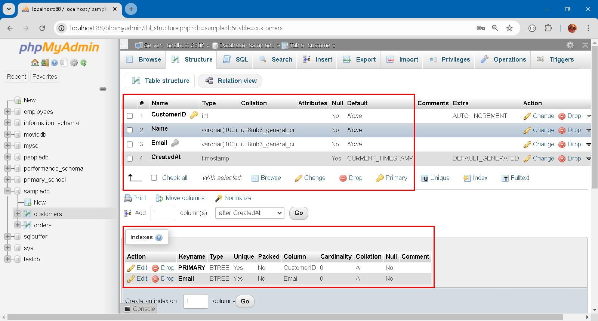

### Article


#### Section 1 
Table, being the unique data structure in RDBMS, is composed of rows of cells of rigid type and size. Table, per se, is compact and efficient way to store structured data, provided that shape and topology doesn't subjected to constant change. 

Rows can be retrofitted by adding, removing and type-changing cells not without much effort. This is because all rows share the same table definition (aka schema in terms of RDBMS). It is believed that small table facilitate schema migration, however highly normalized table also means highly fragmented table. Care should be taken to prevent data lost during schema migration, especially when foreign key constraints are involved. 

RDBMS is well known for it's unparalleled search and aggregation capability but is awkwardly imbecilic in handling unstructured data although JSON and XML support, full-text search capabilities are bestowed of late. Typically speaking: 

1. **Text Documents**
   - Word documents, PDFs, and other text files that contain paragraphs of text without a specific structure.

2. **Emails**
   - Email content, including the body, attachments, and metadata, varies widely in format.

3. **Social Media Posts**
   - Content from platforms like Twitter, Facebook, or Instagram, which can include text, images, videos, and hashtags.

4. **Multimedia Files**
   - Images, audio files, and video files that do not have a consistent structure but can contain valuable information.

5. **Web Pages**
   - HTML content from websites that includes text, images, and multimedia elements, often without a uniform layout.

6. **Logs and Sensor Data**
   - System logs, application logs, and data from IoT devices that contain unstructured entries without a fixed format.

7. **Chat and Messaging Data**
   - Conversations from messaging apps or chat platforms, which can vary in length and content.

8. **Survey Responses**
   - Open-ended answers in surveys where respondents can provide free-text responses.

This type of data does not fall into traditional realm of business data processing and not even exists when RDBMS was invented on late 70's of last century. It is the new application scenarios which bring about new forms of data... 


#### Section 2 

Storage Model, in a restricted and confined sense, focuses on storage of user data stripping off all unrelated meta data. Storage Model directly maps to table space, segment, extend and blocks on disk. Storage strictly means disk storage and disk space not regarding any accompanying overhead on specific reading or writing operations. 

```
-- Create a new database
CREATE DATABASE SampleDB;

-- Use the new database
USE SampleDB;

-- Create a table for Customers
CREATE TABLE Customers (
    CustomerID INT AUTO_INCREMENT PRIMARY KEY,
    Name VARCHAR(100) NOT NULL,
    Email VARCHAR(100) UNIQUE NOT NULL,
    CreatedAt TIMESTAMP DEFAULT CURRENT_TIMESTAMP
);

-- Create a table for Orders with a foreign key constraint referencing Customers
CREATE TABLE Orders (
    OrderID INT AUTO_INCREMENT PRIMARY KEY,
    OrderDate TIMESTAMP DEFAULT CURRENT_TIMESTAMP,
    CustomerID INT,
    Amount DECIMAL(10, 2) NOT NULL,
    FOREIGN KEY (CustomerID) REFERENCES Customers(CustomerID)
        ON DELETE CASCADE
        ON UPDATE CASCADE
);

-- Insert sample data into Customers
INSERT INTO Customers (Name, Email) VALUES
('Alice Smith', 'alice@example.com'),
('Bob Johnson', 'bob@example.com');

-- Insert sample data into Orders
INSERT INTO Orders (CustomerID, Amount) VALUES
(1, 150.00),
(1, 200.50),
(2, 300.00);
```



On the upper part, you can see field type, size and encoding; on the lower part, you can see two [BTREE](https://en.wikipedia.org/wiki/B-tree) indexes, one for primary key access and the other for uniqueness email checking. 

Technically speaking, you can create table without index and is completely valid. Typical log, history and file for archiving purpose are supposed to be processed sequentially and thus no need index for random access on their own. 

In addition, indexes occupy disk space and CPU time to maintain. As Data size grow, indexes also grow... 


#### Section 3 

Access Model includes all static/dynamic overhead on disk or memory in order to enable certain kind of access method on storage model, ie. user data. This covers index, view, temporary file etc. RDBMS is responsible for maintaining these data and we already take it for granted... 

Under RDBMS, this cost is invisible but perceptible and palpable. A INSERT/UPDATE/DELETE runs significantly slower (around 3 times) than a SELECT statement. Because write operation is slower than read operation on disk. Because it's necessary update indexes, which are on disk also. 

Creating [multiple-column index](https://dev.mysql.com/doc/refman/8.4/en/multiple-column-indexes.html) and [Partial index](https://medium.com/nazar-io/partial-index-186e42c4207f) can significantly enhance query performance, especially for complex queries and reduce disk consumption: 

```
-- Create the Users table
CREATE TABLE Users (
    UserID INT AUTO_INCREMENT PRIMARY KEY,
    FirstName VARCHAR(50),
    LastName VARCHAR(50),
    Email VARCHAR(100),
    Age INT
);

-- Insert sample data
INSERT INTO Users (FirstName, LastName, Email, Age) VALUES
('Alice', 'Smith', 'alice@example.com', 28),
('Bob', 'Johnson', 'bob@example.com', 35),
('Charlie', 'Brown', 'charlie@example.com', 40),
('David', 'Wilson', 'david@example.com', 22),
('Eve', 'Davis', 'eve@example.com', 31);

-- Create a multi-column index on LastName and FirstName
CREATE INDEX idx_name ON Users (LastName, FirstName);

-- Create a partial index 
ALTER TABLE Users ADD COLUMN Over30 BOOLEAN AS (CASE WHEN Age > 30 THEN TRUE ELSE FALSE END);

CREATE INDEX idx_over_30 ON Users (Over30);

-- Verify the indexes
SHOW INDEX FROM Users;
```

Multi-column index idx_name works with this pattern: 
```
EXPLAIN SELECT * FROM Users WHERE LastName='Smith'; 
EXPLAIN SELECT * FROM Users WHERE LastName='Smith' AND FirstName='Alice'; 
EXPLAIN SELECT * FROM Users WHERE FirstName='Alice' AND LastName='Smith'; 
```

But not with: 
```
EXPLAIN SELECT * FROM Users WHERE FirstName='Alice'; 
```

Partial index idx_over_30 works with this pattern:
```
EXPLAIN SELECT * FROM Users WHERE Over30 = TRUE;
```

But not with:
```
EXPLAIN SELECT * FROM Users WHERE Age > 30; 
```

Indexes when used discreetly and conscientiously can boost up your performance. I'm furiously obstinate to separate storage and access because very bit of resource should count on modern application system. 


#### Section 4


### EOF (2024/09/27)

[Multiple-Column Indexes](https://dev.mysql.com/doc/refman/8.4/en/multiple-column-indexes.html)
[Partial index](https://medium.com/nazar-io/partial-index-186e42c4207f)
[]()
[]()
