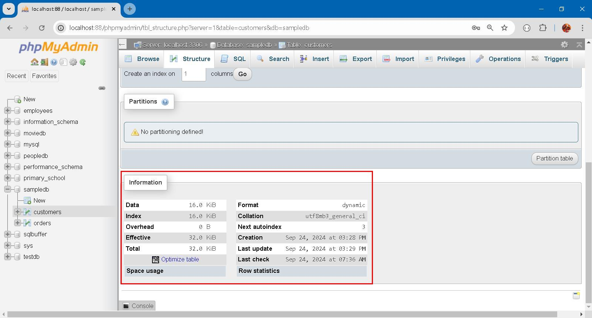

### Index 二三事 


### Prologue

RDBMS can not do without index. Simply put, we create table with primary key and forget thereupon... Only when our app yields poor performance do we remember the index. This article discusses some interesting aspects on index and also makes in depth exploration on [multi-column index](https://dev.mysql.com/doc/refman/8.4/en/multiple-column-indexes.html), [partial index](https://medium.com/nazar-io/partial-index-186e42c4207f), [fulltext index](https://dev.mysql.com/doc/refman/8.4/en/fulltext-search.html) and [data partitioning](https://dev.mysql.com/doc/refman/8.4/en/partitioning.html) using [MySQL 8](https://dev.mysql.com/downloads/mysql/8.0.html). 

All sample codes are credited to [ChatGPT](https://openai.com/chatgpt/), an AI language model developed by [OpenAI](https://openai.com/).


### I. RDBMS predicament

Table, being the unique data structure in RDBMS, is composed of rows of cells of rigid type and size. Table, per se, is compact and efficient way to store structured data, provided that *shape* and *topology* doesn't subjected to constant change. 

Rows can be retrofitted by means of adding, removing and type-changing cells not without much effort. This is because all rows share the same table definition, aka *schema*. It is believed that smaller table facilitates schema migration, however highly *normalized* table also means highly fragmented table. Moreover, care should be taken to prevent data lost during schema migration, especially when foreign key constraints are involved. 

RDBMS is well known for it's unparalleled search and aggregation capability but is awkwardly imbecilic in handling unstructured data although JSON and XML support, full-text search capabilities are bestowed of late. Typically speaking: 

1. **Text Documents**
   - Word documents, PDFs, and other text files that contain paragraphs of text without a specific structure.

2. **Emails**
   - Email content, including the body, attachments, and metadata, varies widely in format.

3. **Social Media Posts**
   - Content from platforms like Twitter, Facebook, or Instagram, which can include text, images, videos, and hashtags.

4. **Multimedia Files**
   - Images, audio files, and video files that do not have a consistent structure but can contain valuable information.

5. **Web Pages**
   - HTML content from websites that includes text, images, and multimedia elements, often without a uniform layout.

6. **Logs and Sensor Data**
   - System logs, application logs, and data from IoT devices that contain unstructured entries without a fixed format.

7. **Chat and Messaging Data**
   - Conversations from messaging apps or chat platforms, which can vary in length and content.

8. **Survey Responses**
   - Open-ended answers in surveys where respondents can provide free-text responses.

This type of data does not fall into traditional realm of business data processing and not even exists when RDBMS was invented on late 70's of last century. It is the new application scenarios which bring about new forms of data... 


### II. Storage Model and Access Model

Storage Model, in a *restricted* and *confined* sense, focuses on storage of user data, stripping off all unrelated meta data. Storage Model directly maps to table space, segment, extend and blocks etc on disk. Storage here strictly means disk storage disregarding accompanying resource on reading and writing operations. 

```
-- Create a new database
CREATE DATABASE SampleDB;

-- Use the new database
USE SampleDB;

-- Create a table for Customers
CREATE TABLE Customers (
    CustomerID INT AUTO_INCREMENT PRIMARY KEY,
    Name VARCHAR(100) NOT NULL,
    Email VARCHAR(100) UNIQUE NOT NULL,
    CreatedAt TIMESTAMP DEFAULT CURRENT_TIMESTAMP
);

-- Create a table for Orders with a foreign key constraint referencing Customers
CREATE TABLE Orders (
    OrderID INT AUTO_INCREMENT PRIMARY KEY,
    OrderDate TIMESTAMP DEFAULT CURRENT_TIMESTAMP,
    CustomerID INT,
    Amount DECIMAL(10, 2) NOT NULL,
    FOREIGN KEY (CustomerID) REFERENCES Customers(CustomerID)
        ON DELETE CASCADE
        ON UPDATE CASCADE
);

-- Insert sample data into Customers
INSERT INTO Customers (Name, Email) VALUES
('Alice Smith', 'alice@example.com'),
('Bob Johnson', 'bob@example.com');

-- Insert sample data into Orders
INSERT INTO Orders (CustomerID, Amount) VALUES
(1, 150.00),
(1, 200.50),
(2, 300.00);
```


On the upper part, you can see field type, size and encoding; on the lower part, you can see two [BTREE](https://en.wikipedia.org/wiki/B-tree) indexes, one for primary key access and the other for uniqueness email checking. 

Technically speaking, you can create table without index and is completely valid. Typical log, history and file for archiving purpose are supposed to be processed *sequentially* and thus no need index for random access on their own. 

In addition, indexes occupy disk space and CPU time to maintain. As Data size grow, indexes also grow... 



Access Model includes all static/dynamic resource on disk or memory in order to enable certain kind of random access on storage model, ie. user data. This covers index, view, temporary file etc. RDBMS is responsible for maintaining these meta data and we already take it for granted... 

The cost is invisible but perceptible and palpable. A INSERT/UPDATE/DELETE runs significantly slower (around 3 times) than a SELECT statement. Because write operation is slower than read operation on disk. Because it's necessary update indexes, which are on disk also. 


### III. Multiple-column index and Partial index 

Creating [multiple-column index](https://dev.mysql.com/doc/refman/8.4/en/multiple-column-indexes.html) and [Partial index](https://medium.com/nazar-io/partial-index-186e42c4207f) can significantly enhance query performance, especially for complex queries and reduce disk consumption: 

```
-- Create the Users table
CREATE TABLE Users (
    UserID INT AUTO_INCREMENT PRIMARY KEY,
    FirstName VARCHAR(50),
    LastName VARCHAR(50),
    Email VARCHAR(100),
    Age INT
);

-- Insert sample data
INSERT INTO Users (FirstName, LastName, Email, Age) VALUES
('Alice', 'Smith', 'alice@example.com', 28),
('Bob', 'Johnson', 'bob@example.com', 35),
('Charlie', 'Brown', 'charlie@example.com', 40),
('David', 'Wilson', 'david@example.com', 22),
('Eve', 'Davis', 'eve@example.com', 31);

-- Create a multi-column index on LastName and FirstName
CREATE INDEX idx_name ON Users (LastName, FirstName);

-- Create a partial index 
ALTER TABLE Users ADD COLUMN Over30 BOOLEAN AS (CASE WHEN Age > 30 THEN TRUE ELSE FALSE END);

CREATE INDEX idx_over_30 ON Users (Over30);

-- Verify the indexes
SHOW INDEX FROM Users;
```

Multi-column index idx_name works with this pattern: 
```
EXPLAIN SELECT * FROM Users WHERE LastName='Smith'; 
EXPLAIN SELECT * FROM Users WHERE LastName='Smith' AND FirstName='Alice'; 
EXPLAIN SELECT * FROM Users WHERE FirstName='Alice' AND LastName='Smith'; 
```


But not with: 
```
EXPLAIN SELECT * FROM Users WHERE FirstName='Alice'; 
```


Partial index idx_over_30 works with this pattern:
```
EXPLAIN SELECT * FROM Users WHERE Over30 = TRUE;
```


But not with:
```
EXPLAIN SELECT * FROM Users WHERE Age > 30; 
```


**Explanation of Columns**

- **id**: The identifier of the select. If there are multiple queries, this helps to identify them.
- **select_type**: The type of SELECT query (e.g., SIMPLE, PRIMARY, UNION).
- **table**: The table being accessed.
- **type**: The join type:
  - `ALL`: Full table scan (not efficient).
  - `ref`: Non-unique index lookup (more efficient).
- **possible_keys**: The indexes that could be used for this query.
- **key**: The actual index used by MySQL to execute the query.
- **key_len**: The length of the key used.
- **ref**: Shows which columns or constants are compared to the index.
- **rows**: An estimate of the number of rows MySQL believes it must examine to execute the query.
- **Extra**: Additional information about the query execution (e.g., "Using where" indicates a filter is applied).

Large e-commerce website would provide comprehensive search options to facilitate searching of items. It is impractical and even impossible to create huge number of multi-column indexes. [Faceted search](https://en.wikipedia.org/wiki/Faceted_search) is the technique widely used solve this issue. 

As of partial index, those un-indexed rows should be archived and move to elsewhere, consolidating table to achieve a more compact storage do good for performance. For example, all fulfilled and uncompleted purchase should be move to history table so that further analysing is done on purchasing patterns. 

Lastly, index is mainly for random access, other than this, you second thought the necessity to conserve speed and space. 


### IV. Fulltext index 

Fulltext index enables search on text-based columns which is particularly useful on searching large amounts of text data efficiently. 

```
-- Create the Articles Table
CREATE TABLE Articles (
    ArticleID INT AUTO_INCREMENT PRIMARY KEY,
    Title VARCHAR(255),
    Body TEXT,
    FULLTEXT (Title, Body)  -- Create a FULLTEXT index on Title and Body
);

INSERT INTO Articles (Title, Body) VALUES
('MySQL Full-Text Search', 'This article explains how to use FULLTEXT search in MySQL.'),
('Understanding Indexes', 'Indexes are important for optimizing query performance.'),
('Advanced SQL Techniques', 'Learn about advanced techniques in SQL, including joins and subqueries.'),
('Using MySQL for Data Analysis', 'MySQL can be used for efficient data analysis with proper indexing.');
```

Perform a FULLTEXT search using the `MATCH()` function combined with `AGAINST()`.To search for articles that contain the word "MySQL" with this pattern:

```
EXPLAIN SELECT * FROM Articles
WHERE MATCH (Title, Body) AGAINST ('MySQL');

EXPLAIN SELECT * FROM Articles
WHERE MATCH (Body, Title) AGAINST ('MySQL');
```


But not with:
```
EXPLAIN SELECT * FROM Articles
WHERE MATCH (Title) AGAINST ('MySQL');

EXPLAIN SELECT * FROM Articles
WHERE MATCH (Body) AGAINST ('MySQL');
```


You can also use *Boolean mode* for more advanced searches. This allows you to use operators like `+`, `-`, `*`, and others. To find articles that must contain the word "MySQL" but can exclude "Data":
```
EXPLAIN SELECT * FROM Articles
WHERE MATCH (Title, Body) AGAINST ('+MySQL -Data' IN BOOLEAN MODE);
```

You can also perform a *natural language* search without Boolean operators:
```
EXPLAIN SELECT * FROM Articles
WHERE MATCH (Title, Body) AGAINST ('SQL techniques');
```


### V. Data Partitioning

Data partitioning allows you to split large tables into smaller, more manageable pieces called **partitions**. This can improve performance, especially for large datasets, by making queries more efficient and easier to manage. 

caveat: 
- Foreign keys are not yet supported in conjunction with partitioning; 
- A PRIMARY KEY must include all columns in the table's partitioning function.
```
CREATE TABLE Orders (
    OrderID INT AUTO_INCREMENT,
    OrderDate DATE,
    CustomerID INT,    
    Amount DECIMAL(10, 2) NOT NULL,
    PRIMARY KEY (OrderID, OrderDate)  -- Include partitioning column in the primary key
) PARTITION BY RANGE (YEAR(OrderDate)) (
    PARTITION p2020 VALUES LESS THAN (2021),
    PARTITION p2021 VALUES LESS THAN (2022),
    PARTITION p2022 VALUES LESS THAN (2023),
    PARTITION pFuture VALUES LESS THAN MAXVALUE
);

INSERT INTO Orders (CustomerID, OrderDate, Amount) VALUES
(1, '2020-05-15', 100.00),
(2, '2021-06-20', 200.50),
(3, '2022-07-25', 150.75),
(4, '2023-08-30', 300.00);
```

You can query the table using standard SQL:
```
SELECT * FROM Orders WHERE OrderDate BETWEEN '2021-01-01' AND '2021-12-31';
```

To check if a table is partitioned, you can query the `information_schema` database, specifically the `PARTITIONS` table. This table contains information about all partitions for each partitioned table in your databases.
```
SELECT *
FROM information_schema.PARTITIONS
WHERE TABLE_SCHEMA = 'SampleDB'
  AND TABLE_NAME = 'Orders';
```


If the table is partitioned, the query will return rows containing details about the partitions, including:

- **PARTITION_NAME**: The name of each partition.
- **PARTITION_ORDINAL_POSITION**: The position of the partition.
- **PARTITION_METHOD**: The method used for partitioning (e.g., RANGE, LIST, HASH).
- **SUBPARTITION_METHOD**: If applicable, the method used for subpartitioning.
- **TABLE_ROWS**: The number of rows in each partition.

If the query returns no results, the table is not partitioned.

You can also check the structure of the table to see if it includes any partitioning metadata:
```
SHOW CREATE TABLE Orders;
```


This command will display the `CREATE TABLE` statement for the `Orders` table, including any partitioning definitions.

In MySQL, partitioning a table across different hosts (or servers) is typically achieved through a technique called **sharding**. Sharding involves distributing data across multiple database instances or servers to improve performance and manageability. *While MySQL does not support cross-server partitioning natively, you can use a combination of techniques to achieve similar results*. Here’s an overview and example of how to implement sharding with MySQL.

To demonstrate how to access data from a sharded Orders table across four different hosts using Node.js, we'll create a simple application. 

```
const mysql = require('mysql2/promise');

// Define your shard configurations
const shards = [
    { host: 'shard1.example.com', user: 'user1', password: 'password1', database: 'SampleDB' },
    { host: 'shard2.example.com', user: 'user2', password: 'password2', database: 'SampleDB' },
    { host: 'shard3.example.com', user: 'user3', password: 'password3', database: 'SampleDB' },
    { host: 'shard4.example.com', user: 'user4', password: 'password4', database: 'SampleDB' },
];

// Function to determine which shard to use based on CustomerID
function getShard(customerId) {
    return shards[customerId % shards.length];
}

// Function to fetch order details
async function fetchOrder(customerId) {
    const shard = getShard(customerId);
    const connection = await mysql.createConnection(shard);
    
    try {
        const [rows] = await connection.execute('SELECT * FROM Orders WHERE CustomerID = ?', [customerId]);
        return rows;
    } catch (error) {
        console.error(`Error fetching order for CustomerID ${customerId} from shard ${shard.host}:`, error);
    } finally {
        await connection.end();
    }
}

// Example usage
(async () => {
    const customerId = 3;  // Change this to test different customers
    const orders = await fetchOrder(customerId);
    
    if (orders.length) {
        console.log(`Orders for CustomerID ${customerId}:`, orders);
    } else {
        console.log(`No orders found for CustomerID ${customerId}`);
    }
})();
```


### Epilogue 
**Ode to RDBMS Index**

In the realm of data, vast and wide,  
Where tables hold secrets, side by side,  
An index stands tall, a guardian bright,  
Guiding the queries through day and night.

A labyrinth of rows, so hard to explore,  
Without the index, we’d search evermore.  
Like a map in the woods, it shows us the way,  
Transforming the chaos, come what may.

With keys that unlock the treasures we seek,  
Performance enhanced, no longer bleak.  
Sorting and filtering, it hastens the pace,  
In the race for results, it finds its own place.

Composite or single, it takes many forms,  
Adapting to queries, weathering storms.  
From balanced trees to hash tables true,  
Each structure designed to help us break through.

Oh, how you serve, dear index divine,  
In the world of RDBMS, you brightly shine.  
With each SELECT that flows from your grace,  
You turn data’s confusion into a clear space.

So here’s to the index, a silent friend,  
In the database dance, you help us transcend.  
With you at our side, we conquer the quest,  
In the kingdom of data, you are truly the best!

(Generated by Chat-GPT)

### EOF (2024/09/27)
