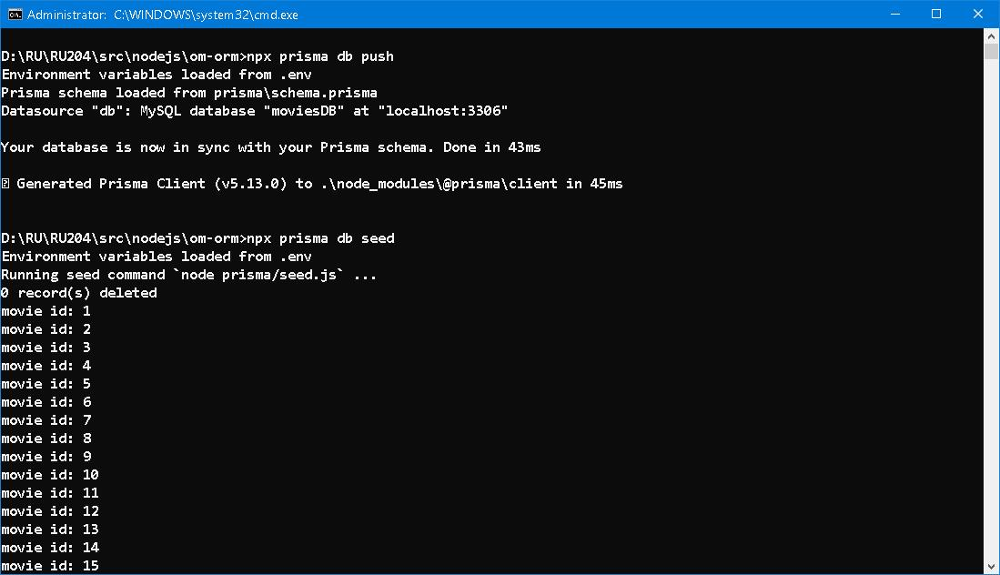

### [OM](https://www.npmjs.com/package/redis-om) vs [ORM](https://www.prisma.io/docs/orm/overview/prisma-in-your-stack/is-prisma-an-orm) 

```
“April is the cruellest month, breeding
Lilacs out of the dead land, mixing
Memory and desire, stirring
Dull roots with spring rain.”
The Waste Land
BY T. S. ELIOT
```


### Prologue 
Every happening has it own connotation behind the scenes, this is the conviction throughout my life. Events, no matter how minute they are, may entangle even more incidents of any scale. More often than not, the effect is not instantaneous and thus not palpable in secular society. We just can't conceive their interworking, can't figure out their causes and consequences, if any. Based on this belief, we can definitely say that "there is no such thing as coincidence!". The term "laws of nature" refers to fundamental principles or regularities that govern the behavior and operations of the natural world. These laws apply to elementary physical elements, not to those in high level mental activities. 


### I. Round 1: Setup 
Chances are rare when it is required to tap on multiple database systems in a single project, especially heterogeneous ones. 


Chances are rarer when it comes to compare an ORM with OM... Being a mature ORM product, [Prisma](https://www.prisma.io/) has wide range of RDBMS support as well as [MongoDB](https://www.mongodb.com/), which is a personage from NoSQL family. [RedisStack](https://redis.io/about/about-stack/) is a new species of database featuring a multi-model data structure server. [Redis-OM](https://github.com/redis/redis-om-node) is an object mapping tool which effectively turns Redis Stack into a document store, in much the same way as [mongoose](https://mongoosejs.com/) to MongoDB. Time to roll up your sleeves and let's start...

Install Prisma as a development dependency and initialize with:: 
```
npm install prisma --save-dev
npx prisma init
```

The `schema.prisma` file within `prisma` folder is where we define our model in. 
```
generator client {
  provider = "prisma-client-js"
  previewFeatures = ["fullTextSearch", "fullTextIndex"]
}

datasource db {
  provider = "mysql"
  url      = env("DATABASE_URL")
}

// Movie model
model Movie {
  id Int @id @default(autoincrement())

  title    String
  released Int     @db.Year
  runtime  Int
  stars    String  
  summary  String  @db.LongText
  rating   Float
  inStock  Boolean 
  director String  
  genre    String  
  country  String  
  language String  
  sequel   Boolean 

  // Enable full text search on these fields
  @@fulltext([title])
  @@fulltext([summary])

  // Linux would map to 'Movie' not 'movie' otherwise
  @@map("movie")
}
```
A Movie model is used here. As you can see, the definition is almost self-depict. 

| Prisma type | [MySQL](https://www.mysql.com/) type |
| ----------- | ----------- |
| Int | INT |
| String | VARCHAR(191) |
| Float | DOUBLE |
| Boolean | BOOLEAN |

1. MySQL BOOLEAN is a synonym for TINYINT(1)
2. @db.Year maps field to MySQL YEAR;
3.  @db.LongText attribute;maps field MySQL LONGTEXT; 
4. @@fulltext([title]) and @@fulltext([summary]) add indexes to these columns since we are going to use MySQL full text Full text search capability. 
5. @@map("movie") ensure table name 'movie' is used lest it could become 'Movie' in Linux system. 

To push changes to backend database with: 
```
npx prisma db push 
```

To enable client access to the database with:  
```
npm install @prisma/client

npx prisma generate
```

**CAVEAT**

Everytime you change the model. Be sure to push changes to backend AND generate new client code for the frontend. 

As for [Redis-OM](https://github.com/redis/redis-om-node), no specific folder is required. We just put stuff beneath `om` folder. 

Install node-redis and redis-om with:: 
```
npm install redis
npm install redis-om
```

movieSchema.js
```
const movieSchema = new Schema("moviedb:movie", {
        title: { type: 'text' },
        released: { type: 'number', sortable: true}, 
        runtime: { type: 'number'}, 
        stars:  { type: 'string[]' },
        summary: { type: 'text' }, 
        rating: { type: 'number' },
        inStock: { type: 'boolean' },
        director: { type: 'string' },
        genre: { type: 'string' },
        country: { type: 'string' },
        language: { type: 'string' },
        sequel: { type: 'boolean' }
    }, 
    {
        dataStructure: 'HASH'
    });
```
Looks familiar right? Except for
1. `stars` field is array of string; 
2. "moviedb:movie" is prefix; 
3. Use HASH data structure to store data; 

redisClient.js
```
import 'dotenv/config'
import { createClient } from 'redis'

const redisClient = new createClient({
        url: process.env.REDIS_OM_URL || 'redis://localhost:6379'
    });
redisClient.on('error', (err) => console.log('Redis Client Error', err));

await redisClient.connect()
const pong = await redisClient.ping()
console.log(pong)

export { redisClient }
```

That's all! No need to push changes to backend nem re-generate client code... 


### II. Round 2: [Seeding](https://www.prisma.io/docs/orm/prisma-migrate/workflows/seeding#integrated-seeding-with-prisma-migrate)
> Seeding allows you to consistently re-create the same data in your database and can be used to:
- Populate your database with data that is required for your application to start - for example, a default language or a default currency.
- Provide basic data for validating and using your application in a development environment. This is particularly useful if you are using Prisma Migrate, which sometimes requires resetting your development database.

Create a new file named `seed.js` in `prisma` folder.

seed.js
```
import { PrismaClient } from '@prisma/client'
import { movieData } from '../data/movieData.js'

const prisma = new PrismaClient()

async function main() {
   let response
   // Erase old data... 
   response = await prisma.$executeRaw`truncate table movie`
   console.log('Table truncated') 

   // Seed new data 
   for (let i = 0; i < movieData.length; i++) {
     // Can not store string array directly... 
     movieData[i].stars = movieData[i].stars.join('|')
      
     response = await prisma.movie.create({
       data: movieData[i]
     })
     console.log(`movie id: ${response.id}`)
   }
    console.log(`${movieData.length} record(s) created`) 
  }

main()
  .then(async () => {
    await prisma.$disconnect()
  })
  .catch(async (e) => {
    console.error(e)
    await prisma.$disconnect()
    process.exit(1)
  })
```

To seed database with: 
```
npx prisma db seed
```



As for [Redis-OM](https://github.com/redis/redis-om-node), we place a `seed.js` in `om` folder: 

seed.js
```
import { Repository, EntityId } from 'redis-om'
import { redisClient } from './redisClient.js'
import { movieSchema } from './movieSchema.js'
import { movieData } from '../data/movieData.js'

const movieRepository = new Repository(movieSchema, redisClient)
await movieRepository.createIndex()

async function main() {
   let response
   // Erase old data... 
   console.log(`Removing index ${movieSchema.indexName} and documents...`)   
   response = await redisClient.sendCommand(['FT.DROPINDEX', `${movieSchema.indexName}`, 'DD'])
   // Redis-OM has a string to keep track of index re-creation. Also remove it!!! 
   response = await redisClient.del(`${movieSchema.indexName}:hash`)
   
   // To re-create the index 
   console.log(`Creating index ${movieSchema.indexName}...`)
   await movieRepository.createIndex()

   // Seed new data 
   for (let i = 0; i < movieData.length; i++) {  
     response = await movieRepository.save(movieData[i])
     console.log(`movie id: ${response[EntityId]}`)
   }
    console.log(`${movieData.length} record(s) created`) 
  }

main()
  .then(async () => {
    await redisClient.quit()
  })
  .catch(async (e) => {
    console.error(e)
    await redisClient.quit()
    process.exit(1)
  })
```

To seed database with: 
```
npm run om-seed
```


### III. Round 3: Searching
Take a seat and drink a beer! Here come more rounds... 

1. Find all movies which are not sequel, select 'title', 'genre' and 'released' year, order by 'released' year in descending order.
   return the first 5 matched. 
   ```
   movies = await prisma.movie.findMany({
    where: { sequel: false },
    select: { title: true, genre: true, released: true },
    orderBy: [ { released: 'desc' } ],
    skip: 0, 
    take: 5
   })
   ```
   ```
   movies = await movieRepository.search()
                .where('sequel').equals(false)
                .sortBy('released', 'DESC')
                .return.page(0, 5)
   ```

2. Find all movies starred by "Morgan Freeman" or "Leonardo DiCaprio", select 'title', 'stars' and 'released' year, 
   order by 'released' year in ascending order
   ```
   movies = await prisma.movie.findMany({
     where: { OR: [
        { stars: { contains: "Morgan Freeman" } } , 
        { stars: { contains: "Leonardo DiCaprio" } } 
     ] },
     orderBy: [ { released: 'asc' } ],
     select: { title: true, stars: true, released: true }
   })
   ```
   ```
   movies = await movieRepository.search()
                .where('stars').contain("Morgan Freeman")
                .or('stars').contain("Leonardo DiCaprio")
                .sortBy('released', 'ASC')
                .return.all()
   ```

3. Find all movies with rating 7~8 (inclusive), select 'title' and 'rating'
   ```
   movies = await prisma.movie.findMany({
   where: { AND: [
      { rating: { gte: 7 } }, 
      { rating: { lte: 8 } }
   ] },
   select: { title: true, rating: true },
  })
   ```
   ```
   movies = await movieRepository.search()
                .where('rating').gte(7)
                .and('rating').lte(8)
                .return.all()
   ```

4. Find all movie with a summary that contains 'crime' or 'police', select 'id', 'title' and 'summary' 
   ```
   movies = await prisma.movie.findMany({
   where: {
      summary: {
         search: 'police crime',
      },
    },
    select: { id: true, title: true, summary: true }
   })
   ```
   ```
   movies = await movieRepository.search()
                .where('summary').match('crime')
                .or('summary').match('police')
                .return.all()

   ```


### IV. Round 4: Aggregation
Last but not least... 

1. How many movies are not sequel? 
```
movies = await prisma.movie.count({
    where: {
      sequel: false
    }
  })
```  
```
movies = await redisClient.sendCommand(['FT.SEARCH', 'moviedb:movie:index', '@sequel:{0}', 'LIMIT', '0', '0'])
```

2. Min, max, avg runtime in movies which are not sequel? 
```
movies = await prisma.movie.aggregate({
   _count: { title: true }, 
   _max: { runtime: true }, 
   _min: { runtime: true }, 
   _avg: { runtime: true }, 
   where: {
     sequel: false
   }
 })
``` 
```
movies = await redisClient.sendCommand(['FT.AGGREGATE', 'moviedb:movie:index', '@sequel:{0}', 'GROUPBY', '0', 'REDUCE', 'COUNT', '0', 'AS', 'Total', 'REDUCE', 'MAX', '1', '@runtime', 'AS', 'Maxinum', 'REDUCE', 'MIN', '1', '@runtime', 'AS', 'Minimum', 'REDUCE', 'AVG', '1', '@runtime', 'AS', 'Average'])
```

3. Group by genre. having count >=3 and list top 10 only.  
```
movies = await prisma.movie.groupBy({
   by: ['genre'],
   _count: { title: true }, 
   orderBy: {
      _count: { title: 'desc' },
   },
   having: {
      title: {
        _count: {
          gte: 3,
        },
      },
    },
   skip: 0,
   take: 10,
  })
```
```
movies = await redisClient.sendCommand(['FT.AGGREGATE', 'moviedb:movie:index', "*", 'GROUPBY', '1', '@genre', 'REDUCE', 'COUNT', '0', 'AS', 'Total', 'SORTBY', '2', '@Total', 'DESC', 'filter', "@Total >= 3", 'LIMIT', '0', '10'])
```


### V. Round up

#### [Prisma](https://www.prisma.io/)

**Pros**
1. Implementation agnostic, suports mainsream RDBMS (except Oracle); 
2. Code First and Database First bi-directional approach; 
3. Complete SDLC (Software Development Life Cycle) support; 

**Cons**
1. Longer learning curve; 
2. One kind of database per project;
3. Performance overhead; 

#### [Redis-OM](https://github.com/redis/redis-om-node)

**Pros**
1. Enablement of document database in Redis;
2. Manage indexes automatically; 
3. Endows data types on HASH data structure; 

**Cons**
1. Still under development; 
2. Libraries for Python, .NET, Node.js, and Java only; 
3. Less features than [mongoose](https://mongoosejs.com/);


### VI. Bibliography
#### prisma
1. [prisma/docs | MySQL/MariaDB](https://www.prisma.io/docs/orm/overview/databases/mysql)
2. [Prisma Client Quickstart](https://www.prisma.io/docs/getting-started/quickstart)
3. [Prisma Client API reference](https://www.prisma.io/docs/orm/reference/prisma-client-reference)
4. [Filtering and Sorting](https://www.prisma.io/docs/orm/prisma-client/queries/filtering-and-sorting)
5. [Aggregation, grouping, and summarizing](https://www.prisma.io/docs/orm/prisma-client/queries/aggregation-grouping-summarizing)
6. [Full-text search](https://www.prisma.io/docs/orm/prisma-client/queries/full-text-search)
7. [MySQL Full-Text Search Functions](https://dev.mysql.com/doc/refman/8.0/en/fulltext-search.html)
8. [Learn Prisma In 60 Minutes, by WDS](https://youtu.be/RebA5J-rlwg)

#### redis 
1. [Storing, querying, and indexing JSON at speed, Redis University](https://university.redis.com/courses/ru204/)
2. [Redis Stack for Application Modernization, by Luigi Fugaro, Mirko Ortensi](https://www.amazon.com/Redis-Stack-Application-Modernization-applications-ebook/dp/B0CMR28RT1/ref=sr_1_1?crid=22O91FJWWHK9Y&dib=eyJ2IjoiMSJ9.y5lDgi1pCr-YeUHEjJAo6Q.HmDkpYrL9BqnFJj2V-yDtMVVaXfzfpQ-nKIMW8h6EgQ&dib_tag=se&keywords=Redis+Stack+for+Application+Modernization&qid=1714444777&s=books&sprefix=redis+stack+for+application+modernization%2Cstripbooks-intl-ship%2C258&sr=1-1)
3. [Node-Redis](https://github.com/redis/node-redis)
4. [redis-om-node](https://github.com/redis/redis-om-node/tree/main?tab=readme-ov-file#full-text-search)
5. [Query syntax](https://redis.io/docs/latest/develop/interact/search-and-query/advanced-concepts/query_syntax/)
6. [Aggregations](https://redis.io/docs/latest/develop/interact/search-and-query/advanced-concepts/aggregations/)


### Epilogue
`Learn by comparison` is my motto in studying. The rationale behind is commonality and differential. While questing for some knowledge of [Redis Stack](https://redis.io/about/about-stack/), I was chanced to be aware of some fun facts: 

1. [SINTER](https://redis.io/docs/latest/commands/sinter/) and alike to be used in [Faceted Search](https://www.oxfordsemantic.tech/faqs/what-is-faceted-search) is an analogy to [SQL INNER JOIN](https://www.w3schools.com/sql/sql_join_inner.asp) operation. 

2. [HASH](https://redis.io/docs/latest/commands/?group=hash) can be compared to a single [SQL ROW](https://www.educba.com/sql-row/). 

3. Partial [Indexing](https://redis.io/docs/latest/develop/interact/search-and-query/indexing/) as a result of reducing memory usage, works similarly to [SQL Views](https://www.w3schools.com/sql/sql_view.asp). 

Does these pure coincidence? Or some underlaying intricacy drives them together? I not know... 

```
“To be, or not to be, that is the question”
BY WILLIAM SHAKESPEARE
```

> It is also recommended to refrain from indexing all of the fields within a document, as that will consume considerable compute overhead and space, which is an antipattern of Redis. (Indexing JSON Documents with RediSearch)

### EOF (2024/05/03)

Without further ado
Stop beating around the bushes
Time to rollup your sheelves 
Let get started
For better or worse 

We'll look at examples written in Python, .NET, Node.js,
and Java.

