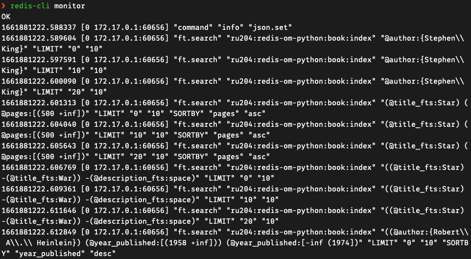
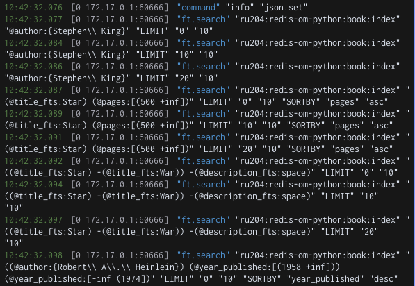

#### [Back to Part 1](summary.md)

#### IV. Indexing and Searching in Your Application

You've reached Section 4 of the course. Now it's time to see how you can integrate the JSON search capabilities that were introduced in Section 3 into your application. We'll look at examples written in Python, .NET, Node.js, and Java. You'll learn how to query a collection of documents with the Redisson clients. Remember that to be successful in this course, you don't need to know all four programming languages. 

While we'd recommend that you read each unit that follows, feel free to focus on the languages that are relevant to your application development needs and personal experience. It's also important to note that you don't have to use the Redisson clients to leverage functionality from RediSearch in an application. The lower-level clients redis-py, Node Redis, and Jedis all include support for RediSearch commands. And StackExchange.Redis allows you to run these commands using the generic ExecuteAsync function to send arbitrary commands to Redis.

##### 1. Querying JSON Documents with Redis OM for Node.js

Let's see how Redis OM for Node.js allows us to store and query JSON documents in a more developer friendly way than using the lower level [node-redis](https://github.com/redis/node-redis) client and the [FT.SEARCH](https://redis.io/commands/ft.search/) command directly.

In this module, we'll refer to the source code contained in the [src/nodejs/redis_om_search_example](https://github.com/redislabs-training/ru204/tree/main/src/nodejs/redis_om_search_example) folder of the course GitHub repository. We suggest that you have this folder open in a separate browser tab, or your preferred IDE while studying this module.

**Data Model**

For this example, we'll continue using our Book data model that you saw in section 2 when we saw how to save JSON documents in Redis with Redis OM Node. It's now time to add indexing and search capabilities to this, so let's take a look at what's changed since section 2...

The data model is defined in a schema in the file model.js. This is largely unchanged from section 2 and looks like this:
```
import { Entity, Schema } from 'redis-om';

class Book extends Entity {};

export const bookSchema = new Schema(Book, {
  author: { type: 'string' },
  id: { type: 'string' },
  description: { type: 'text' },
  genres: { type: 'string[]' },
  pages: { type: 'number', sortable: true },
  title: { type: 'text' },
  url: { type: 'string' },
  yearPublished: { type: 'number', sortable: true },
  // Redis OM Node does not yet support embedded objects, 
  // so the metrics object has been flattened to the following
  // two fields, and we have omitted the inventory array of 
  // objects for the same reason.
  ratingVotes: { type: 'number' },
  score: { type: 'number' }
}, {
  prefix: 'ru204:redis-om-node:book'
});"  
```

Note that we've changed the type for the description and title fields since section 2. These used to be of type string, now they're text. We'll see why next...

**Creating the Search Index**

Redis OM Node manages the creation of the RediSearch index for us, there's no need for us to use the [FT.CREATE](https://redis.io/commands/ft.create/) command directly or to know its syntax.

Open the file [load_data.js](https://github.com/redislabs-training/ru204/blob/main/src/nodejs/redis_om_search_example/load_data.js). Let's see how the index is created and documents added to it...

First, use the createIndex function that Redis OM Node provides on our book repository:
```
await bookRepository.createIndex();
```

And that's it... our index is created for us! Redis OM Node uses the model definition to determine how to index each field. Fields of type string become TAG fields in the index, fields of type text become TEXT (full-text search) fields, and fields of type number become NUMERIC fields. If we want to be able to sort a field, we declare it as sortable: true.

Adding documents to the index is then as simple as creating new book instances and saving them in Redis. This process is the same as you saw in section 2, let's create a new book and save it:
```
const bookRepository = client.fetchRepository(bookSchema);
const newBook = bookRepository.createEntity({
    'title': 'Redis: An Introduction',
    'author': 'Redis University',
    // Other fields…
);

await bookRepository.save();  
```

RediSearch automatically adds the book to the search index for us, and keeps the index updated with any future changes to the book's JSON document in Redis.

That's all there is to it!

**Querying the Index**

Redis OM for Node also provides us with a fluent querying interface. This operates at a higher level of abstraction than the underlying [node-redis](https://github.com/redis/node-redis) client, and doesn't require you to learn the query syntax for the [FT.SEARCH](https://redis.io/commands/ft.search/) command.

Open the file [search_om_example.js](https://github.com/redislabs-training/ru204/blob/main/src/nodejs/redis_om_search_example/search_om_example.js) to follow along.

Repositories in Redis OM Node have a search function. We use this to write queries, and it returns an array of matching instances. Let's find books that were written by Stephen King:
```
let resultSet = await bookRepository.search()
  .where('author').equals('Stephen King')
  .return.all();
```

Here, we're saying "Find all books where the author field has the value Stephen King". resultSet will contain an array of matching book instances. Redis OM Node handles translating this query to the correct [FT.SEARCH](https://redis.io/commands/ft.search/) command invocation, running it, and parsing the results into instances of our model.

When working with fields that were indexed as `TEXT`, we can use the matches function to perform a full-text search. We can also combine search clauses, here we'll look for books with "Star" in the title field that are also over 500 pages long:
```
resultSet = await bookRepository.search()
  .where('title').matches('Star')
  .and('pages').is.greaterThan(500)
  .sortAscending('pages')
  .return.all();
```

Note that as well as combining search clauses, we're asking Redis OM to sort the results by the number of pages in ascending order. If we wanted a descending sort, we'd use sortDescending:
```
.sortDescending('pages')
```

When querying numeric fields, we can use the greaterThan and lessThan functions. Let's find books published between 1959 and 1973 inclusive:
```
resultSet = await bookRepository.search()
  .where('yearPublished').is.greaterThan(1958)
  .and('yearPublished').is.lessThan(1974)
  .return.all();
```

To learn more about Redis OM for Node's query syntax, please [refer to the documentation](https://github.com/redis/redis-om-node#-using-redisearch).

##### 2. Optional: Redis OM Node.js Workshop

[Redis Stack Workshop: Redis Stack OM Library for Node.js](https://youtu.be/KUfufrwpBkM)

##### 3. Hands-on Exercise

Now that you've seen how the Redis OM clients make querying JSON documents in Redis more developer friendly, it's time to try working with your favorite programming language and the sample data provided!

If you're not a coder, don't worry - this is an ungraded exercise!

**Setup**

First, pick a Redis OM client for your preferred programming language, and follow the instructions in the README file to load the sample data into Redis and run the queries provided:

- Python - [start here](https://github.com/redislabs-training/ru204/tree/main/src/python/redis_om_search_example).
- Node.js - [start here](https://github.com/redislabs-training/ru204/tree/main/src/nodejs/redis_om_search_example).
- .NET (C#) - [start here](https://github.com/redislabs-training/ru204/tree/main/src/dotnet/redis_om_search_example).
- Java (Spring) - [start here](https://github.com/redislabs-training/ru204/tree/main/src/java/redis_om_search_example).

Note: if you choose to repeat this exercise in more than one of the supported languages, you must flush the Redis database and reload the data for each new language that you try, using the instructions provided at the links above.

**Verify the Data Set**

Next, use redis-cli or RedisInsight to verify that your data loaded correctly. Run the following command:

`DBSIZE`

Redis should return:

- Python: 1487
- Node.js: 1487
- .NET: 1486
- Java: 1487

The [DBSIZE](https://redis.io/commands/dbsize/) command returns the number of keys currently set in Redis. Some of the Redis OM clients use an additional key to store information about the state of the search index in Redis - this is why the output of [DBSIZE](https://redis.io/commands/dbsize/) varies depending on the language you're working with here.

Take a moment to look at how the example queries are formed in each language, and how the results are output to the console. You may also want to refer to the documentation for the Redis OM client that you're working with:

- [Python](https://github.com/redis/redis-om-python)
- [Node.js](https://github.com/redis/redis-om-node)
- [.NET (C#)](https://github.com/redis/redis-om-dotnet)
- [Java (Spring)](https://github.com/redis/redis-om-spring)

Now, try adding 2-3 extra search queries of your own design. For example you might want to search for books that are between 500 and 1000 pages long, published between 1950 and 1999. Experiment with the different fields, search operators and sort capabilities.

While running your queries, use the Redis [MONITOR](https://redis.io/commands/monitor/) command to see the [FT.SEARCH](https://redis.io/commands/ft.search/) commands that Redis OM translates your code into.

To run [MONITOR](https://redis.io/commands/monitor/) from redis-cli, open a new terminal window and start redis-cli, then simply enter the command:

`MONITOR`

To use [MONITOR](https://redis.io/commands/monitor/) in RedisInsight, [check out the Profiler documentation](https://docs.redis.com/latest/ri/using-redisinsight/profiler/).

Should you need help or would like to share your success with Redis staff and your fellow students, reach out to us on the [course Discord channel](https://discord.gg/46upnugY5B).

Best of luck!


#### V. Advanced Topics

Welcome to Section 5 where we'll discuss advanced topics that will assist you in integrating RedisSearch and RedisJSON into your application. The commands and topics covered in this section may not be necessary for every application. However, it is important to know that such actions do exist should certain scenarios arise. 

RedisSearch and RedisJSON are constantly evolving with new features and capabilities. So this section will expand as newer versions are released. As always, we encourage you to jump into the discussion on Discord as we are always interested in what our students would like to see covered. 

This will be a light section with one collective hands-on activity at the end. Well then proceed to the final exam where you can earn a certificate of completion if you reach a grade of 65% or higher. Good luck and happy learning.

##### 1. RediSearch and RedisJSON Utilities

When creating a new index for your JSON documents, there may be a need to look "into" the indexing process to ensure that your documents are being indexed as intended. This module introduces commands used to ensure that your RediSearch indexing and application development runs smoothly and efficiently. This is not an exhaustive list of commands and methods, but will provide you with the most used commands. For more information, check out the command list for Redisearch [here](https://redis.io/commands/?group=search).

**MONITOR**

[MONITOR](https://redis.io/commands/monitor/) is a debugging command that streams back every command processed by the Redis server. It can help in understanding what is happening to the database. The ability to see all the requests processed by the server is useful in order to spot bugs in an application using client libraries.

RedisInsight has the built-in [Profiler](https://docs.redis.com/latest/ri/using-redisinsight/profiler/) tool which performs the same function as MONITOR.

**FT._LIST**

The [FT._LIST](https://redis.io/commands/ft._list/) command lists all indexes created by Redisearch. This allows you to check what indexes are available.

Here is an example call to FT._LIST that returns multiple indexes:
```
FT._LIST
1) "index:bookdemo"
2) "index:users:profiles"
3) "index:products
4) "inventory-index"
5) "search:locations"  
```

**FT.INFO**

[FT.INFO](https://redis.io/commands/ft.info/) returns a list of key value pairs with information about a specified index. This is especially useful to track whether or not your new index is scanning the correct documents and indexing them as intended.

Returned values include:

- `index_definition`: reflection of [FT.CREATE](https://redis.io/commands/ft.create/) command parameters. This includes what data type the index is over (JSON or Hash), the prefix used for scanning, and the default score given to all documents when indexed.
- `attributes`: index schema - field names, types, and attributes.
- Number of documents.
- Number of distinct terms.
- Average bytes per record.
- Size and capacity of the index buffers.
- Indexing state and percentage as well as failures:
1. `indexing`: whether or not the index is being scanned in the background.
2. `percent_indexed`: progress of background indexing (1 if complete).
2. `hash_indexing_failures`: number of failures due to document formats not compatible with a supplied index schema.

Optional statistics include:

- Garbage collection information.
- Cursors if a cursor exists for the index.
- Stopword lists if a custom stopword list is used. [Stop words](https://redis.io/docs/stack/search/reference/stopwords/#:~:text=RediSearch%20has%20a%20pre%2Ddefined,are%20discarded%20and%20not%20indexed) are words that are usually so common that they do not add much information to search, but take up a lot of space and CPU time in the index. When indexing, stop-words are discarded and not indexed. When searching, they are also ignored and treated as if they were not sent to the query processor.

The `attributes` list outlines all of the search field attributes given to the index . The `num_docs` key tells us how many documents have been indexed.

Here we see `FT.INFO` called on one of our book indexes used in this course:
```
FT.INFO index:bookdemo
```

Redis returns information about the specific index:
```
  1) "index_name"
  2) "index:bookdemo"
  3) "index_options"
  4) (empty list or set)
  5) "index_definition"
  6) 1) "key_type"
     2) "JSON"
     3) "prefixes"
     4) 1) "ru204:book:"
     5) "default_score"
     6) "1"
  7) "attributes"
  8) 1) 1) "identifier"
        2) "$.author"
        3) "attribute"
        4) "author"
        5) "type"
        6) "TEXT"
        7) "WEIGHT"
        8) "1"
     2) 1) "identifier"
        2) "$.title"
        3) "attribute"
        4) "title"
        5) "type"
        6) "TEXT"
        7) "WEIGHT"
        8) "1"
     3) 1) "identifier"
        2) "$.description"
        3) "attribute"
        4) "description"
        5) "type"
        6) "TEXT"
        7) "WEIGHT"
        8) "1"
     4) 1) "identifier"
        2) "$.year_published"
        3) "attribute"
        4) "year_published"
        5) "type"
        6) "NUMERIC"
        7) "SORTABLE"
     5) 1) "identifier"
        2) "$.pages"
        3) "attribute"
        4) "pages"
        5) "type"
        6) "NUMERIC"
        7) "SORTABLE"
     6) 1) "identifier"
        2) "$.metrics.score"
        3) "attribute"
        4) "score"
        5) "type"
        6) "NUMERIC"
        7) "SORTABLE"
     7) 1) "identifier"
        2) "$.genres[*]"
        3) "attribute"
        4) "genres"
        5) "type"
        6) "TAG"
        7) "SEPARATOR"
        8) ""
  9) "num_docs"
  10) "1486"
  11) "max_doc_id"
  12) "1486"
  13) "num_terms"
  14) "29095"
  15) "num_records"
  16) "185593"
  17) "inverted_sz_mb"
  18) "1.1262779235839844"
  19) "vector_index_sz_mb"
  20) "0"
  21) "total_inverted_index_blocks"
  22) "68338"
  23) "offset_vectors_sz_mb"
  24) "0.21737957000732422"
  25) "doc_table_size_mb"
  26) "0.11415290832519531"
  27) "sortable_values_size_mb"
  28) "0.1020355224609375"
  29) "key_table_size_mb"
  30) "0.046214103698730469"
  31) "records_per_doc_avg"
  32) "124.89434814453125"
  33) "bytes_per_record_avg"
  34) "6.3633217811584473"
  35) "offsets_per_term_avg"
  36) "1.1415139436721802"
  37) "offset_bits_per_record_avg"
  38) "8.6072778701782227"
  39) "hash_indexing_failures"
  40) "0"
  41) "indexing"
  42) "0"
  43) "percent_indexed"
  44) "1"
  45) "gc_stats"
  46) 1) "bytes_collected"
     2) "0"
     3) "total_ms_run"
     4) "0"
     5) "total_cycles"
     6) "0"
     7) "average_cycle_time_ms"
     8) "-nan"
     9) "last_run_time_ms"
     10) "0"
     11) "gc_numeric_trees_missed"
     12) "0"
     13) "gc_blocks_denied"
     14) "0"
  47) "cursor_stats"
  48) 1) "global_idle"
     2) "0"
     3) "global_total"
     4) "0"
     5) "index_capacity"
     6) "128"
     7) "index_total"
     8) "0"  
```

**FT.EXPLAIN / FT.EXPLAINCLI**

The [FT.EXPLAIN](https://redis.io/commands/ft.explain/) command returns a description of the provided query as understood by RediSearch. This helps identify the search intersections, unions, optional, and not clauses.

The [FT.EXPLAINCLI](https://redis.io/commands/ft.explaincli/) command returns the description in a way that is easy to read when using a command line interface.

Let's have RediSearch explain our search query for books by Stephen King that are 500 pages or less:
```
FT.EXPLAINCLI index:bookdemo "@author:Stephen King @pages:[-inf 500]"

1) "INTERSECT {"
2) "  @author:INTERSECT {"
3) "    @author:UNION {"
4) "      @author:stephen"
5) "      @author:+stephen(expanded)"
6) "    }"
7) "    @author:UNION {"
8) "      @author:king"
9) "      @author:+king(expanded)"
10) "    }"
11) "  }"
12) "  NUMERIC {-inf <= @pages <= 500.000000}"
13) "}"
14) ""  
```

**FT.PROFILE**

The [FT.PROFILE](https://redis.io/commands/ft.profile/) command accepts an index and query or aggregation as parameters and returns the results as well as an array of statistics on performance. Performance statistics include total runtime of the query as well as the time required to parse the parameters and iterate through the query clauses (Intersection, Union, etc). This is useful for optimizing query performance by analyzing runtimes.

Let's profile our query for Stephen King books with 500 pages or less:
```
FT.PROFILE index:bookdemo SEARCH QUERY "@author:Stephen King @pages:[-inf 500]"

1) 1) "3"
      2) 
2) 1) 1) "Total profile time"
      2) "0.434"
    2) 1) "Parsing time"
      2) "0.052999999999999999"
    3) 1) "Pipeline creation time"
      2) "0.064000000000000001"
    4) 1) "Iterators profile"
      2) 1) "Type"
          2) "INTERSECT"
          3) "Time"
          4) "0.20100000000000001"
          5) "Counter"
          6) "3"
          7) "Child iterators"
          8) 1) "Type"
            2) "INTERSECT"
            3) "Time"
            4) "0.083000000000000004"
            5) "Counter"
            6) "15"
            7) "Child iterators"
            8) 1) "Type"
                2) "UNION"
                3) "Query type"
                4) "UNION"
                5) "Time"
                6) "0.045999999999999999"
                7) "Counter"
                8) "22"
                9) "Child iterators"
                10) 1) "Type"
                  2) "TEXT"
                  3) "Term"
                  4) "stephen"
                  5) "Time"
                  6) "0.010999999999999999"
                  7) "Counter"
                  8) "20"
                  9) "Size"
                  10) "35"
                11) 1) "Type"
                  2) "TEXT"
                  3) "Term"
                  4) "+stephen"
                  5) "Time"
                  6) "0.0030000000000000001"
                  7) "Counter"
                  8) "3"
                  9) "Size"
                  10) "4"
            9) 1) "Type"
                2) "TEXT"
                3) "Term"
                4) "king"
                5) "Time"
                6) "0.012"
                7) "Counter"
                8) "15"
                9) "Size"
                10) "74"
          9) 1) "Type"
            2) "UNION"
            3) "Query type"
            4) "NUMERIC"
            5) "Time"
            6) "0.098000000000000004"
            7) "Counter"
            8) "15"
            9) "Child iterators"
            10) 1) "Type"
                2) "NUMERIC"
                3) "Term"
                4) "202 - 326.946"
                5) "Time"
                6) "0.029999999999999999"
                7) "Counter"
                8) "13"
                9) "Size"
                10) "158"
            11) 1) "Type"
                2) "NUMERIC"
                3) "Term"
                4) "326.946 - 454.514"
                5) "Time"
                6) "0.0080000000000000002"
                7) "Counter"
                8) "12"
                9) "Size"
                10) "163"
            12) 1) "Type"
                2) "NUMERIC"
                3) "Term"
                4) "454.514 - 589.523"
                5) "Time"
                6) "0.01"
                7) "Counter"
                8) "10"
                9) "Size"
                10) "155"
    5) 1) "Result processors profile"
      2) 1) "Type"
          2) "Index"
          3) "Time"
          4) "0.20899999999999999"
          5) "Counter"
          6) "3"
      3) 1) "Type  
```

**FT.CONFIG GET/SET**

Note: These commands are not available for Redis Cloud instances.

The [FT.CONFIG GET](https://redis.io/commands/ft.config-get/) and [FT.CONFIG SET](https://redis.io/commands/ft.config-set/) commands retrieve and update the settings of the RediSearch module. To retrieve all of the settings with their current values, use the wildcard (*) modifier after FT.CONFIG GET:
```
FT.CONFIG GET *

1) 1) "EXTLOAD"
    2) "null"
2) 1) "SAFEMODE"
    2) "true"
3) 1) "CONCURRENT_WRITE_MODE"
    2) "false"
4) 1) "NOGC"
    2) "false"
5) 1) "MINPREFIX"
    2) "2"
6) 1) "FORKGC_SLEEP_BEFORE_EXIT"
    2) "0"
7) 1) "MAXDOCTABLESIZE"
    2) "1000000"
8) 1) "MAXSEARCHRESULTS"
    2) "10000"
9) 1) "MAXAGGREGATERESULTS"
    2) "10000"
10) 1) "MAXEXPANSIONS"
    2) "200"
11) 1) "MAXPREFIXEXPANSIONS"
    2) "200"
12) 1) "TIMEOUT"
    2) "500"
13) 1) "INDEX_THREADS"
    2) "8"
14) 1) "SEARCH_THREADS"
    2) "20"
15) 1) "FRISOINI"
    2) "null"
16) 1) "ON_TIMEOUT"
    2) "return"
17) 1) "GCSCANSIZE"
    2) "100"
18) 1) "MIN_PHONETIC_TERM_LEN"
    2) "3"
19) 1) "GC_POLICY"
    2) "fork"
20) 1) "FORK_GC_RUN_INTERVAL"
    2) "30"
21) 1) "FORK_GC_CLEAN_THRESHOLD"
    2) "100"
22) 1) "FORK_GC_RETRY_INTERVAL"
    2) "5"
23) 1) "FORK_GC_CLEAN_NUMERIC_EMPTY_NODES"
    2) "true"
24) 1) "_FORK_GC_CLEAN_NUMERIC_EMPTY_NODES"
    2) "true"
25) 1) "_MAX_RESULTS_TO_UNSORTED_MODE"
    2) "1000"
26) 1) "UNION_ITERATOR_HEAP"
    2) "20"
27) 1) "CURSOR_MAX_IDLE"
    2) "300000"
28) 1) "NO_MEM_POOLS"
    2) "false"
29) 1) "PARTIAL_INDEXED_DOCS"
    2) "false"
30) 1) "UPGRADE_INDEX"
    2) "Upgrade config for upgrading"
31) 1) "_NUMERIC_COMPRESS"
    2) "false"
32) 1) "_FREE_RESOURCE_ON_THREAD"
    2) "true"
33) 1) "_PRINT_PROFILE_CLOCK"
    2) "true"
34) 1) "RAW_DOCID_ENCODING"
    2) "false"
35) 1) "_NUMERIC_RANGES_PARENTS"
    2) "0"
36) 1) "DEFAULT_DIALECT"
    2) "1"
37) 1) "VSS_MAX_RESIZE"
    2) "0"  
```

Similar to CONFIG GET / SET for Redis Core, all settings can be updated with the [FT.CONFIG SET](https://redis.io/commands/ft.config-set/) command.

For a full list of descriptions for every RediSearch configuration option, [refer to the documentation](https://redis.io/docs/stack/search/configuring/).

`TIMEOUT` and `ON_TIMEOUT` may be of particular interest, as these dictate how long a query is allowed to run before ending automatically, and with either a `RETURN` or `FAIL` result.

**FT.DROPINDEX**

The [FT.DROPINDEX](https://redis.io/commands/ft.dropindex/) command deletes an index. With the optional `DD` clause, all of the documents that are indexed will also be deleted from Redis.

Here is an example of deleting just the index and retaining the documents:
```
FT.DROPINDEX index:bookdemo
```

Here is an example of deleting the index and all of the documents that were indexed:
```
FT.DROPINDEX index:bookdemo DD
```

In the next module, we'll cover advanced options for creating indexes.

##### 2. Advanced Index Administration

The [FT.CREATE](https://redis.io/commands/ft.create/) command has numerous optional clauses that allow the indexing function to be customized and optimized for various use cases. This section will outline some clauses that may be useful for your indexing needs.

**FILTER**

The filter clause may be used to apply indexing to documents that pass a given criteria based on the [RediSearch aggregation expression language](https://redis.io/docs/stack/search/reference/aggregations/). An example of this would be whether a book has been published within the last ten years or if the book has received an award or has a high enough rating score.

This allows for one or more indexes that would search among a more refined collection of documents.

Let's create a new index that would filter for only books published since 2015:
```
FT.CREATE index:bookdemo:2015+
  ON JSON 
  PREFIX 1 "ru204:book:"
  FILTER '@year_published > 2014'
SCHEMA 
  $.year_published AS year_published NUMERIC SORTABLE
```

This will scan every document with the ru204:book prefix but will NOT index the document if the year_published value does not satisfy the filter expression (@year_published > 2014).

**TEMPORARY**

The Temporary clause essentially adds a TTL (Time-To-Live) to an index with a specified number of seconds to exist unless it is accessed. If the index is accessed before the seconds have elapsed, then the timer will reset to the original time set. Here's an example with a simple timestamp to illustrate the behavior of `TEMPORARY`:

Time: 00:00
```
FT.CREATE index:bookdemo:temporary
    ON JSON 
    PREFIX 1 "ru204:book:"
    TEMPORARY 30
SCHEMA 
    $.year_published AS year_published NUMERIC SORTABLE
```

The index is created and has a TEMPORARY clause of 30 seconds.

Time: 00:15
```
FT.SEARCH index:bookdemo:temporary * nocontent
<result>
```

The index is accessed within the 30 second countdown, therefore the timer will restart at 30 seconds.

Time: 01:00
```
FT.SEARCH index:bookdemo:temporary * nocontent
"index:bookdemo:temporary: no such index"
```

After the 30 second timer on the index elapses, the index is deleted.

This allows for many indexes to be created and destroyed without degrading performance.

**SCORE and SCORE_FIELD**

The `SCORE` attribute within the [FT.CREATE](https://redis.io/commands/ft.create/) command allows for the addition of a custom score for each document added. The default value is 1.0, giving all documents the same score. This means that there is no preference for any document to appear higher or lower than any other document in a search result.

The `SCORE_FIELD` attribute allows for a specific score to be added to individual documents to raise or lower the individual score compared to the default score.

Here is an example of the SCORE and `SCORE_FIELD` used in an [FT.CREATE](https://redis.io/commands/ft.create/) command:
```
FT.CREATE index:bookdemo:scored
    ON JSON 
    PREFIX 1 "ru204:book:"
    SCORE 0.5 
    SCORE_FIELD "book_score" 
SCHEMA 
    $.author AS author TEXT
    $.title AS title TEXT
...
```

Now, when documents are created, they will have a default score of 0.5. To set a specific score for a document, set the attribute book_score to a value between 0 and 1.

**STOPWORDS**

[Stop-words](https://redis.io/docs/stack/search/reference/stopwords/) are commonly occurring words that are ignored by Redisearch, as they usually aren't relevant to search queries. Stop-words are ignored to prevent Redis from spending CPU time on results that would offer little relevance to the actual search. These words are not indexed at creation and are parsed out of queries before execution.

Here is a list of predefined stop-words that RediSearch ignores by default:
```
a,    is,    the,   an,   and,  are, as,  at,   be,   but,  by,   for,
if,   in,    into,  it,   no,   not, of,  on,   or,   such, that, their,
then, there, these, they, this, to,  was, will, with 
```

When creating an index, stop-words can be overwritten or disabled completely by using the `STOPWORDS` clause. This should be inserted before the `SCHEMA` is declared. Here is an example of setting the words "science", "fiction", and "reality" as the stop-words in an index:
```
FT.CREATE index:bookdemo:stopwords
    ON JSON 
    PREFIX 1 "ru204:book:"
    STOPWORDS 3 science fiction reality
SCHEMA (
    $.author AS author TEXT
    $.title AS title TEXT
...
```

Note that the number 3 directly after `STOPWORDS` is the number of stop-words that follow.

To completely disable stop-words in the index, use STOPWORDS 0 (empty stop-words list). Here is an example of creating an index with stop-words disabled:
```
FT.CREATE index:bookdemo:no-stopwords
  ON JSON 
  PREFIX 1 "ru204:book:"
  STOPWORDS 0
SCHEMA 
  $.author AS author TEXT
  $.title AS title TEXT
...
```

**FT.ALTER**

The [FT.ALTER](https://redis.io/commands/ft.alter/) command is used to add additional attributes to an existing index. This triggers a reindexing of all documents with the new attribute. This is ideal for adding attributes to an existing index rather than dropping and rebuilding it.

Let's add a votes search field to our index:bookdemo index. We'll set it to numeric and sortable:
```
FT.ALTER index:bookdemo SCHEMA ADD $.metrics.rating_votes AS votes NUMERIC SORTABLE
```

The first paramater that [FT.ALTER](https://redis.io/commands/ft.alter/) expects is the name of the index to update. We then use the SCHEMA ADD clause followed by the attributes to insert. These are treated the same as the attributes in a [FT.CREATE](https://redis.io/commands/ft.create/) command; they can receive aliases with the AS clause and all standard JSONPath projections apply.

It should be noted that [FT.ALTER](https://redis.io/commands/ft.alter/) does not trigger a reindex of previously indexed documents with the updated attributes.

##### 3. Hands-on Exercise

In this section we will explore the use of debugging commands that you may find helpful when creating indexes for RediSearch. We will also create advanced indexes that have specific features above and beyond the scope of the indexes created in the previous sections. If you have any questions about any of the commands, we are available to help on our [Discord channel](https://discord.gg/46upnugY5B).

**1. MONITOR**

[MONITOR](https://redis.io/commands/monitor/) allows for the inspection of commands sent to the Redis Server in real-time. This is particularly useful when we want to observe commands sent to the server from client libraries.

Let's explore this by running a Python script after we have executed the [MONITOR](https://redis.io/commands/monitor/) command in a redis-cli terminal or the [Profiler](https://developer.redis.com/explore/redisinsightv2/profiler/) window in RedisInsight.

If you are using redis-cli in a terminal window, enter the command MONITOR. This should return an "OK" from the server.

If you are using RedisInsight, select the Profiler tab on the bottom of the window.

Now let's run a [Python script](https://github.com/redislabs-training/ru204/blob/main/src/python/redis_om_search_example/search_om_example.py) from a previous section that queries our index. If you prefer another programming language example, feel free to choose any previous section's code examples. Our main goal is to observe [MONITOR](https://redis.io/commands/monitor/) and the Profiler recording the commands sent to the Redis Server.

After running the script, our [MONITOR](https://redis.io/commands/monitor/) command reports a timestamped sequence of commands sent to Redis:



In the RedisInsight window, after the Python script is executed, we see the following output:




The [MONITOR](https://redis.io/commands/monitor/) command helps to reveal the underlying commands sent to the server from the client libraries. This may help to debug your application when results you receive are not exactly what is expected or when invalid commands are sent to Redis.

**2. FT.EXPLAINCLI**

The [FT.EXPLAINCLI](https://redis.io/commands/ft.explaincli/) command allows us to see the RediSearch execution plan for a given query. This is helpful for debugging queries that return unexpected results.

Let's explore the command with the first command from the previous section where we used [MONITOR](https://redis.io/commands/monitor/). In the Python script that was chosen, this was the first query:
```
  result_set = Book.find(
      Book.author == "Stephen King"
  ).all()
```

The corresponding output from the [MONITOR](https://redis.io/commands/monitor/) command shows this command was sent to Redis:
```
  1661881352.077671 [0 172.17.0.1:60666] "ft.search" "ru204:redis-om-python:book:index" "@author:{Stephen\\ King}" "LIMIT" "0" "10"
```

When we execute [FT.EXPLAINCLI](https://redis.io/commands/ft.explaincli/) specifying our index and query, we receive the following response from Redis:
```
  FT. FT.EXPLAINCLI  ru204:redis-om-python:book:index '@author:{Stephen\\ King}'
  1) TAG:@author {
  2)   INTERSECT {
  3)     stephen\
  4)     king
  5)   }
  6) }
  7)   
```

We can see that RediSearch is interpreting our query as the intersection of all books that contain the tag words "stephen" and "king". Notice that the query has changed the words to lowercase. This is the execution plan we should expect for this sort of query.

**3. FT.INFO**

The [FT.INFO](https://redis.io/commands/ft.info/) command displays information about an index, for example which attributes are available to us, what data types those attributes are, how many documents have been indexed, and how many indexing errors there may have been.

Let's retrieve information about the index index:bookdemo:
```
  FT.INFO index:bookdemo
```

The command returns information about this specific index. Here are some especially useful parts of the response:
```
  ...
  5) "index_definition"
  6) 1) "key_type"
     2) "JSON"
     3) "prefixes"
     4) 1) "ru204:book:"
  ...
```

Here we see this index covers JSON documents that all begin with the prefix "ru204:book:":
```
  ...
  7) 1) "identifier"
      2) "$.genres[*]"
      3) "attribute"
      4) "genres"
      5) "type"
      6) "TAG"
      7) "SEPARATOR"
      8) ""
  ...
```

This shows that the genres attribute is an array of all elements within a genres array of the JSON document.

And this tells us how many documents were scanned and indexed since the creation of the index:
```
  ...
  9) "num_docs"
  10) "1486"
  ...  
```

This is helpful if you have an expected quantity of indexed documents to compare with the actual number of indexed documents.

**4. FT.DROPINDEX**

There may be times when it is necessary to delete an existing index, such as during development or when indexes are dynamically created by your application. When deleting indexes, there are two options; retain the original documents or delete them as well.

Let's first call [FT.DROPINDEX](https://redis.io/commands/ft.dropindex/) without destroying the original documents that have been indexed:
```
  FT.DROPINDEX index:bookdemo
```

Redis returns "OK" and we can observe that the index no longer exists by calling the [FT._LIST](https://redis.io/commands/ft._list/) command to show all indexes:
```
  FT._LIST
  1) "ru204:redis-om-python:book:index"  
```

If we want to delete an index and all of the indexed documents, we would call [FT.DROPINDEX](https://redis.io/commands/ft.dropindex/) with the optional DD clause.

Let's delete another index and all of the associated documents. Careful, this is permanent!
```
  FT.DROPINDEX ru204:redis-om-python:book:index DD
```

Redis returns "OK" again and if we check for documents that were previously indexed by ru204:redis-om-python:book:index or the index of your choosing, you should see that they have been deleted as well.

**5. Advanced Index Creation**

When creating indexes, there are many options available to optimize for speed, size, and document specificity. The following commands will demonstrate various indexing options by creating small indexes with specific purposes.

**5.1 FILTER**

Let's create an index of books that consists of only books that are 400 pages or less:
```
  FT.CREATE index:bookdemo:400-pages-or-less ON JSON PREFIX 1 "ru204:book:" FILTER '@pages <= 400' SCHEMA $.pages AS pages NUMERIC SORTABLE
```

By running [FT.INFO](https://redis.io/commands/ft.info/) on the index index:bookdemo:400-pages-or-less, we'll see that there are fewer books in this index than our standard index:bookdemo, meaning the filter only allowed books with pages values less than or equal to 400.

**5.2 TEMPORARY**

Let's create an index that will be removed if it isn't accessed within a minute (60 seconds). If the index is accessed before the 60 second timer elapses, the timer will be reset to 60 seconds.
```
  FT.CREATE index:bookdemo:temporary ON JSON PREFIX 1 "ru204:book:" TEMPORARY 60 SCHEMA $.title AS title TEXT
```

Try accessing the index after a minute has elapsed. You'll find that the index has been removed!

**5.3 SCORE and SCORE FIELD**

Let's create an index that reduces the default score for all documents to 0.5 and sets the `SCORE_FIELD` attribute to "book_score":
```
  FT.CREATE index:bookdemo:scored ON JSON PREFIX 1 "ru204:book:" SCORE 0.5 SCORE_FIELD "book_score" SCHEMA $.author AS author TEXT $.title AS title TEXT
```

Now, every document has a default score of 0.5. If new documents are added with a higher book_score value, they will appear higher in the search results. If documents have a lower book_score than 0.5, they will appear lower in the search results. Existing documents may also be updated with a new book_score value.

**5.4 FT.ALTER**

The [FT.ALTER](https://redis.io/commands/ft.alter/) command allows for the addition of attributes to an existing index. Let's add a title and author attribute to our filtered index from exercise 5.1:
```
  FT.ALTER index:bookdemo:400-pages-or-less SCHEMA ADD $.title AS title TEXT $.author AS author TEXT
```
  
Now, subsequent document additions will have the title and author fields indexed.

That's all for the hands-on exercises for Section 5. We look forward to your participation in the Final Exam in the next section!


#### Epilogue 

### EOF (2024/09/27) 