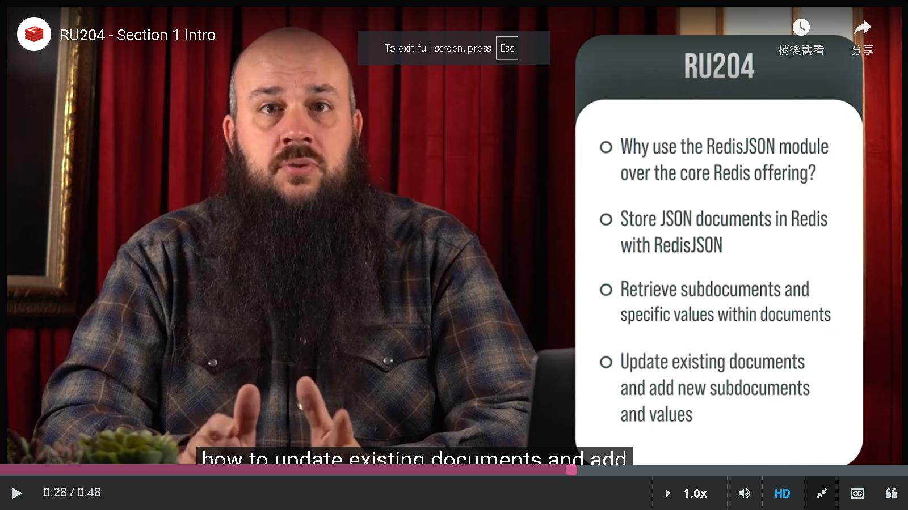
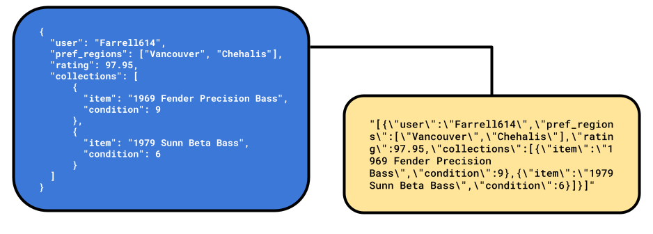
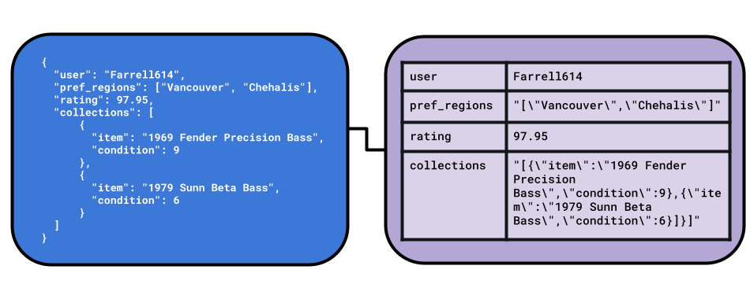
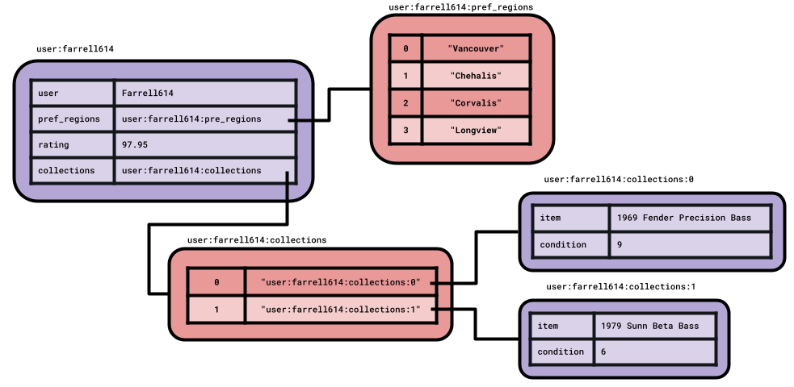

### Summary from RU204 

#### Prologue 

#### I. Managing JSON Data in Redis
Welcome to the first section of RU204, Managing JSON Data in Redis. In the next four units, you'll learn the following, the rationale for using the [Redis JSON](https://redis.io/json/) module over the core Redis offering, how to store JSON documents in Redis with Redis JSON, how to retrieve subdocuments and specific values within documents, how to update existing documents and add new subdocuments and values. 

Each unit will have a hands-on exercise designed to explore the topics covered and solidify your Redis JSON skills. Since the goal of this section is to familiarize you with Redis JSON, the exercises will be based on entering commands into the Command Line Interface to demonstrate common actions performed on JSON documents.

1. Storing and Retrieving JSON with Redis Strings

The traditional approach to storing JSON documents in Redis has been to serialize them to Strings. Serialization happens in application code, with the resulting String value saved in Redis using the SET command.

Reading or updating JSON documents stored in this way can be a costly operation. The entire document needs to be retrieved from Redis, and deserialized back to its original form, a process that usually happens in your application's code.

Serialized JSON Documents cannot be updated by Redis String commands. The process of retrieving, deserializing, updating, re-serializing, then re-storing the document to update a single field would be considered an expensive set of operations for both Redis and the client application.

A more efficient solution than a String could be the Hash data type. Hashes store multiple field-value pairs at a single key. Accessing Hash values is a constant-time complexity operation, so this is a valid solution. When serializing JSON to a Redis Hash, we can only go one level deep, so arrays and embedded objects in the JSON document still need to be serialized to String values or modeled in a different way.

Using more of the native data types in Redis, Lists and Hashes could be created for a JSON document's nested objects. This would require a document to be broken up and stored in multiple different Redis keys. Creating, reading, updating and deleting a document would require multiple calls to Redis as well as incurring the overhead required to marshall data between Redis data types and JSON. This approach can quickly become unwieldy and should be considered an anti-pattern, as the goal of Redis is for speed and efficiency.

2. 
3. 
4. 
5. 

#### II. Application Development with RedisJSON

1. 
2. 
3. 
4. 
5. 

#### III. Indexing and Searching JSON Documents

1. 
2. 
3. 
4. 
5. 

#### IV. Indexing and Searching in Your Application

1. 
2. 
3. 
4. 
5. 

#### V. Advanced Topics

1. 
2. 
3. 
4. 
5. 

#### Epilogue 

### EOF (2024/09/27) 
