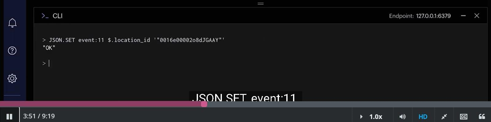
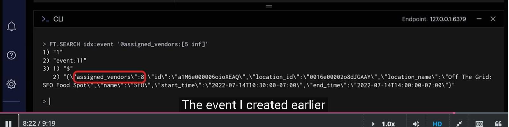

### Summary from RU204 


#### Prologue 


#### I. Managing JSON Data in Redis
Welcome to the first section of RU204, Managing JSON Data in Redis. In the next four units, you'll learn the following, the rationale for using the [Redis JSON](https://redis.io/json/) module over the core Redis offering, how to store JSON documents in Redis with Redis JSON, how to retrieve subdocuments and specific values within documents, how to update existing documents and add new subdocuments and values. 


Each unit will have a hands-on exercise designed to explore the topics covered and solidify your Redis JSON skills. Since the goal of this section is to familiarize you with Redis JSON, the exercises will be based on entering commands into the Command Line Interface to demonstrate common actions performed on JSON documents.

##### 1. Storing and Retrieving JSON with Redis Strings

The traditional approach to storing JSON documents in Redis has been to *serialize* them to Strings. Serialization happens in application code, with the resulting String value saved in Redis using the `SET` command.

Reading or updating JSON documents stored in this way can be a costly operation. The entire document needs to be retrieved from Redis, and *deserialized* back to its original form, a process that usually happens in your application's code.


Serialized JSON Documents cannot be updated by Redis String commands. The process of retrieving, deserializing, updating, re-serializing, then re-storing the document to update a single field would be considered an expensive set of operations for both Redis and the client application.


A more efficient solution than a String could be the Hash data type. Hashes store multiple field-value pairs at a single key. Accessing Hash values is a constant-time complexity operation, so this is a valid solution. When serializing JSON to a Redis Hash, we can only go one level deep, so arrays and embedded objects in the JSON document still need to be serialized to String values or modeled in a different way.


Using more of the native data types in Redis, Lists and Hashes could be created for a JSON document's nested objects. This would require a document to be broken up and stored in multiple different Redis keys. Creating, reading, updating and deleting a document would require multiple calls to Redis as well as incurring the overhead required to marshall data between Redis data types and JSON. This approach can quickly become unwieldy and should be considered an [anti-pattern](https://en.wikipedia.org/wiki/Anti-pattern), as the goal of Redis is for speed and efficiency.

--- 
In simple terms, an "anti-pattern" is a common solution to a problem that seems good at first but actually makes things worse in the long run. It's like a recipe for disaster in the world of problem-solving or software development. Just like how a bad cake recipe leads to a terrible cake, an anti-pattern can lead to problems, inefficiencies, or difficulties in projects or processes. It's something you want to avoid if you want things to work smoothly and efficiently.

##### 2. Introducing RedisJSON

RedisJSON is a component within Redis Stack that lets you store, update and retrieve JSON documents in Redis as a native data type. With RedisJSON, documents can be updated atomically and efficiently in-place in Redis. Your application code no longer needs to read an entire document from Redis or deal with serialization and deserialization in order to update or retrieve document fragments.

RedisJSON allows users to store a JSON document at a single Redis key regardless of depth or child data types. There are no additional keys or data structure mappings required. JSON document fragments can also be viewed and modified without retrieving the entire object - saving a lot of custom application code, time and network bandwidth.

Here are some key features of RedisJSON:

- Full support for the JSON standard: JSON created and utilized by programming languages and their frameworks can be natively stored in Redis.

- JSONPath syntax for selecting/updating elements inside documents: individual and multiple values can be selected and retrieved using the standard JSONPath syntax.

- New commands enabling atomic operations on all JSON value types.

`Commands`

RedisJSON adds many new commands to Redis. All RedisJSON commands have the "JSON." prefix. To store or update a document, we use `JSON.SET`. To retrieve either a complete document or a fragment of one, we'll use `JSON.GET`.

In this section, we'll introduce some RedisJSON commands, using the following simple document as our data source:

```
{
    "base_id": 18161,
    "author": " Jennifer L. Armentrout",
    "title": "Obsidian",
    "pages": 999,
    "inventory": [
        {
            "stock_number": "18161_1",
            "status": "on_loan"
        },
        {
            "stock_number": "18161_3",
            "status": "maintenance"
        }
    ],
    "genres": [
        "Young Adult",
        "Fantasy",
        "Science Fiction (Aliens) ",
        "Science Fiction"
    ]
}
```

2.1. Storing a JSON Document

To create a new JSON document in Redis, use the `JSON.SET` command:
```
JSON.SET ru204:book:18161 $ '{"base_id":18161,"author":"Jennifer L. Armentrout","title":"Obsidian","pages":999,"inventory":[{"stock_number":"18161_1","status":"on_loan"},{"stock_number":"18161_3","status":"maintenance"}],"genres":["Young Adult","Fantasy","Science Fiction (Aliens)","Science Fiction"]}'
```

Redis responds with: "OK". Notice the dollar sign **$** after the key name and before the JSON string in single quotes. This is a JSONPath that represents the root of the document. We'll see how to use this path to perform partial updates on existing documents later.


If you are using RedisInsight, you should see the document displayed as above when you navigate to `ru204:book/Keys/book:18161` in the key browser.

2.2. Setting a value within an existing JSON Document

The `JSON.SET` command is also used to update existing documents. For example, to change the number of pages in our book, we need to update the value of the "pages" field. As this field is at the root level, we use the JSONPath $.pages to identify it. To change the number of pages from 999 to 1025 for the book whose ID is 18161, use this command:
```
JSON.SET ru204:book:18161 $.pages 1025
```

Redis responds with: "OK"

$.pages refers to the pages field within the JSON document.

The JSONPath selector syntax to access embedded objects and arrays is similar to using dot notation when working with objects in JavaScript, or square brackets when working with dictionaries in Python.

2.3. Accessing a JSON Document

Use the `JSON.GET` command to retrieve RedisJSON documents from Redis. `JSON.GET` can be used to retrieve the entire document, multiple fields, or a single field.

Let's get the entire document for book 18161:
```
JSON.GET ru204:book:18161 $
```

Redis returns an array containing the JSON for book 18161:
```
"[{\"base_id\":18161,\"author\":\"Jennifer L. Armentrout\",\"title\":\"Obsidian\",\"pages\":999,\"inventory\":[{\"stock_number\":\"18161_1\",\"status\":\"on_loan\"},{\"stock_number\":\"18161_3\",\"status\":\"maintenance\"}],\"genres\":[\"Young Adult\",\"Fantasy\",\"Science Fiction (Aliens) \",\"Science Fiction\"]}]"
```

In the next module we'll examine how to use JSONPath expressions to retrieve single fields and parts of a document.

##### 3. [RedisJSON Explained Video](https://youtu.be/I-ohlZXXaxs)

Hello, and welcome back. In this video, we'll take a look at what's new with Redis JSON. The big news is that you can now efficiently query and index your JSON documents in Redis. I want to revisit my previous challenge of organizing my favorite food trucks in Oakland, but this time let's add some extra spice with JSON path syntax and querying documents with Redis search. Tuck in, and let's get started


To start, we'll fire up a [Redis Stack](https://redis.io/about/about-stack/) instance, which supports JSON, indexing, queries, and quite a bit more. We'll also be using [RedisInsight](https://redis.io/insight/), the Redis GUI, in these demos. Let's first check out the JSON we'll be working with. Our food trucks have been busy. Each food truck JSON object, known as a vendor, has a name, an array of cuisines offered, a primary cuisine, and an address. 


There are events about town that have a number of attending vendors, a start and end time, and an associated location ID. 


Lastly, there are locations that host events for the vendors. Locations contain an address object with coordinates providing the longitude and latitude. 


We can use these three JSON object types to discover which food trucks will be at certain locations during specific events. 


Let's start by inserting a new vendor JSON object into our Redis instance. Our new vendor is one of my favorites-- Tacos Mi Rancho. Here's the JSON object. We haven't inserted any event for Tacos Mi Rancho to attend yet. We'll do that in a bit. 


I'll call `JSON.SET` followed by a key name. I'll use the format truck colon and a unique ID number for each vendor. This is a new document. So I'll be storing it at the root path. I'll do this by setting the path option to the dollar sign followed by the JSON document in single quotes. 


Now we'll add another JSON document that we'll use to store details about a location. Here's a location JSON object representing the San Francisco International Airport. 


We'll store the entire JSON document in Redis in the same manner we used with the previous truck object. Only this time, the key name will be location:23. 


Finally, to bring everything together, we'll create a third document containing an event object. This object contains a location ID, start and end dates, and the number of vendors attending. 


Let's create an event at SFO on the 14th of July starting at 10:30 AM and ending at 2:00 PM. I'm converting the start time and end time to Unix timestamps, so we can query the dates. 


Now, we need to update our vendors that have the events within their object populated with all of the events that they are attending. Since the events property within the vendor is an array, I'll use an array append function. I'll call `JSON.ARRAPPEND`, truck:42, the JSON path, $.events, and lastly, the idea of the event. 


Events also need to take place at a location. Fortunately, we have JSON documents representing various locations within the Bay Area that will host the food trucks. Here's the JSON document for our location. Notice the info object within containing the address information and coordinates.


Redis JSON has no problem storing embedded objects-- a vast improvement over storing data as traditional flat hashes. Now, each event must have a location, so I'll insert the location ID into the event JSON with JSON.SET, event:11, $.location_id. 


I've shown you how to create and manipulate JSON documents in Redis with the newest version of Redis JSON. But did you know you can also index and query your JSON data? RediSearch, another component of Redis Stack, allows us to index data within our JSON documents and perform queries over a collection of documents. I'll show you how to do just that. 

I'm using Redis Stack, so RediSearch is already installed and ready to go. I'm going to create an index on a few select fields within my JSON data structure. This means I search using terms that I would expect to find within these fields. I want to search for a vendor's name, a particular cuisine, locations of events near me, or maybe events that have more than five food trucks, so we can enjoy some culinary variety. 


To do this, we'll want to create search indexes on the vendor and event documents. 


I'll start with the vendors. To create an index on all food trucks, I'll call `FT.CREATE` followed by a name. I'll call it idx:truck. `ON JSON` tells RediSearch that will be indexing and searching through JSON documents. `PREFIX 1` truck colon instructs RediSearch to look inside all documents of the key prefix truck colon. This means that all subsequent vendor documents should also have the truck colon key prefix. `SCHEMA` tells RediSearch to create indexes with ensuing property and search type pairs. $.name AS name `TEXT` allows us to search the name properties as text under the search field name. `SORTABLE` means we'll receive the return search results in a sortable list. 

The next line is a bit more complex. We're flagging everything within the array cuisines within the vendor object as a tag search type separated by commas. So as an example, if we had a cuisines array containing BBQ, barbecue, and Texas, all three will be counted as tags.

Now, I'll demonstrate searching using the index we just created. I'll look for the food truck we created by their name, Tacos Mi Rancho. Since they have the key, truck:42, RediSearch will have included this document in the index based on the truck colon prefix. 

I'll call `FT.SEARCH`, the index, idx:truck, then the query. Since I'll be searching for a name, I'll use @name to indicate I want to search within the name field of the JSON entries. I'll enter the word tacos as the search term. 


And I've received the vendor object for Tacos Mi Rancho. If I want to search using a phrase with multiple words, I'll want to wrap the entire query in single quotes like this.


Next, I'll search for a tag data type. Remember that we set the cuisines array in our vendor documents as a list of tags in our search index. This allows me to enter one of the tag words as a search term. I'll call `FT.SEARCH`, idx:truck, followed by the cuisines field. I want to find vendors with a tag word Peruvian within their cuisines array. So I'll enter Peruvian in curly braces. Note that when searching tags, the term must be wrapped in curly braces. 


Now, I want to create an index for our event JSON documents. For this index, I'll be searching through all keys with the prefix event colon. The `SCHEMA` will have three fields to search through-- $.assigned_vendors AS assigned_underscore `NUMERIC` `SORTABLE`. This indicates that assigned vendors will be a number. I'll want to be able to sort the results, so I'm including the option, `SORTABLE`. $.name will be treated the same as the vendor object's name. I'll set it as a text search type, and the results will be sortable. I want to treat $.location_name the same as name. I'll set it as location_name `TEXT`. 


Now, I'll try to find an event with five or more food trucks. I'll call `FT.SEARCH`, specifying idx:event as the index the search. In my query, @assigned_vendors tells RediSearch the field to look at and 5 and infinite in square brackets to find the range of values to search for. 


---
Pro tip-- if I wanted to search for events with exactly five assigned vendors, I would simply set the range from 5 to 5. The event I created earlier is returned since it has eight assigned vendors. 

---

That's a lot of delicious options. OK. That was a lot of info to go over. If you'd like to learn more about the new Redis JSON and how well it interacts with RediSearch at your own pace, check out our new Redis University course, [RU204](https://redis.io/university/courses/ru204/), Storing, Querying, and Indexing JSON at Speed. It's just one of many courses available to you covering specific topics within Redis. If you'd like to try it out Redis Stack, use one of the links in the video description below. You can download Redis Stack, or you can provision a basic instance in the cloud for free. No installation or local configuration necessary. Thanks for watching. I hope you enjoy these delicious new updates to Redis JSON and find them just as appetizing as I do.

##### 4. Hands-On Exercise

The goal of this exercise is to become familiar with storing and retrieving simple JSON documents in Redis. If you have any questions or difficulties, don't hesitate to ask for clarification in the [ru204](https://discord.com/channels/697882427875393627/910996015266558022) channel in Discord, we are more than happy to help.

Before continuing with this challenge, you should have a Redis instance running with the RU204 data loaded. If you haven't done so already, refer to the instructions here.

`Document creation`

4.1. Store a JSON Document in Redis

To create a new JSON document in Redis, use the JSON.SET command. The command format is:
```
JSON.SET KEY $ JSONSTRING
```

- **KEY**: The name of the Redis key that the document will be stored at. The key naming convention is at the discretion of the developer. We recommend using colons  :  between words to build up a key name that describes the contents of the document. For RU204, the data set consists of documents each of which is about a book. Each book has its own unique ID. Therefore, our keys have the format **ru204:book:<book_id>**. For this exercise you'll store a document whose key is **ru204:exercise:1.2.1**

- **$**: this is the JSONPath symbol representing the root level of the new document. When updating an existing document, you use a JSONPath expression representing the section of the document to modify. You should always use $ as the JSONPath when creating a new document.

- **JSONSTRING**: This is the JSON encoded string representing the document to store. Ensure that the JSON string uses double quotes around the properties and string values. The entire JSONSTRING must be wrapped in single quotes. For this example the JSONSTRING will be:
```
'{"course":"ru204", "exercise": "1.2.1", "status":"complete"}'
```

In RedisInsight or at the redis-cli, enter the complete command:
```
JSON.SET ru204:exercise:1.2.1 $ '{"course":"ru204", "exercise": "1.2.1", "status":"complete"}'
```

If you receive an "OK" response from Redis then you have successfully stored your first JSON document in Redis!

4.2. Retrieve an existing JSON Document from Redis

Now that we have stored our first JSON document into our database, we can retrieve all or a some of it back with the `JSON.GET` command. The command structure is similar to the `JSON.SET` command in the previous step:
```
JSON.GET ru204:exercise:1.2.1 $
```

After the `JSON.GET` command, we provide the name of the key we want followed by the JSONPath expression $, meaning that we want to retrieve all of the document from its root. This command returns the document contained within square brackets in quotes:
```
"[{\"course\":\"ru204\",\"exercise\":\"1.2.2\",\"status\":\"complete\"}]"
```

Lets try retrieving a book object from the preloaded data set. Call `JSON.GET` on the book with the key ru204:book:687:
```
JSON.GET ru204:book:687 $
```

Redis returns the following response containing the JSON document stored at ru204:book:687.
```
"[{\"author\":\"David Brin\",\"id\":\"687\",\"description\":\"In all the universe, no species reached for the stars without \xe2\x80\x9cuplift\xe2\x80\x9d guidance, except possibly humankind. Did some cryptic patron race begin the job long ago, then abandon us? Or did we leap all by ourselves? That question burns, yet a greater mystery looms ahead, in the furnace of a star. Under the caverns of Mercury, Expedition Sundiver prepares for the most momentous voyage in our history \xe2\x80\x93 into the boiling inferno of the sun, seeking our destiny in the cosmic order of life.\",\"editions\":[\"english\"],\"genres\":[\"fantasy\",\"fiction\",\"mystery\",\"novels\",\"science fiction\",\"science fiction (aliens)\",\"science fiction fantasy\",\"space\",\"space (space opera)\",\"speculative fiction\"],\"inventory\":[{\"status\":\"available\",\"stock_id\":\"687_1\"},{\"status\":\"available\",\"stock_id\":\"687_2\"},{\"status\":\"on_loan\",\"stock_id\":\"687_3\"},{\"status\":\"available\",\"stock_id\":\"687_4\"},{\"status\":\"maintenance\",\"stock_id\":\"687_5\"},{\"status\":\"on_loan\",\"stock_id\":\"687_6\"},{\"status\":\"available\",\"stock_id\":\"687_7\"}],\"metrics\":{\"rating_votes\":23721,\"score\":3.69},\"pages\":710,\"title\":\"Sundiver\",\"url\":\"https://www.goodreads.com/book/show/96472.Sundiver\",\"year_published\":1980}]"
```

Note that this response is contained in an array. This is because `JSON.GET` can accept multiple JSONPaths, returning the matching parts of the document as a single array response. This is something that we'll explore later.

##### 5. Retrieving Data with RedisJSON

The key to efficient data retrieval with RedisJSON is a good understanding of the JSONPath syntax. Using the correct JSONPath expression ensures that only the data that your application needs is returned by Redis. This saves time and data transfer bandwidth between your application and the Redis Server. Let's see how JSONPath expressions can help us retrieve book data from the course data set.

JSONPath expressions begin with the dollar sign $, representing the root of the document.

The following table shows the JSONPath operators supported by RedisJSON:

| JSONPath Selector | Description |
| ----------- | ----------- |
| $ | the root object or element |	
| @ | current object or element |
| . | child operator, used to denote a child element of the current element |
| .. | recursive scan |
| * | wildcard, returning all objects or elements regardless of their names |
| [] | subscript operator / array operator |
| , | union operator, returns the union of the children or indexes indicated |
| : | array slice operator; you can slice arrays using the syntax [start:step] |
| () | lets you pass a script expression in the underlying implementation’s script language |
| ?() | applies a filter/script expression to query all items that meet certain criteria |

5.1. Retrieving a Document

Use the `JSON.GET` command to retrieve an existing JSON document from Redis. `JSON.GET` can be used to retrieve the entire document, multiple fields, or a single field. The JSONPath $ after the key name retrieves the entire document (from root level).

When we run the command:
```
JSON.GET ru204:book:18161 $
```
We get the following JSON document response from Redis:
```
"[{\"base_id\":18161,\"author\":\"Jennifer L. Armentrout\",\"title\":\"Obsidian\",\"pages\":999,\"inventory\":[{\"stock_number\":\"18161_1\",\"status\":\"on_loan\"},{\"stock_number\":\"18161_3\",\"status\":\"maintenance\"}],\"genres\":[\"Young Adult\",\"Fantasy\",\"Science Fiction (Aliens) \",\"Science Fiction\"]}]"
```

Note that this response is contained in an array. This is because `JSON.GET` can accept multiple JSONPaths, returning the matching parts of the document as a single array response. This is something that we'll explore later.

5.2. Retrieve a single field from a document

To retrieve a single field at the root level of a document, we use a JSONPath expression consisting of the $ (root) followed by a dot . and the name of the desired field. To retrieve the page count of our book object, we'll use the JSONPath expression **$.pages**
```
JSON.GET ru204:book:18161 $.pages
```

Redis responds with:
```
"[999]"
```

5.3. Retrieve a field within an embedded object or list

Recall that our book object contains an "inventory" array, containing information about the status of each copy of the book in the library system:
```
"inventory": [
    {"stock_number": "18161_1","status": "on_loan"},
    {"stock_number": "18161_3","status": "maintenance"}
]
```

Let's create a JSONPath expression to retrieve the value of the "status" field from the first object in the inventory array. First use bracket notation to access the desired element. A second dot notation child operator . is then necessary to access the "status" field. The final JSONPath expression is: **$.inventory[0].status**
```
JSON.GET ru204:book:18161 $.inventory[0].status
```

Redis responds with:
```
"[\"on_loan\"]"
```

5.4. Retrieve multiple fields with one JSONPath Expression

JSONPath allows us to select multiple paths in a single expression. To select multiple paths with different property names, list each one in the `JSON.GET` command with a full JSONPath expression:
```
JSON.GET ru204:book:18161 $.title $.author $.genres[0]
```

Redis responds with:
```
"{\"$.author\":[\"Jennifer L. Armentrout\"],\"$.genres[0]\":[\"Young Adult\"],\"$.title\":[\"Obsidian\"]}"
```

To select all fields named "status" no matter where they occur in the document, use two dots before the field name. Here, we're looking for all fields names "status" no matter where they occur in the document:

**$..status**

Note that this captures all fields named "status" including those in nested objects, and objects inside arrays.

$.. refers to all fields available descended from root (recursively).

$..status captures all status fields that are descended from root.
```
JSON.GET ru204:book:18161 $..status

"[\"on_loan\",\"maintenance\"]"
```

This command searches for all fields titled "status" and returns an array of their values.

5.5. Find the length of an array within a document

RedisJSON provides data-type specific commands to return values and properties of a stored document. The command `JSON.ARRLEN` returns the number of elements in an embedded array inside a document.
```
JSON.ARRLEN ru204:book:18161 $.inventory
```

Redis responds:
```
"2"
```

This is an efficient method to retrieve the length of an array without fetching its contents into your application, thus saving network traffic and client work.

5.6. Retrieve the same property from multiple documents

The command `JSON.MGET` retrieves one property from multiple documents. Let's gather the titles from the documents **ru204:book:18161** and **ru204:book:684**:
```
JSON.MGET ru204:book:18161 ru204:book:684 $.title
```

Redis returns:
```
1) "[\"Obsidian\"]"
2) "[\"Odyssey One\"]"
```

Note that key order is preserved in the response, so "Obsidian" is the title of the book whose key is **ru204:book:18161** and "Odyssey One" is the title of the book whose key is **ru204:book:684**.

Let's collect the genres arrays for both book documents:
```
JSON.MGET ru204:book:18161 ru204:book:684 $.genres
```

Redis returns:
```
1) "[[\"Young Adult\",\"Fantasy\",\"Science Fiction (Aliens) \",\"Science Fiction\"]]"
2) "[[\"adventure\",\"audiobook\",\"fiction\",\"science fiction\",\"science fiction (aliens)\",\"science fiction (military science fiction)\",\"space\",\"space (space opera)\",\"war\",\"war (military fiction)\"]]"
```

In the next module we'll explore how to update documents by amending existing properties and adding new ones.

##### 6. Hands-On Exercise

In this exercise you will explore a few JSONPath expressions to retrieve specific fragments of a stored document. You'll be using the `JSON.GET` command and writing JSONPath expressions so that you can select a specific intended target or retrieve all fragments that match a given criteria. These exercises won't cover all possibilities, but will provide examples of the most common use cases. Refer to the [JSONPath documentation](https://goessner.net/articles/JsonPath/) for a full explanation of the expressions.

Retrieve a single value from a document

In this exercise, we will use the book object `ru204:book:206`. To only retrieve the title property of the JSON document, we use the JSONPath expression $.title. Recall that $ represents the root level of the JSON document. JSONPath uses dot notation similar to Javascript to navigate properties.

6.1. Retrieve a single property from a document

Enter the following command to retrieve the title of the book object:
```
JSON.GET ru204:book:206 $.title
```

Redis responds with the value in an array:
```
"[\"Timeless: Diego and the Rangers of the Vastlantic\"]"
```

Using the JSONPath expression to retrieve only one property saves bandwidth by avoiding returning the entire JSON object, which can be costly and inefficient.

6.2. Retrieve an element of an array in a document

Accessing an array within a document begins with using dot notation to identify the property containing the array. Bracket notation is then used to access individual elements of the array, similar to Javascript and other programming languages.

The book object **ru204:book:206** contains an inventory array. Lets access the first element within that array, remembering that arrays are zero-indexed.
```
JSON.GET ru204:book:206 $.inventory[0]
```

Redis responds with:
```
"[{\"status\":\"available\",\"stock_id\":\"206_1\"}]"
```

In the command above, the JSONPath expression first specifies the path to the inventory array. It then seeks out the element at index 0. In this case, the return value is an object.

This command retrieves the element at index 3 of the array genres within the stored document:
```
JSON.GET ru204:book:206 $.genres[3]
```

Redis responds with:
```
"[\"fantasy\"]"
```

6.3. Retrieve a property within an element of an array

Dot notation may further be used to access properties within the objects stored inside the inventory array. Here is an example of accessing the stock_id of the second element of the inventory array (at index 1):
```
JSON.GET ru204:book:206 $.inventory[1].stock_id
```

Redis returns the stock_id value:
```
"[\"206_2\"]"
```

Retrieving Multiple Elements

6.1. Recursive scanning for properties

JSON documents stored in Redis can be traversed recursively to find specific properties wherever they occur in the document's structure. These properties do not need to be on the same depth or within the same data type.

Lets retrieve all stock_id properties of the book **ru204:book:206**:
```
JSON.GET ru204:book:206 $..stock_id
```

Redis returns a list of all stock_id values:
```
"[\"206_1\",\"206_2\",\"206_3\",\"206_4\",\"206_5\",\"206_6\",\"206_7\"]"
```

The double dot notation after the dollar sign $ and before the property name is a JSONPath expression that signifies that the command should recursively traverse the entire object and retrieve all values associated with the property name of stock_id. Redis then returns a list of all retrieved values.

6.2. Array Slice Operations
JSONPath uses the colon : operator within bracket notation selection to select a range of elements within an array.

This example retrieves all of the elements of the inventory array from index 2 until index 4:
```
JSON.GET ru204:book:206 $.inventory[2:4]
```

Redis returns:
```
"[{\"status\":\"available\",\"stock_id\":\"206_3\"},{\"status\":\"maintenance\",\"stock_id\":\"206_4\"}]"
```

Notice the bracket notation selector [2:4]. This means the JSONPATH expression is to capture the elements starting at index 2 and up to but not including index 4.

This next example retrieves all of the elements from the beginning of the array up to but not including index 3:
```
JSON.GET ru204:book:206 $.inventory[:3]
```

Redis returns:
```
"[{\"status\":\"available\",\"stock_id\":\"206_1\"},{\"status\":\"maintenance\",\"stock_id\":\"206_2\"},{\"status\":\"available\",\"stock_id\":\"206_3\"}]"
```

The bracket notation selector [:3] signifies that all elements from the beginning will be captured up to but not including index 3.

Alternatively, a bracket notation selector of [3:]retrieves all elements from index 3 to the end of the array:
```
JSON.GET ru204:book:206 $.inventory[3:]
```

Redis returns:
```
"[{\"status\":\"maintenance\",\"stock_id\":\"206_4\"},{\"status\":\"on_loan\",\"stock_id\":\"206_5\"},{\"status\":\"available\",\"stock_id\":\"206_6\"},{\"status\":\"maintenance\",\"stock_id\":\"206_7\"}]"
```

Miscellaneous

6.1. Retrieving the length of a string in a document

The `JSON.STRLEN` command returns the length of a string value within a document. Lets check the length of the title in the document **ru204:book:206**:
```
JSON.STRLEN ru204:book:206 $.title
```

Redis responds with:
```
49
```

Redis selects the title property and returns the length of the title value "Timeless: Diego and the Rangers of the Vastlantic".

##### 7. Updating Data with RedisJSON

RedisJSON includes many commands specifically designed for updating each of the data types used in JSON documents. These include the ability to atomically update parts of a document on the Redis server without the complexities, performance issues and network bandwidth associated with handling this in your application code. Let's begin with a look at how to efficiently and atomically update an array in a JSON document stored in Redis.

Updating Arrays in a JSON Document

7.1. Adding an element to an array with `JSON.ARRAPPEND`

`JSON.ARRAPPEND` pushes one or more new elements onto the right of a given array. This can be compared to an `RPUSH` command when working with Redis Lists.

Let's add a new copy of book 18161 to the inventory array of the JSON document stored at **ru204:book:18161**:
```
JSON.ARRAPPEND ru204:book:18161 $.inventory '{"stock_number": "18161_5","status": "maintenance"}'
```

Redis returns the new length of the array that was appended to:
```
3
```

7.2. Inserting a new element into an array with `JSON.ARRINSERT`

The `JSON.ARRINSERT` command extends the functionality of `JSON.ARRAPPEND` by providing an index argument. This command allows the insertion of a new element directly before the provided index (thus shifting the original index element to the right). Using 0 as an index inserts the element at the beginning of the array. Using -1 as the index inserts the element at the end of the array.

This command inserts a new object in the book inventory array at index position 1:
```
JSON.ARRINSERT ru204:book:18161 $.inventory 1 '{"stock_number": "18161_2","status": "available"}'
```

Redis responds with the new length of the array:
```
4
```

This command inserts a new object into the book inventory array at index position 3:
```
JSON.ARRINSERT ru204:book:18161 $.inventory 3 '{"stock_number": "18161_2","status": "available"}'
```
Again, the response from Redis contains the new length of the array:
```
5
```

7.3. Removing elements from an array with `JSON.ARRPOP`

Use the `JSON.ARRPOP` command to remove elements from an array. By default, `JSON.ARRPOP` removes the last element of a specified array within a document. When an optional index argument is provided, `JSON.ARRPOP` removes and returns the element at that index.

This command removes the last element in the inventory array of the ru204:book:18161 document:
```
JSON.ARRPOP ru204:book:18161 $.inventory
```

Redis responds with the element that was removed:
```
"{\"stock_number\":\"18161_5\",\"status\":\"maintenance\"}"
```

This command removes the element at index 2 of the inventory array:
```
JSON.ARRPOP ru204:book:18161 $.inventory 2
```

Again, Redis responds with the element that was removed:
```
"{\"stock_number\":\"18161_3\",\"status\":\"maintenance\"}"
```

Updating numerical data in a JSON document

RedisJSON includes commands similar to the Redis `INCRBY` command to handle atomic addition and subtraction operations on numerical data stored in a JSON document. This is useful for incrementing page views, adjusting inventory counts, and any situation where only the value needs to be updated, not the entire document.

Here is a command that we can use to keep a count of the total number of times a specific book title has been checked out to a user. Each time a user checks out a book to read, the system runs this to increment the **checked_out** value by 1:

First, lets create a checked_out property within the book document:
```
JSON.SET ru204:book:18161 $.checked_out 0
```

Then let's call the `JSON.NUMINCRBY` command:

JSON.NUMINCRBY ru204:book:18161 $.checked_out 1

Redis responds with:
```
[1]
```

And if we run the same command again, we can see that Redis updates the value stored at $.checked_out to 2:
```
JSON.NUMINCRBY ru204:book:18161 $.checked_out 1
```

Redis responds with an updated value:
```
[2]
```

To decrement a numerical value, use a negative number. Let's add some ratings metrics to the document **ru204:book:18161** then decrement the rating_votes stored within:
```
JSON.SET ru204:book:18161 $.metrics '{"rating_votes":784, "score":3.97}'
```

Now let's call `JSON.NUMINCRBY` on the property ratings_votes with a negative value:
```
JSON.NUMINCRBY ru204:book:18161 $.metrics.rating_votes -10
```

Redis responds with the new value stored at $.metrics.rating_votes:
```
[774]
```

It should be noted that numerical values within a document **MUST** exist before performing commands upon them.

Updating strings in a JSON document

7.1. Updating a string value in a JSON document

To change the value of a string within a document, use the JSON.SET command. Let's change the value of author from Jennifer L Armentrout to Jennifer Lynn Armentrout:
```
JSON.SET ru204:book:18161 $.author '"Jennifer Lynn Armentrout"'
```

Appending to a string value in a JSON document

The command `JSON.STRAPPEND` provides a simple method to add a string to the end of an existing string within a document. Let's maybe add the suffix ", Esq."
```
JSON.STRAPPEND ru204:book:18161 $.author '", Esq."'
```

Redis returns the new length of the string:
```
30
```

Updating boolean data in a JSON document

Boolean values in a document can be quickly "flipped" by using the `JSON.TOGGLE` command. Let's add a property **has_ebook_version** and set it to **false**:
```
JSON.SET ru204:book:18161 $.has_ebook_version false
```

Note that booleans do not need any quotes around them as they are interpreted by Redis as boolean true or false.

Now when the `JSON.TOGGLE` command is called on the value, the boolean state is flipped:
```
JSON.TOGGLE ru204:book:18161 $.has_ebook_version
```

Redis responds with a numeric representation of the new boolean state:
```
1
```

Removing properties from a JSON document

Use the `JSON.DEL` command to remove a property and its associated value from a JSON document.

Let's remove the entire **genres** array from the **ru204:book:18161** document:
```
JSON.DEL ru204:book:18161 $.genres
```

Redis returns the number of properties successfully removed; in this case one:
```
1
```

While it is important to understand how to use the Redis CLI to use the RedisJSON commands to create and maintain documents within Redis, most developers will want to perform these operations from their application code directly. In the next section, we will explore how to manage JSON documents in Redis using popular Redis client libraries for commonly used programming languages.

##### 8. Hands-On Exercise

In this exercise you will update existing RedisJSON documents with new properties and new values. While we will be using every command covered in this unit, this is not an exhaustive list of commands available in RedisJSON. Refer to the [RedisJSON command documentation](https://redis.io/commands/?group=json) for a full list of available commands.

Adding new properties to an existing document

8.1. Adding a new property and value to a document

The `JSON.SET` command can be used to add property value pairs to any existing document. In this exercise we will be using the data set of book objects, specifically the object **ru204:book:425**

Let's add a publisher property with the value "Simon and Schuster" to the object:
```
JSON.SET ru204:book:425 $.publisher '"Simon and Schuster"'
```

Redis responds with "OK" when the document has been updated.

The `JSON.SET` command will accept the JSONPath **$.publisher** as a new property if it doesn't already exist. For the value, the string must be a valid JSON string, which requires that it be encased in double quotes as well as single quotes.

8.2. Adding an array to an existing document

Arrays and objects can also be added to documents with the `JSON.SET` command. Lets add an array of available book formats ["paperback", "hardcover", "audio book", ".epub", ".txt"] to the book document:
```
JSON.SET ru204:book:425 $.formats '["paperback", "hardcover", "audio book", ".epub", ".txt"]'
```

Redis again responds with an "OK" when the document is updated.

8.3. Adding objects to existing documents

Objects can also be added with a similar pattern to an array. Let's add an object tracking checkout popularity amongst age groups to the **metrics** subdocument in the book **ru204:book:425**.
```
JSON.SET ru204:book:425 $.metrics.popularity '{"<18": 20, "18-25": 32, "26-35": 48, "36-45": 56, "46-55": 64, ">55": 37}'
```

Redis responds with "OK".

8.4. Adding an element to an array in an existing document

To add an element to an existing array within a document, RedisJSON offers two commands: `ARRAPPEND` and `ARRINSERT`.

`ARRAPPEND` appends an element to the end of a given array within a document. Lets add another book into the inventory array of the book object **ru204:book:425**:
```
JSON.ARRAPPEND ru204:book:425 $.inventory '{"status":"available","stock_id":"425_10"}'
```

Redis returns 10 as the new length of the array inventory.

`ARRINSERT` allows the client to insert an element into the array at a given index. This is useful when the order of elements is important. The **genres** array in each book is maintained in alphabetical order, so lets add a new genre **futuristic** at index 4.
```
JSON.ARRINSERT ru204:book:425 $.genres 4 '"futuristic"'
```

Redis responds with 11, the new length of the array.

8.5. Removing an element from an array in an existing document

RedisJSON provides the `ARRPOP` command to remove an element from an array within a document. Normally, a list pop function removes the last element within an array; this is the default behavior of `ARRPOP` when an index argument is not provided. `ARRPOP` will remove an element at any position in the array when an index is provided.

Let's remove the the genre **fiction** from our book object **ru204:book:425**:
```
JSON.ARRPOP ru204:book:425 $.genres 3
```

The return value is the element fiction "popped" from the list.

Updating existing properties in a document

8.1. Updating an existing property's value in a document

To update an existing property with a known value in a document, the JSON.SET command can again be used. The full command is similar to adding a new property and value to an existing document:
```
JSON.SET ru204:book:425 $.publisher '"Random House"'
```

Redis responds with an "OK".

8.2. Updating an existing array element in a document

To update an existing value within an array in a document, the `JSON.SET` command should be used. Let's set the status of one of the books in our inventory for **ru204:book:425** from **maintenance** to **available**. We will use bracket notation to access the specific element within the array then dot notation to target the status property.
```
JSON.SET ru204:book:425 $.inventory[7].status '"available"'

"OK"
```

Working with numbers in existing documents

Practice using the `JSON.NUMINCRBY` command by increasing the **rating_votes** count by 23. **rating_votes** is stored within the **metrics** subdocument of the book object. Let's continue using the document **ru204:book:425**:
```
JSON.NUMINCRBY ru204:book:425 $.metrics.rating_votes 23
```

Redis responds with the updated value for rating_votes:
```
[3436]
```

The `JSON.NUMINCRBY` command may also be used to decrement numerical values as well. Using a negative number performs subtraction upon any numerical value within the document. Let's reduce the **rating_votes** by 10:
```
JSON.NUMINCRBY ru204:book:425 $.metrics.rating_votes -10
```

Redis responds with the updated value for rating_votes:
```
[3426]
```

Removing elements, arrays, objects, properties, and documents

The `JSON.DEL` command can be used to remove properties of an existing document or delete an entire existing document.

Let's remove the last book from the inventory array in the object **ru204:book:425**:
```
JSON.DEL ru204:book:425 $.inventory[-1]
```

Redis responds with the number of properties deleted:
```
1
```

Now let's remove the document entirely from Redis:
```
JSON.DEL ru204:book:425
```

Redis responds with the number of documents deleted:
```
1
```

Let's add the book **ru204:book:425** back to our documents collection for future use:
```
JSON.SET ru204:book:425 $ '{  "author":"Sophie Littlefield",  "id":"425",  "description":  "Awakening in a bleak landscape as scarred as her body, Cass Dollar vaguely recalls surviving something terrible. Having no idea how many weeks have passed, she slowly realizes the horrifying truth: Ruthie has vanished.And with her, nearly all of civilization.Where once-lush hills carried cars and commerce, the roads today see only cannibalistic Beaters -- people turned hungry for human flesh by a government experiment gone wrong.In a broken, barren California, Cass will undergo a harrowing quest to get Ruthie back. Few people trust an outsider, let alone a woman who became a zombie and somehow turned back, but she finds help from an enigmatic outlaw, Smoke. Smoke is her savior, and her safety.For the Beaters are out there.And the humans grip at survival with their trigger fingers. Especially when they learn that she and Ruthie have become the most feared, and desired, of weapons in a brave new worldxe2x80xa6.",  "editions":["english","spanish","french"],  "genres":["apocalyptic (post apocalyptic)","fantasy (paranormal)","fantasy (urban fantasy)","futuristic","horror","horror (zombies)","science fiction","science fiction (apocalyptic)","science fiction (dystopia)","young adult"],  "inventory":[    {"status":"maintenance","stock_id":"425_1"},{"status":"maintenance","stock_id":"425_2"},{"status":"maintenance","stock_id":"425_3"},{"status":"available","stock_id":"425_4"},{"status":"on_loan","stock_id":"425_5"},{"status":"available","stock_id":"425_6"},{"status":"available","stock_id":"425_7"},{"status":"available","stock_id":"425_8"},{"status":"maintenance","stock_id":"425_9"},{"status":"available","stock_id":"425_10"}  ],    "metrics":{      "rating_votes":3459,      "score":3.54,      "popularity":{"<18":20,"18-25":32,"26-35":48,"36-45":56,"46-55":64,">55":37}    },  "pages":738,  "title":"Aftertime",  "url":"https://www.goodreads.com/book/show/9065272-aftertime",  "year_published":2011,  "publisher":"Random House",  "formats":["paperback","hardcover","audio book",".epub",".txt"]}'
Redis returns an "OK" meaning the document has been successfully created:

"OK"
```


#### II. Application Development with RedisJSON

1. 
2. 
3. 
4. 
5. 


#### III. Indexing and Searching JSON Documents

1. 
2. 
3. 
4. 
5. 


#### IV. Indexing and Searching in Your Application

1. 
2. 
3. 
4. 
5. 


#### V. Advanced Topics

1. 
2. 
3. 
4. 
5. 


#### Epilogue 


### EOF (2024/09/27) 
