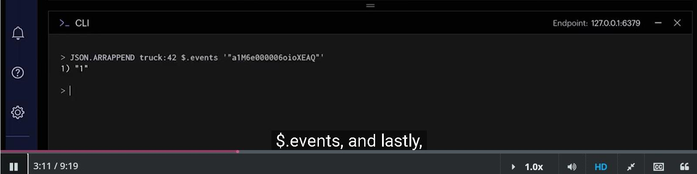
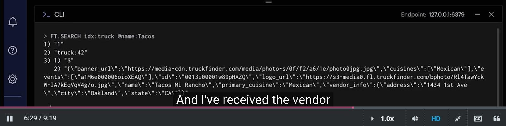

### Summary from RU204 


#### Prologue 


#### I. Managing JSON Data in Redis
Welcome to the first section of RU204, Managing JSON Data in Redis. In the next four units, you'll learn the following, the rationale for using the [Redis JSON](https://redis.io/json/) module over the core Redis offering, how to store JSON documents in Redis with Redis JSON, how to retrieve subdocuments and specific values within documents, how to update existing documents and add new subdocuments and values. 


Each unit will have a hands-on exercise designed to explore the topics covered and solidify your Redis JSON skills. Since the goal of this section is to familiarize you with Redis JSON, the exercises will be based on entering commands into the Command Line Interface to demonstrate common actions performed on JSON documents.

##### 1. Storing and Retrieving JSON with Redis Strings

The traditional approach to storing JSON documents in Redis has been to *serialize* them to Strings. Serialization happens in application code, with the resulting String value saved in Redis using the `SET` command.

Reading or updating JSON documents stored in this way can be a costly operation. The entire document needs to be retrieved from Redis, and *deserialized* back to its original form, a process that usually happens in your application's code.


Serialized JSON Documents cannot be updated by Redis String commands. The process of retrieving, deserializing, updating, re-serializing, then re-storing the document to update a single field would be considered an expensive set of operations for both Redis and the client application.


A more efficient solution than a String could be the Hash data type. Hashes store multiple field-value pairs at a single key. Accessing Hash values is a constant-time complexity operation, so this is a valid solution. When serializing JSON to a Redis Hash, we can only go one level deep, so arrays and embedded objects in the JSON document still need to be serialized to String values or modeled in a different way.


Using more of the native data types in Redis, Lists and Hashes could be created for a JSON document's nested objects. This would require a document to be broken up and stored in multiple different Redis keys. Creating, reading, updating and deleting a document would require multiple calls to Redis as well as incurring the overhead required to marshall data between Redis data types and JSON. This approach can quickly become unwieldy and should be considered an [anti-pattern](https://en.wikipedia.org/wiki/Anti-pattern), as the goal of Redis is for speed and efficiency.

--- 
In simple terms, an "anti-pattern" is a common solution to a problem that seems good at first but actually makes things worse in the long run. It's like a recipe for disaster in the world of problem-solving or software development. Just like how a bad cake recipe leads to a terrible cake, an anti-pattern can lead to problems, inefficiencies, or difficulties in projects or processes. It's something you want to avoid if you want things to work smoothly and efficiently.

##### 2. Introducing RedisJSON

RedisJSON is a component within Redis Stack that lets you store, update and retrieve JSON documents in Redis as a native data type. With RedisJSON, documents can be updated atomically and efficiently in-place in Redis. Your application code no longer needs to read an entire document from Redis or deal with serialization and deserialization in order to update or retrieve document fragments.

RedisJSON allows users to store a JSON document at a single Redis key regardless of depth or child data types. There are no additional keys or data structure mappings required. JSON document fragments can also be viewed and modified without retrieving the entire object - saving a lot of custom application code, time and network bandwidth.

Here are some key features of RedisJSON:

- Full support for the JSON standard: JSON created and utilized by programming languages and their frameworks can be natively stored in Redis.

- JSONPath syntax for selecting/updating elements inside documents: individual and multiple values can be selected and retrieved using the standard JSONPath syntax.

- New commands enabling atomic operations on all JSON value types.

`Commands`

RedisJSON adds many new commands to Redis. All RedisJSON commands have the "JSON." prefix. To store or update a document, we use `JSON.SET`. To retrieve either a complete document or a fragment of one, we'll use `JSON.GET`.

In this section, we'll introduce some RedisJSON commands, using the following simple document as our data source:

```
{
    "base_id": 18161,
    "author": " Jennifer L. Armentrout",
    "title": "Obsidian",
    "pages": 999,
    "inventory": [
        {
            "stock_number": "18161_1",
            "status": "on_loan"
        },
        {
            "stock_number": "18161_3",
            "status": "maintenance"
        }
    ],
    "genres": [
        "Young Adult",
        "Fantasy",
        "Science Fiction (Aliens) ",
        "Science Fiction"
    ]
}
```

2.1. Storing a JSON Document

To create a new JSON document in Redis, use the `JSON.SET` command:
```
JSON.SET ru204:book:18161 $ '{"base_id":18161,"author":"Jennifer L. Armentrout","title":"Obsidian","pages":999,"inventory":[{"stock_number":"18161_1","status":"on_loan"},{"stock_number":"18161_3","status":"maintenance"}],"genres":["Young Adult","Fantasy","Science Fiction (Aliens)","Science Fiction"]}'
```

Redis responds with: "OK". Notice the dollar sign **$** after the key name and before the JSON string in single quotes. This is a JSONPath that represents the root of the document. We'll see how to use this path to perform partial updates on existing documents later.


If you are using RedisInsight, you should see the document displayed as above when you navigate to `ru204:book/Keys/book:18161` in the key browser.

2.2. Setting a value within an existing JSON Document

The `JSON.SET` command is also used to update existing documents. For example, to change the number of pages in our book, we need to update the value of the "pages" field. As this field is at the root level, we use the JSONPath $.pages to identify it. To change the number of pages from 999 to 1025 for the book whose ID is 18161, use this command:
```
JSON.SET ru204:book:18161 $.pages 1025
```

Redis responds with: "OK"

$.pages refers to the pages field within the JSON document.

The JSONPath selector syntax to access embedded objects and arrays is similar to using dot notation when working with objects in JavaScript, or square brackets when working with dictionaries in Python.

2.3. Accessing a JSON Document

Use the `JSON.GET` command to retrieve RedisJSON documents from Redis. `JSON.GET` can be used to retrieve the entire document, multiple fields, or a single field.

Let's get the entire document for book 18161:
```
JSON.GET ru204:book:18161 $
```

Redis returns an array containing the JSON for book 18161:
```
"[{\"base_id\":18161,\"author\":\"Jennifer L. Armentrout\",\"title\":\"Obsidian\",\"pages\":999,\"inventory\":[{\"stock_number\":\"18161_1\",\"status\":\"on_loan\"},{\"stock_number\":\"18161_3\",\"status\":\"maintenance\"}],\"genres\":[\"Young Adult\",\"Fantasy\",\"Science Fiction (Aliens) \",\"Science Fiction\"]}]"
```

In the next module we'll examine how to use JSONPath expressions to retrieve single fields and parts of a document.

##### 3. [RedisJSON Explained Video](https://youtu.be/I-ohlZXXaxs)

Hello, and welcome back. In this video, we'll take a look at what's new with Redis JSON. The big news is that you can now efficiently query and index your JSON documents in Redis. I want to revisit my previous challenge of organizing my favorite food trucks in Oakland, but this time let's add some extra spice with JSON path syntax and querying documents with Redis search. Tuck in, and let's get started


To start, we'll fire up a [Redis Stack](https://redis.io/about/about-stack/) instance, which supports JSON, indexing, queries, and quite a bit more. We'll also be using [RedisInsight](https://redis.io/insight/), the Redis GUI, in these demos. Let's first check out the JSON we'll be working with. Our food trucks have been busy. Each food truck JSON object, known as a vendor, has a name, an array of cuisines offered, a primary cuisine, and an address. 


There are events about town that have a number of attending vendors, a start and end time, and an associated location ID. 


Lastly, there are locations that host events for the vendors. Locations contain an address object with coordinates providing the longitude and latitude. 


We can use these three JSON object types to discover which food trucks will be at certain locations during specific events. 


Let's start by inserting a new vendor JSON object into our Redis instance. Our new vendor is one of my favorites-- Tacos Mi Rancho. Here's the JSON object. We haven't inserted any event for Tacos Mi Rancho to attend yet. We'll do that in a bit. 


I'll call `JSON.SET` followed by a key name. I'll use the format truck colon and a unique ID number for each vendor. This is a new document. So I'll be storing it at the root path. I'll do this by setting the path option to the dollar sign followed by the JSON document in single quotes. 


Now we'll add another JSON document that we'll use to store details about a location. Here's a location JSON object representing the San Francisco International Airport. 


We'll store the entire JSON document in Redis in the same manner we used with the previous truck object. Only this time, the key name will be location:23. 


Finally, to bring everything together, we'll create a third document containing an event object. This object contains a location ID, start and end dates, and the number of vendors attending. 


Let's create an event at SFO on the 14th of July starting at 10:30 AM and ending at 2:00 PM. I'm converting the start time and end time to Unix timestamps, so we can query the dates. 


Now, we need to update our vendors that have the events within their object populated with all of the events that they are attending. Since the events property within the vendor is an array, I'll use an array append function. I'll call `JSON.ARRAPPEND`, truck:42, the JSON path, $.events, and lastly, the idea of the event. 


Events also need to take place at a location. Fortunately, we have JSON documents representing various locations within the Bay Area that will host the food trucks. Here's the JSON document for our location. Notice the info object within containing the address information and coordinates.


Redis JSON has no problem storing embedded objects-- a vast improvement over storing data as traditional flat hashes. Now, each event must have a location, so I'll insert the location ID into the event JSON with `JSON.SET`, event:11, $.location_id. 


I've shown you how to create and manipulate JSON documents in Redis with the newest version of Redis JSON. But did you know you can also index and query your JSON data? [RediSearch](https://redis.io/search/), another component of Redis Stack, allows us to index data within our JSON documents and perform queries over a collection of documents. I'll show you how to do just that. 

I'm using Redis Stack, so RediSearch is already installed and ready to go. I'm going to create an index on a few select fields within my JSON data structure. This means I search using terms that I would expect to find within these fields. 

I want to search for a vendor's name, a particular cuisine, locations of events near me, or maybe events that have more than five food trucks, so we can enjoy some culinary variety. 


To do this, we'll want to create search indexes on the vendor and event documents. 


```
FT.CREATE idx:truck 
ON JSON PREFIX 1 "truck:" 
SCHEMA $.name AS name TEXT SORTABLE 
       $.cuisines[*] AS cuisines TAG 
```

I'll start with the vendors. To create an index on all food trucks, I'll call `FT.CREATE` followed by a name. I'll call it idx:truck. `ON JSON` tells RediSearch that will be indexing and searching through JSON documents. `PREFIX 1` truck colon instructs RediSearch to look inside all documents of the key prefix truck colon. This means that all subsequent vendor documents should also have the truck colon key prefix. `SCHEMA` tells RediSearch to create indexes with ensuing property and search type pairs. $.name AS name `TEXT` allows us to search the name properties as text under the search field name. `SORTABLE` means we'll receive the return search results in a sortable list. 

The next line is a bit more complex. We're flagging everything within the array cuisines within the vendor object as a tag search type separated by commas. So as an example, if we had a cuisines array containing BBQ, barbecue, and Texas, all three will be counted as tags.

Now, I'll demonstrate searching using the index we just created. I'll look for the food truck we created by their name, Tacos Mi Rancho. Since they have the key, truck:42, RediSearch will have included this document in the index based on the truck colon prefix. 

I'll call `FT.SEARCH`, the index, idx:truck, then the query. Since I'll be searching for a name, I'll use @name to indicate I want to search within the name field of the JSON entries. I'll enter the word tacos as the search term. 


And I've received the vendor object for Tacos Mi Rancho. If I want to search using a phrase with multiple words, I'll want to wrap the entire query in single quotes like this.


Next, I'll search for a tag data type. Remember that we set the cuisines array in our vendor documents as a list of tags in our search index. This allows me to enter one of the tag words as a search term. I'll call `FT.SEARCH`, idx:truck, followed by the cuisines field. I want to find vendors with a tag word Peruvian within their cuisines array. So I'll enter Peruvian in curly braces. Note that when searching tags, the term must be wrapped in curly braces. 


Now, I want to create an index for our event JSON documents. For this index, I'll be searching through all keys with the prefix event colon. The `SCHEMA` will have three fields to search through-- $.assigned_vendors AS assigned_underscore `NUMERIC` `SORTABLE`. This indicates that assigned vendors will be a number. I'll want to be able to sort the results, so I'm including the option, `SORTABLE`. $.name will be treated the same as the vendor object's name. I'll set it as a text search type, and the results will be sortable. I want to treat $.location_name the same as name. I'll set it as location_name `TEXT`. 


```
FT.CREATE idx:event 
ON JSON PREFIX 1 "event:" 
SCHEMA $.assigned_vendors AS assigned_vendors NUMERIC SORTABLE 
       $.name AS name TEXT SORTABLE 
       $.location_name AS location_name TEST 
```

Now, I'll try to find an event with five or more food trucks. I'll call `FT.SEARCH`, specifying idx:event as the index the search. In my query, @assigned_vendors tells RediSearch the field to look at and 5 and infinite in square brackets to find the range of values to search for. 


---
Pro tip-- if I wanted to search for events with exactly five assigned vendors, I would simply set the range from 5 to 5. The event I created earlier is returned since it has eight assigned vendors. 

---

That's a lot of delicious options. OK. That was a lot of info to go over. If you'd like to learn more about the new Redis JSON and how well it interacts with RediSearch at your own pace, check out our new Redis University course, [RU204](https://redis.io/university/courses/ru204/), Storing, Querying, and Indexing JSON at Speed. It's just one of many courses available to you covering specific topics within Redis. 

If you'd like to try it out Redis Stack, use one of the links in the video description below. You can download Redis Stack, or you can provision a basic instance in the cloud for free. No installation or local configuration necessary. Thanks for watching. I hope you enjoy these delicious new updates to Redis JSON and find them just as appetizing as I do.

##### 4. Hands-On Exercise

The goal of this exercise is to become familiar with storing and retrieving simple JSON documents in Redis. If you have any questions or difficulties, don't hesitate to ask for clarification in the [ru204](https://discord.com/channels/697882427875393627/910996015266558022) channel in Discord, we are more than happy to help.

Before continuing with this challenge, you should have a Redis instance running with the RU204 data loaded. If you haven't done so already, refer to the instructions here.

4.1. Store a JSON Document in Redis

To create a new JSON document in Redis, use the `JSON.SET` command. The command format is:
```
JSON.SET KEY $ JSONSTRING
```

- **KEY**: The name of the Redis key that the document will be stored at. The key naming convention is at the discretion of the developer. We recommend using colons  :  between words to build up a key name that describes the contents of the document. For RU204, the data set consists of documents each of which is about a book. Each book has its own unique ID. Therefore, our keys have the format **ru204:book:<book_id>**. For this exercise you'll store a document whose key is **ru204:exercise:1.2.1**

- **$**: this is the JSONPath symbol representing the root level of the new document. When updating an existing document, you use a JSONPath expression representing the section of the document to modify. You should always use $ as the JSONPath when creating a new document.

- **JSONSTRING**: This is the JSON encoded string representing the document to store. Ensure that the JSON string uses double quotes around the properties and string values. The entire JSONSTRING must be wrapped in single quotes. For this example the JSONSTRING will be:
```
'{"course":"ru204", "exercise": "1.2.1", "status":"complete"}'
```

In RedisInsight or at the redis-cli, enter the complete command:
```
JSON.SET ru204:exercise:1.2.1 $ '{"course":"ru204", "exercise": "1.2.1", "status":"complete"}'
```

If you receive an "OK" response from Redis then you have successfully stored your first JSON document in Redis!

4.2. Retrieve an existing JSON Document from Redis

Now that we have stored our first JSON document into our database, we can retrieve all or a some of it back with the `JSON.GET` command. The command structure is similar to the `JSON.SET` command in the previous step:
```
JSON.GET ru204:exercise:1.2.1 $
```

After the `JSON.GET` command, we provide the name of the key we want followed by the JSONPath expression $, meaning that we want to retrieve all of the document from its root. This command returns the document contained within square brackets in quotes:
```
"[{\"course\":\"ru204\",\"exercise\":\"1.2.2\",\"status\":\"complete\"}]"
```

Lets try retrieving a book object from the preloaded data set. Call `JSON.GET` on the book with the key ru204:book:687:
```
JSON.GET ru204:book:687 $
```

Redis returns the following response containing the JSON document stored at ru204:book:687.
```
"[{\"author\":\"David Brin\",\"id\":\"687\",\"description\":\"In all the universe, no species reached for the stars without \xe2\x80\x9cuplift\xe2\x80\x9d guidance, except possibly humankind. Did some cryptic patron race begin the job long ago, then abandon us? Or did we leap all by ourselves? That question burns, yet a greater mystery looms ahead, in the furnace of a star. Under the caverns of Mercury, Expedition Sundiver prepares for the most momentous voyage in our history \xe2\x80\x93 into the boiling inferno of the sun, seeking our destiny in the cosmic order of life.\",\"editions\":[\"english\"],\"genres\":[\"fantasy\",\"fiction\",\"mystery\",\"novels\",\"science fiction\",\"science fiction (aliens)\",\"science fiction fantasy\",\"space\",\"space (space opera)\",\"speculative fiction\"],\"inventory\":[{\"status\":\"available\",\"stock_id\":\"687_1\"},{\"status\":\"available\",\"stock_id\":\"687_2\"},{\"status\":\"on_loan\",\"stock_id\":\"687_3\"},{\"status\":\"available\",\"stock_id\":\"687_4\"},{\"status\":\"maintenance\",\"stock_id\":\"687_5\"},{\"status\":\"on_loan\",\"stock_id\":\"687_6\"},{\"status\":\"available\",\"stock_id\":\"687_7\"}],\"metrics\":{\"rating_votes\":23721,\"score\":3.69},\"pages\":710,\"title\":\"Sundiver\",\"url\":\"https://www.goodreads.com/book/show/96472.Sundiver\",\"year_published\":1980}]"
```

Note that this response is contained in an array. This is because `JSON.GET` can accept multiple JSONPaths, returning the matching parts of the document as a single array response. This is something that we'll explore later.

##### 5. Retrieving Data with RedisJSON

The key to efficient data retrieval with RedisJSON is a good understanding of the JSONPath syntax. Using the correct JSONPath expression ensures that only the data that your application needs is returned by Redis. This saves time and data transfer bandwidth between your application and the Redis Server. Let's see how JSONPath expressions can help us retrieve book data from the course data set.

JSONPath expressions begin with the dollar sign $, representing the root of the document.

The following table shows the JSONPath operators supported by RedisJSON:

| JSONPath Selector | Description |
| ----------- | ----------- |
| $ | the root object or element |	
| @ | current object or element |
| . | child operator, used to denote a child element of the current element |
| .. | recursive scan |
| * | wildcard, returning all objects or elements regardless of their names |
| [] | subscript operator / array operator |
| , | union operator, returns the union of the children or indexes indicated |
| : | array slice operator; you can slice arrays using the syntax [start:step] |
| () | lets you pass a script expression in the underlying implementation’s script language |
| ?() | applies a filter/script expression to query all items that meet certain criteria |

5.1. Retrieving a Document

Use the `JSON.GET` command to retrieve an existing JSON document from Redis. `JSON.GET` can be used to retrieve the entire document, multiple fields, or a single field. The JSONPath $ after the key name retrieves the entire document (from root level).

When we run the command:
```
JSON.GET ru204:book:18161 $
```
We get the following JSON document response from Redis:
```
"[{\"base_id\":18161,\"author\":\"Jennifer L. Armentrout\",\"title\":\"Obsidian\",\"pages\":999,\"inventory\":[{\"stock_number\":\"18161_1\",\"status\":\"on_loan\"},{\"stock_number\":\"18161_3\",\"status\":\"maintenance\"}],\"genres\":[\"Young Adult\",\"Fantasy\",\"Science Fiction (Aliens) \",\"Science Fiction\"]}]"
```

Note that this response is contained in an array. This is because `JSON.GET` can accept multiple JSONPaths, returning the matching parts of the document as a single array response. This is something that we'll explore later.

5.2. Retrieve a single field from a document

To retrieve a single field at the root level of a document, we use a JSONPath expression consisting of the $ (root) followed by a dot . and the name of the desired field. To retrieve the page count of our book object, we'll use the JSONPath expression **$.pages**
```
JSON.GET ru204:book:18161 $.pages
```

Redis responds with:
```
"[999]"
```

5.3. Retrieve a field within an embedded object or list

Recall that our book object contains an "inventory" array, containing information about the status of each copy of the book in the library system:
```
"inventory": [
    {"stock_number": "18161_1","status": "on_loan"},
    {"stock_number": "18161_3","status": "maintenance"}
]
```

Let's create a JSONPath expression to retrieve the value of the "status" field from the first object in the inventory array. First use bracket notation to access the desired element. A second dot notation child operator . is then necessary to access the "status" field. The final JSONPath expression is: **$.inventory[0].status**
```
JSON.GET ru204:book:18161 $.inventory[0].status
```

Redis responds with:
```
"[\"on_loan\"]"
```

5.4. Retrieve multiple fields with one JSONPath Expression

JSONPath allows us to select multiple paths in a single expression. To select multiple paths with different property names, list each one in the `JSON.GET` command with a full JSONPath expression:
```
JSON.GET ru204:book:18161 $.title $.author $.genres[0]
```

Redis responds with:
```
"{\"$.author\":[\"Jennifer L. Armentrout\"],\"$.genres[0]\":[\"Young Adult\"],\"$.title\":[\"Obsidian\"]}"
```

To select all fields named "status" no matter where they occur in the document, use two dots before the field name. Here, we're looking for all fields names "status" no matter where they occur in the document:

**$..status**

Note that this captures all fields named "status" including those in nested objects, and objects inside arrays.

$.. refers to all fields available descended from root (recursively).

$..status captures all status fields that are descended from root.
```
JSON.GET ru204:book:18161 $..status

"[\"on_loan\",\"maintenance\"]"
```

This command searches for all fields titled "status" and returns an array of their values.

5.5. Find the length of an array within a document

RedisJSON provides data-type specific commands to return values and properties of a stored document. The command `JSON.ARRLEN` returns the number of elements in an embedded array inside a document.
```
JSON.ARRLEN ru204:book:18161 $.inventory
```

Redis responds:
```
"2"
```

This is an efficient method to retrieve the length of an array without fetching its contents into your application, thus saving network traffic and client work.

5.6. Retrieve the same property from multiple documents

The command `JSON.MGET` retrieves *one property from multiple documents*. Let's gather the titles from the documents **ru204:book:18161** and **ru204:book:684**:
```
JSON.MGET ru204:book:18161 ru204:book:684 $.title
```

Redis returns:
```
1) "[\"Obsidian\"]"
2) "[\"Odyssey One\"]"
```

*Note that key order is preserved in the response*, so "Obsidian" is the title of the book whose key is **ru204:book:18161** and "Odyssey One" is the title of the book whose key is **ru204:book:684**.

Let's collect the genres arrays for both book documents:
```
JSON.MGET ru204:book:18161 ru204:book:684 $.genres
```

Redis returns:
```
1) "[[\"Young Adult\",\"Fantasy\",\"Science Fiction (Aliens) \",\"Science Fiction\"]]"
2) "[[\"adventure\",\"audiobook\",\"fiction\",\"science fiction\",\"science fiction (aliens)\",\"science fiction (military science fiction)\",\"space\",\"space (space opera)\",\"war\",\"war (military fiction)\"]]"
```

In the next module we'll explore how to update documents by amending existing properties and adding new ones.

##### 6. Hands-On Exercise

In this exercise you will explore a few JSONPath expressions to retrieve specific fragments of a stored document. You'll be using the `JSON.GET` command and writing JSONPath expressions so that you can select a specific intended target or retrieve all fragments that match a given criteria. These exercises won't cover all possibilities, but will provide examples of the most common use cases. Refer to the [JSONPath documentation](https://goessner.net/articles/JsonPath/) for a full explanation of the expressions.

- Retrieve a single value from a document

In this exercise, we will use the book object `ru204:book:206`. To only retrieve the title property of the JSON document, we use the JSONPath expression $.title. Recall that $ represents the root level of the JSON document. JSONPath uses dot notation similar to Javascript to navigate properties.

6.1. Retrieve a single property from a document

Enter the following command to retrieve the title of the book object:
```
JSON.GET ru204:book:206 $.title
```

Redis responds with the value in an array:
```
"[\"Timeless: Diego and the Rangers of the Vastlantic\"]"
```

Using the JSONPath expression to retrieve only one property saves bandwidth by avoiding returning the entire JSON object, which can be costly and inefficient.

6.2. Retrieve an element of an array in a document

Accessing an array within a document begins with using dot notation to identify the property containing the array. Bracket notation is then used to access individual elements of the array, similar to Javascript and other programming languages.

The book object **ru204:book:206** contains an inventory array. Lets access the first element within that array, remembering that arrays are zero-indexed.
```
JSON.GET ru204:book:206 $.inventory[0]
```

Redis responds with:
```
"[{\"status\":\"available\",\"stock_id\":\"206_1\"}]"
```

In the command above, the JSONPath expression first specifies the path to the inventory array. It then seeks out the element at index 0. In this case, the return value is an object.

This command retrieves the element at index 3 of the array genres within the stored document:
```
JSON.GET ru204:book:206 $.genres[3]
```

Redis responds with:
```
"[\"fantasy\"]"
```

6.3. Retrieve a property within an element of an array

Dot notation may further be used to access properties within the objects stored inside the inventory array. Here is an example of accessing the stock_id of the second element of the inventory array (at index 1):
```
JSON.GET ru204:book:206 $.inventory[1].stock_id
```

Redis returns the stock_id value:
```
"[\"206_2\"]"
```

- Retrieving Multiple Elements

6.1. Recursive scanning for properties

JSON documents stored in Redis can be traversed recursively to find specific properties wherever they occur in the document's structure. These properties do not need to be on the same depth or within the same data type.

Lets retrieve all stock_id properties of the book **ru204:book:206**:
```
JSON.GET ru204:book:206 $..stock_id
```

Redis returns a list of all stock_id values:
```
"[\"206_1\",\"206_2\",\"206_3\",\"206_4\",\"206_5\",\"206_6\",\"206_7\"]"
```

The double dot notation after the dollar sign $ and before the property name is a JSONPath expression that signifies that the command should recursively traverse the entire object and retrieve all values associated with the property name of stock_id. Redis then returns a list of all retrieved values.

6.2. Array Slice Operations
JSONPath uses the colon : operator within bracket notation selection to select a range of elements within an array.

This example retrieves all of the elements of the inventory array from index 2 until index 4:
```
JSON.GET ru204:book:206 $.inventory[2:4]
```

Redis returns:
```
"[{\"status\":\"available\",\"stock_id\":\"206_3\"},{\"status\":\"maintenance\",\"stock_id\":\"206_4\"}]"
```

Notice the bracket notation selector [2:4]. This means the JSONPATH expression is to capture the elements starting at index 2 and up to but not including index 4.

This next example retrieves all of the elements from the beginning of the array up to but not including index 3:
```
JSON.GET ru204:book:206 $.inventory[:3]
```

Redis returns:
```
"[{\"status\":\"available\",\"stock_id\":\"206_1\"},{\"status\":\"maintenance\",\"stock_id\":\"206_2\"},{\"status\":\"available\",\"stock_id\":\"206_3\"}]"
```

The bracket notation selector [:3] signifies that all elements from the beginning will be captured up to but not including index 3.

Alternatively, a bracket notation selector of [3:]retrieves all elements from index 3 to the end of the array:
```
JSON.GET ru204:book:206 $.inventory[3:]
```

Redis returns:
```
"[{\"status\":\"maintenance\",\"stock_id\":\"206_4\"},{\"status\":\"on_loan\",\"stock_id\":\"206_5\"},{\"status\":\"available\",\"stock_id\":\"206_6\"},{\"status\":\"maintenance\",\"stock_id\":\"206_7\"}]"
```

- Miscellaneous

6.1. Retrieving the length of a string in a document

The `JSON.STRLEN` command returns the length of a string value within a document. Lets check the length of the title in the document **ru204:book:206**:
```
JSON.STRLEN ru204:book:206 $.title
```

Redis responds with:
```
49
```

Redis selects the title property and returns the length of the title value "Timeless: Diego and the Rangers of the Vastlantic".

##### 7. Updating Data with RedisJSON

RedisJSON includes many commands specifically designed for updating each of the data types used in JSON documents. These include the ability to atomically update parts of a document on the Redis server without the complexities, performance issues and network bandwidth associated with handling this in your application code. Let's begin with a look at how to efficiently and atomically update an array in a JSON document stored in Redis.

- Updating Arrays in a JSON Document

7.1. Adding an element to an array with `JSON.ARRAPPEND`

`JSON.ARRAPPEND` pushes one or more new elements onto the right of a given array. This can be compared to an `RPUSH` command when working with Redis Lists.

Let's add a new copy of book 18161 to the inventory array of the JSON document stored at **ru204:book:18161**:
```
JSON.ARRAPPEND ru204:book:18161 $.inventory '{"stock_number": "18161_5","status": "maintenance"}'
```

Redis returns the new length of the array that was appended to:
```
3
```

7.2. Inserting a new element into an array with `JSON.ARRINSERT`

The `JSON.ARRINSERT` command extends the functionality of `JSON.ARRAPPEND` by providing an index argument. This command allows the insertion of a new element directly before the provided index (thus shifting the original index element to the right). Using 0 as an index inserts the element at the beginning of the array. Using -1 as the index inserts the element at the end of the array.

This command inserts a new object in the book inventory array at index position 1:
```
JSON.ARRINSERT ru204:book:18161 $.inventory 1 '{"stock_number": "18161_2","status": "available"}'
```

Redis responds with the new length of the array:
```
4
```

This command inserts a new object into the book inventory array at index position 3:
```
JSON.ARRINSERT ru204:book:18161 $.inventory 3 '{"stock_number": "18161_2","status": "available"}'
```
Again, the response from Redis contains the new length of the array:
```
5
```

7.3. Removing elements from an array with `JSON.ARRPOP`

Use the `JSON.ARRPOP` command to remove elements from an array. By default, `JSON.ARRPOP` removes the last element of a specified array within a document. When an optional index argument is provided, `JSON.ARRPOP` removes and returns the element at that index.

This command removes the last element in the inventory array of the ru204:book:18161 document:
```
JSON.ARRPOP ru204:book:18161 $.inventory
```

Redis responds with the element that was removed:
```
"{\"stock_number\":\"18161_5\",\"status\":\"maintenance\"}"
```

This command removes the element at index 2 of the inventory array:
```
JSON.ARRPOP ru204:book:18161 $.inventory 2
```

Again, Redis responds with the element that was removed:
```
"{\"stock_number\":\"18161_3\",\"status\":\"maintenance\"}"
```

- Updating numerical data in a JSON document

RedisJSON includes commands similar to the Redis `INCRBY` command to handle atomic addition and subtraction operations on numerical data stored in a JSON document. This is useful for incrementing page views, adjusting inventory counts, and any situation where only the value needs to be updated, not the entire document.

Here is a command that we can use to keep a count of the total number of times a specific book title has been checked out to a user. Each time a user checks out a book to read, the system runs this to increment the **checked_out** value by 1:

First, lets create a checked_out property within the book document:
```
JSON.SET ru204:book:18161 $.checked_out 0
```

Then let's call the `JSON.NUMINCRBY` command:

JSON.NUMINCRBY ru204:book:18161 $.checked_out 1

Redis responds with:
```
[1]
```

And if we run the same command again, we can see that Redis updates the value stored at $.checked_out to 2:
```
JSON.NUMINCRBY ru204:book:18161 $.checked_out 1
```

Redis responds with an updated value:
```
[2]
```

To decrement a numerical value, use a negative number. Let's add some ratings metrics to the document **ru204:book:18161** then decrement the rating_votes stored within:
```
JSON.SET ru204:book:18161 $.metrics '{"rating_votes":784, "score":3.97}'
```

Now let's call `JSON.NUMINCRBY` on the property ratings_votes with a negative value:
```
JSON.NUMINCRBY ru204:book:18161 $.metrics.rating_votes -10
```

Redis responds with the new value stored at $.metrics.rating_votes:
```
[774]
```

It should be noted that numerical values within a document **MUST** exist before performing commands upon them.

- Updating strings in a JSON document

7.1. Updating a string value in a JSON document

To change the value of a string within a document, use the JSON.SET command. Let's change the value of author from Jennifer L Armentrout to Jennifer Lynn Armentrout:
```
JSON.SET ru204:book:18161 $.author '"Jennifer Lynn Armentrout"'
```

Appending to a string value in a JSON document

The command `JSON.STRAPPEND` provides a simple method to add a string to the end of an existing string within a document. Let's maybe add the suffix ", Esq."
```
JSON.STRAPPEND ru204:book:18161 $.author '", Esq."'
```

Redis returns the new length of the string:
```
30
```

Updating boolean data in a JSON document

Boolean values in a document can be quickly "flipped" by using the `JSON.TOGGLE` command. Let's add a property **has_ebook_version** and set it to **false**:
```
JSON.SET ru204:book:18161 $.has_ebook_version false
```

Note that booleans do not need any quotes around them as they are interpreted by Redis as boolean true or false.

Now when the `JSON.TOGGLE` command is called on the value, the boolean state is flipped:
```
JSON.TOGGLE ru204:book:18161 $.has_ebook_version
```

Redis responds with a numeric representation of the new boolean state:
```
1
```

- Removing properties from a JSON document

Use the `JSON.DEL` command to remove a property and its associated value from a JSON document.

Let's remove the entire **genres** array from the **ru204:book:18161** document:
```
JSON.DEL ru204:book:18161 $.genres
```

Redis returns the number of properties successfully removed; in this case one:
```
1
```

While it is important to understand how to use the Redis CLI to use the RedisJSON commands to create and maintain documents within Redis, most developers will want to perform these operations from their application code directly. In the next section, we will explore how to manage JSON documents in Redis using popular Redis client libraries for commonly used programming languages.

##### 8. Hands-On Exercise

In this exercise you will update existing RedisJSON documents with new properties and new values. While we will be using every command covered in this unit, this is not an exhaustive list of commands available in RedisJSON. Refer to the [RedisJSON command documentation](https://redis.io/commands/?group=json) for a full list of available commands.

- Adding new properties to an existing document

8.1. Adding a new property and value to a document

The `JSON.SET` command can be used to add property value pairs to any existing document. In this exercise we will be using the data set of book objects, specifically the object **ru204:book:425**

Let's add a publisher property with the value "Simon and Schuster" to the object:
```
JSON.SET ru204:book:425 $.publisher '"Simon and Schuster"'
```

Redis responds with "OK" when the document has been updated.

The `JSON.SET` command will accept the JSONPath **$.publisher** as a new property if it doesn't already exist. For the value, the string must be a valid JSON string, which requires that it be encased in double quotes as well as single quotes.

8.2. Adding an array to an existing document

Arrays and objects can also be added to documents with the `JSON.SET` command. Lets add an array of available book formats ["paperback", "hardcover", "audio book", ".epub", ".txt"] to the book document:
```
JSON.SET ru204:book:425 $.formats '["paperback", "hardcover", "audio book", ".epub", ".txt"]'
```

Redis again responds with an "OK" when the document is updated.

8.3. Adding objects to existing documents

Objects can also be added with a similar pattern to an array. Let's add an object tracking checkout popularity amongst age groups to the **metrics** subdocument in the book **ru204:book:425**.
```
JSON.SET ru204:book:425 $.metrics.popularity '{"<18": 20, "18-25": 32, "26-35": 48, "36-45": 56, "46-55": 64, ">55": 37}'
```

Redis responds with "OK".

8.4. Adding an element to an array in an existing document

To add an element to an existing array within a document, RedisJSON offers two commands: `ARRAPPEND` and `ARRINSERT`.

`ARRAPPEND` appends an element to the end of a given array within a document. Lets add another book into the inventory array of the book object **ru204:book:425**:
```
JSON.ARRAPPEND ru204:book:425 $.inventory '{"status":"available","stock_id":"425_10"}'
```

Redis returns 10 as the new length of the array inventory.

`ARRINSERT` allows the client to insert an element into the array at a given index. This is useful when the order of elements is important. The **genres** array in each book is maintained in alphabetical order, so lets add a new genre **futuristic** at index 4.
```
JSON.ARRINSERT ru204:book:425 $.genres 4 '"futuristic"'
```

Redis responds with 11, the new length of the array.

8.5. Removing an element from an array in an existing document

RedisJSON provides the `ARRPOP` command to remove an element from an array within a document. Normally, a list pop function removes the last element within an array; this is the default behavior of `ARRPOP` when an index argument is not provided. `ARRPOP` will remove an element at any position in the array when an index is provided.

Let's remove the the genre **fiction** from our book object **ru204:book:425**:
```
JSON.ARRPOP ru204:book:425 $.genres 3
```

The return value is the element fiction "popped" from the list.

- Updating existing properties in a document

8.1. Updating an existing property's value in a document

To update an existing property with a known value in a document, the JSON.SET command can again be used. The full command is similar to adding a new property and value to an existing document:
```
JSON.SET ru204:book:425 $.publisher '"Random House"'
```

Redis responds with an "OK".

8.2. Updating an existing array element in a document

To update an existing value within an array in a document, the `JSON.SET` command should be used. Let's set the status of one of the books in our inventory for **ru204:book:425** from **maintenance** to **available**. We will use bracket notation to access the specific element within the array then dot notation to target the status property.
```
JSON.SET ru204:book:425 $.inventory[7].status '"available"'

"OK"
```

Working with numbers in existing documents

Practice using the `JSON.NUMINCRBY` command by increasing the **rating_votes** count by 23. **rating_votes** is stored within the **metrics** subdocument of the book object. Let's continue using the document **ru204:book:425**:
```
JSON.NUMINCRBY ru204:book:425 $.metrics.rating_votes 23
```

Redis responds with the updated value for rating_votes:
```
[3436]
```

The `JSON.NUMINCRBY` command may also be used to decrement numerical values as well. Using a negative number performs subtraction upon any numerical value within the document. Let's reduce the **rating_votes** by 10:
```
JSON.NUMINCRBY ru204:book:425 $.metrics.rating_votes -10
```

Redis responds with the updated value for rating_votes:
```
[3426]
```

- Removing elements, arrays, objects, properties, and documents

The `JSON.DEL` command can be used to remove properties of an existing document or delete an entire existing document.

Let's remove the last book from the inventory array in the object **ru204:book:425**:
```
JSON.DEL ru204:book:425 $.inventory[-1]
```

Redis responds with the number of properties deleted:
```
1
```

Now let's remove the document entirely from Redis:
```
JSON.DEL ru204:book:425
```

Redis responds with the number of documents deleted:
```
1
```

Let's add the book **ru204:book:425** back to our documents collection for future use:
```
JSON.SET ru204:book:425 $ '{  "author":"Sophie Littlefield",  "id":"425",  "description":  "Awakening in a bleak landscape as scarred as her body, Cass Dollar vaguely recalls surviving something terrible. Having no idea how many weeks have passed, she slowly realizes the horrifying truth: Ruthie has vanished.And with her, nearly all of civilization.Where once-lush hills carried cars and commerce, the roads today see only cannibalistic Beaters -- people turned hungry for human flesh by a government experiment gone wrong.In a broken, barren California, Cass will undergo a harrowing quest to get Ruthie back. Few people trust an outsider, let alone a woman who became a zombie and somehow turned back, but she finds help from an enigmatic outlaw, Smoke. Smoke is her savior, and her safety.For the Beaters are out there.And the humans grip at survival with their trigger fingers. Especially when they learn that she and Ruthie have become the most feared, and desired, of weapons in a brave new worldxe2x80xa6.",  "editions":["english","spanish","french"],  "genres":["apocalyptic (post apocalyptic)","fantasy (paranormal)","fantasy (urban fantasy)","futuristic","horror","horror (zombies)","science fiction","science fiction (apocalyptic)","science fiction (dystopia)","young adult"],  "inventory":[    {"status":"maintenance","stock_id":"425_1"},{"status":"maintenance","stock_id":"425_2"},{"status":"maintenance","stock_id":"425_3"},{"status":"available","stock_id":"425_4"},{"status":"on_loan","stock_id":"425_5"},{"status":"available","stock_id":"425_6"},{"status":"available","stock_id":"425_7"},{"status":"available","stock_id":"425_8"},{"status":"maintenance","stock_id":"425_9"},{"status":"available","stock_id":"425_10"}  ],    "metrics":{      "rating_votes":3459,      "score":3.54,      "popularity":{"<18":20,"18-25":32,"26-35":48,"36-45":56,"46-55":64,">55":37}    },  "pages":738,  "title":"Aftertime",  "url":"https://www.goodreads.com/book/show/9065272-aftertime",  "year_published":2011,  "publisher":"Random House",  "formats":["paperback","hardcover","audio book",".epub",".txt"]}'
Redis returns an "OK" meaning the document has been successfully created:

"OK"
```


#### II. Application Development with RedisJSON

Now that you've seen how to create and manage JSON document data in Redis using Redis CLI and RedisInsight, it's time to switch gears and consider how to use the capabilities of RedisJSON in your application code. 

In this section, you'll learn what Redis client libraries are and how to use them to execute RedisJSON commands from popular programming languages. We'll then show you how to model and persist document data using the higher-level [? RedisOM ?] family of clients. Let's get started.

##### 1. Introducing Redis Clients

Redis Clients are software libraries that provide a mapping between Redis commands and functions that developers can call in their application code. A wide selection of Redis clients are available, making Redis accessible from almost any programming language that you can think of. A community maintained list of Redis clients is [available on redis.io](https://redis.io/docs/clients/).

In this course, we'll see how to use the capabilities of RedisJSON in applications developed using popular clients for Python, Node.js, Java and C#. You don't need to understand how to code in all of these languages to be successful on this course - pick the language(s) that you are most comfortable with and study the example code for these.

We'll begin by working with a popular Redis client for each language:

- [redis-py](https://github.com/redis/redis-py) for Python.
- [node-redis](https://github.com/redis/node-redis) for Node.js.
- [Jedis](https://github.com/redis/jedis) for Java.
- [StackExchange.Redis](https://stackexchange.github.io/StackExchange.Redis/) for C#.

Having seen how to manage JSON documents in Redis using these clients and the RedisJSON commands, we'll move on to explore the Redis OM family of clients. These clients operate at a higher level of abstraction, shielding the developer from the underlying RedisJSON commands. Here you'll see how to model and manage document data in each of our four programming languages. In later sections, we'll build on this foundation and introduce powerful searching and secondary indexing capabilities.

##### 2. Working with JSON Documents in Code

In this unit, we'll demonstrate how to use popular Redis Clients to store and manipulate JSON documents in Redis.

You'll see how to initialize each client, connect to Redis and work with RedisJSON commands. We'll use the same example in all four programming languages. You don't need to read and understand all four - focus on the language(s) that are relevant to your application development needs.

- Getting the Code

The code is located in the src folder in the [course GitHub repository](https://github.com/redislabs-training/ru204/). You should have already cloned this repository to your machine as part of the initial course setup step.

- Example Data

The example code creates a new JSON document in Redis that models a book called "Up and running with RedisJSON". The book will be stored in a key named ru204:book:99999 and the document initially looks like this:
```
{
  "author": "Redis University",
  "id": 99999,
  "description": "This is a fictional book used to demonstrate RedisJSON!",
  "editions": [
    "english",
    "french"
  ],
  "genres": [
    "education",
    "technology"
  ],
  "inventory": [
    {
      "status": "available",
      "stock_id": "99999_1"
    },
    {
      "status": "on_loan",
      "stock_id": "99999_2"
    }
  ],
  "metrics": {
    "rating_votes": 12,
    "score": 2.3
  },
  "pages": 1000,
  "title": "Up and Running with RedisJSON",
  "url": "https://university.redis.com/courses/ru204/",
  "year_published": 2022
}   
```

- RedisJSON Commands Used in the Example Code

Each example program uses the following RedisJSON commands to store and manipulate the book data:

[JSON.SET](https://redis.io/commands/json.set/) to create the document at key **ru204:book:99999** in Redis.
[JSON.GET](https://redis.io/commands/json.get/) to retrieve data from the document using JSONPath expressions.
[JSON.NUMINCRBY](https://redis.io/commands/json.numincrby/) to atomically update numeric data in the document.
[JSON.ARRAPPEND](https://redis.io/commands/json.arrappend/) to add extra entries to an array in the document.

- Running the Code

In the modules that follow this one, we'll walk you through how the code works and how you can run it on your machine to add data to your Redis instance. While you don't have to run the code, we'd strongly recommend that you try it with at least one of the languages.

Let's begin with Node.js...

##### 3. Using RedisJSON in a Node.js Application

We've provided you with a small example program that uses the [node-redis](https://github.com/redis/node-redis/) client for Node.js to store and manipulate a new book object in Redis.

The code is located in the [src/nodejs/node_redis_example](https://github.com/redislabs-training/ru204/tree/main/src/nodejs/node_redis_example) folder in the course GitHub repository. You should have already cloned this repository to your machine as part of the initial course setup step.

Follow the instructions in the [README.md]() file if you'd like to run the code in your local environment.

- Code Walkthrough

The code is contained in a single file, json_example.js. [Click here to open this file in GitHub](https://github.com/redislabs-training/ru204/blob/main/src/nodejs/node_redis_example/json_example.js) - you will need to refer to it throughout this module.

Let's take a look at the code that stores and updates JSON documents.

First, notice that our book document is represented in JavaScript as a regular JavaScript object:
```
const BOOK = {
  author: 'Redis University',
  id: 99999,
  description: 'This is a fictional book used to demonstrate RedisJSON!',
  editions: [
    'english',
    'french'
  ],
  genres: [
    'education',
    'technology'
  ],
  inventory: [
    {
      status: 'available',
      stock_id: '99999_1'
    },
    {
      status: 'on_loan',
      stock_id: '99999_2'
    }
  ],
  metrics: {
    rating_votes: 12,
    score: 2.3
  },
  pages: 1000,
  title: 'Up and Running with RedisJSON',
  url: 'https://university.redis.com/courses/ru204/',
  year_published: 2022
};  
```

- Storing a JSON Document in Redis

To store this object as a JSON document in Redis, we use the Redis [JSON.SET](https://redis.io/commands/json.set/) command, which looks like this when working with node-redis:
```
let response = await r.json.set(BOOK_KEY, '$', BOOK);
```

Here, **BOOK_KEY** is the name of the key to store the document at, '$' is the JSONPath (recall that we should always use '**$**' meaning root when creating new documents) and BOOK is the JavaScript object containing the book data.

This function returns OK if the data was stored successfully in Redis.

- Retrieving Parts of a Stored JSON Document

Let's retrieve the author and score properties for our book. The author property is at the root level of the document, and the score property is inside an object named metrics. With node-redis we retrieve these using the [JSON.GET](https://redis.io/commands/json.get/) command, providing the key name and an array of two JSONPaths:
```
response = await r.json.get(BOOK_KEY, {
  path: [
    '$.author',
    '$.metrics.score'
  ]
});
```

The value of response will be a JavaScript object that looks like this:
```
{ '$.metrics.score': [ 2.3 ], '$.author': [ 'Redis University' ] }
```

- Modifying a Stored JSON Document

We can add 1 to the value stored at $.metrics.rating_votes using [JSON.NUMINCRBY](https://redis.io/commands/json.numincrby/):
```
response = await r.json.numIncrBy(BOOK_KEY, '$.metrics.rating_votes', 1);
The value of response will be 13: the new value of $.metrics.rating_votes.
```

To add a new copy of the book to the inventory array, we use [JSON.ARRAPPEND](https://redis.io/commands/json.arrappend/):
```
response = await r.json.arrAppend(BOOK_KEY, '$.inventory', {
  status: 'available',
  stock_id: '99999_3'
});
```

The value of response will be 3: the new length of the array in the JSON document stored in Redis.

##### 4. Hands-On Exercise

Now that you've seen how to work with JSON documents and RedisJSON commands with four different Redis clients, it's time to try working with your favorite programming language and the sample data provided!

If you're not a coder, don't worry - this is an ungraded exercise!

- Coding Exercise

Using the sample code from the previous modules as a template, write code in your preferred language that performs some of all of the following operations on the sample data set:

- Try out the [JSON.STRAPPEND](https://redis.io/commands/json.strappend/) command to add the "Jr." suffix to the author of the book at key ru204:book:21, making the author's name "Kurt Busiek Jr.".
- Use the [JSON.MGET](https://redis.io/commands/json.mget/) path to get the titles for the books whose keys are ru204:book:91, ru204:book:2718 and ru204:book:171.
- Add a new entry to the inventory array for the book at key ru204:book:10542 with the [JSON.ARRINSERT](https://redis.io/commands/json.arrinsert/) command. Add your new entry at position 2 in the array, and use the following object:
```
{
  "status": "maintenance",
  "stock_id": "10542_5"
}
```

Don't forget that you'll need to have your Redis Stack instance up and running with the course sample data loaded. If you need help with this, please consult the [README](https://github.com/redislabs-training/ru204/blob/main/README.md) in the course GitHub repository.

Check that your code worked by using RedisInsight or the redis-cli to view the contents of the database.

Should you need help or would like to share your success with Redis staff and your fellow students, reach out to us on the [course Discord channel](https://discord.gg/46upnugY5B).

If you like to code in a language other than Python, Node.js, C# or Java and would like to implement the example code in that language, [send us a pull request](https://github.com/redislabs-training/ru204/pulls) - we'd love to expand the scope of this section of the course!

Best of luck!

##### 5. Introducing the Redis OM Clients

You've seen how to work with JSON documents in Redis using some of the most popular Redis clients available. These general purpose clients generally map each Redis command to a function call in the programming language that they support. While this makes for a quick and easy API to learn, it also means that you're operating at a low level of abstraction and need to know a lot about individual Redis commands.

When storing document data in a database, it's common to use object mapping tools to handle the conversion of objects in your programming language to a particular database and storage model. For example, [Object Relational Mapping](https://en.wikipedia.org/wiki/Object%E2%80%93relational_mapping) tools (commonly referred to as ORMs) are used to provide a higher level interface between object-oriented programming languages and relational databases.

The Redis OM family of clients were designed to provide this level of abstraction when working with document data in Redis. Rather than working with arbitrary JSON document structures and low-level commands such as `JSON.SET`, the Redis OM clients allow you to define an object model and persist domain objects to Redis simply by calling a "save" function. This makes for more readable code, and saves developers from having to learn the specifics of many Redis commands - the client abstracts this away for you.

There are four Redis OM clients, one each for Python, Node.js, .NET (C#) and Java (Spring). Each has been designed with the conventions and idioms of the target language in mind, so should feel familiar to developers.

In the modules that follow, we'll introduce you to the object mapping capabilities of the Redis OM clients with RedisJSON. Later, in section 4, you'll learn how these clients also provide an easy to learn yet powerful query interface to retrieve and aggregate document data using the power of RediSearch.

To get a feel for how each client works, check out the video that follows before diving into example code where you'll see how to model our book objects in the four supported languages.

##### 6. [Redis OM Overview Video](https://youtu.be/DFNKmbGKa5w)

##### 7. [Redis Stack Workshop: Redis Stack OM Library for Node.js](https://youtu.be/KUfufrwpBkM)

##### 8. What are ULIDs?

In the previous module, we said that one of the capabilities of Redis OM is ID generation. When creating and storing domain entities in a database, each entity requires some sort of unique or primary identifier. For key/value stores such as Redis, this identifier is the key name. For example, in our sample data set, we store the book "The Moon is a Harsh Mistress" by Robert Heinlein at key **ru204:book:3903**.

The Redis OM clients provide a mechanism for automatically generating unique IDs for you, and they use this ID as part of the key name when persisting your document data to Redis. These IDs are **Universally Unique Lexicographically Sortable Identifiers** - ULIDs for short. Think of a ULID as a sort of user-friendly, globally unique identifier that is also URL safe and reasonably human readable.


A typical ULID looks like this: **01ARZ3NDEKTSV4RRFFQ69G5FAV**.


The Redis OM clients allow you to specify your own key naming patterns, so you could for example persist book objects as **ru204:book:<ulid>** and author objects as **ru204:author:<ulid>**.

One of the advantages of using these identifiers is that they can be generated in the client, and are guaranteed to be unique. This means that many client instances can concurrently create objects and persist them to Redis without having to have some sort of database managed unique identifier process in place.

If you'd like to learn more about ULIDs, check out the [official specification](https://github.com/ulid/spec). Note that detailed knowledge of the specification is optional, and not required to be successful with this course!

##### 9. Document Modeling with Redis OM for Node.js

We've provided you with a small example program that uses the Node.js Redis OM client to store and manipulate a new book object in Redis.

The code is located in the [src/nodejs/redis_om_example](https://github.com/redislabs-training/ru204/tree/main/src/nodejs/redis_om_example) folder in the course GitHub repository. You should have already cloned this repository to your machine as part of the initial course setup step.

Follow the instructions in the [README.md](https://github.com/redislabs-training/ru204/blob/main/src/nodejs/redis_om_example/README.md) file if you'd like to run the code in your local environment.

- Code Walkthrough

The code is contained in a single file, **json_om_example.js**. [Click here to open this file in GitHub](https://github.com/redislabs-training/ru204/blob/main/src/nodejs/redis_om_example/json_om_example.js) - you will need to refer to it throughout this module.

- Data Model

Let's begin by looking at the way that Redis OM Node.js models our book document. We have a schema **bookSchema** that defines what our entities look like and what the data type of each property is.

*Note that at this time, Redis OM for Node.js does not support nested objects in JSON documents*, so we're using a slightly "flattened' version of the model used with the other clients. We'll update this course when this capability has been added to Redis OM Node.js.

Here's our entity and schema definition:
```
class Book extends Entity {};

const bookSchema = new Schema(Book, {
  author: { type: 'string' },
  id: { type: 'string' }, 
  description: { type: 'string' },
  genres:  { type: 'string[]' },
  pages: { type: 'number' },
  title: { type: 'string' },
  url: { type: 'string' },
  yearPublished:  { type: 'number' },
  // Redis OM Node does not yet support embedded objects, 
  // so the metrics object has been flattened to the following
  // two fields, and we have omitted the inventory array of 
  // objects for the same reason.
  ratingVotes: { type: 'number' },
  score: { type: 'number' }
}, {
  prefix: 'ru204:redis-om-node:book'
});
```

The prefix is used to specify metadata about our book entities. Here we're saying that we want Redis OM to store books in Redis using keys beginning with **ru204:redis-om-node:book**. The full key name for a given book will be **ru204:redis-om-node:book:%lt;;ulid%gt**;, using the ULID generated by Redis OM when we create a Book instance.

- Storing Entities in Redis

To create and persist entities with Redis OM Node.js, we need to obtain a Repository:
```
const bookRepository = client.fetchRepository(bookSchema);
```

Now we can create an entity:
```
const newBook = bookRepository.createEntity({
  author: 'Redis Staff',
  id: '999',
  description: 'This is a book all about Redis.',
  genres: [ 'redis', 'tech', 'computers' ],
  pages: 1000,
  title: 'Redis for Beginners',
  url: 'https://university.redis.com/courses/ru204/',
  yearPublished: 2022,
  ratingVotes: 4000,
  score: 4.5
});
```

Redis OM generates a ULID ID for this entity that we can access as the entityId property:

**newBook.entityId**

Without knowing what the Redis command(s) involved are, we can store our new book in Redis like this:

**await bookRepository.save(newBook);**

- Retrieving Entities from Redis

Let's retrieve that book using its ULID (note we don't need to know the entire Redis key to retrieve the book):
```
const aBook = await bookRepository.fetch(newBook.entityId);
```

- Updating Entities in Redis

To update a property, change its value and save the book back to Redis:
```
aBook.author = 'Redis University';
await bookRepository.save(aBook);  
```

- Further Details
For more about the Redis OM Node.js client, [explore the documentation on GitHub](https://github.com/redis/redis-om-node). We'll cover indexing and searching capabilities later in this course.

##### 10. Hands-On Exercise

We've shown you the basics of JSON data modeling with the four Redis OM clients, now it's your turn to try it out in your preferred programming language.

If you're not a coder, don't worry - this is an ungraded exercise!

- Coding Exercise

Imagine we're operating a video rental store. We've decided to represent each of the movies in our inventory using JSON documents that have the following structure:
```
{
  "title": "The Matrix",
  "released": 1999,
  "runtime": 137,
  "stars": [
    "Keanu Reeves",
    "Laurence Fishburne",
    "Carrie-Ann Moss"
  ],
  "Summary": "A stranger leads computer hacker Neo to a forbidding underworld, he discovers the truth: the life he knows is the elaborate deception of an evil cyber-intelligence."
} 
```

Using the sample code from the previous modules as a template, write code in your preferred language that uses the Redis OM client to:

- Model the JSON structure above as an entity of class **Movie**.
- Create some Movie instances for 2-3 of your favorite movies ([look them up on IMDB!](https://www.imdb.com/))
- Persist them to Redis, and verify that the correct JSON structure is stored in Redis for each document.

Don't forget that you'll need to have your Redis Stack instance up and running with the course sample data loaded. If you need help with this, please consult the [README](https://github.com/redislabs-training/ru204/) in the course GitHub repository.

Check that your code worked by using RedisInsight or the redis-cli to view the contents of the database.

Should you need help or would like to share your success with Redis staff and your fellow students, reach out to us on the [course Discord channel](https://discord.gg/46upnugY5B).

Best of luck!


#### III. Indexing and Searching JSON Documents

Welcome to Section 3. Here, you'll learn how to use the powerful RediSearch secondary indexing and full text query capabilities to search collections of JSON documents and extract statistics from them using aggregate queries. In this section, you'll work with RediSearch at the Redis CLI or add RedisInsight. Once you've mastered the commands here, we'll move on to show you how to include these capabilities in your application code. Let's go.

##### 1. Indexing JSON Documents with RediSearch

Welcome to Section 3, where we start combining document storage from RedisJSON with search indexing and querying from RediSearch. For a strong foundational understanding of RediSearch, we recommend that you take [RU203: Querying, Indexing, and Full-Text Search](https://university.redis.com/courses/ru203/). That course is dedicated solely to RediSearch and its unique capabilities.

With RediSearch, we are able to create and maintain indexes that constantly scan for new and updated documents for a fast search experience.

There are four ways that RediSearch can index a field in a JSON document:

- **TEXT**: Allows full-text search queries against the value in this attribute.
- **TAG**: Allows exact-match queries, such as categories or primary keys, against the value in this attribute.
- **NUMERIC**: Allows numeric range queries against the value in this attribute. Use **NUMERIC** fields containing UNIX timestamp values to store dates in a way that allows for querying by range.
- **GEO**: Allows geographic range queries against the value in this attribute. The value of the attribute must be a string containing a longitude (first) and latitude separated by a comma.

Let's explore the motivation behind indexing JSON documents. On their own, each document is only accessible by referencing its specific key name. This means that in order to access a specific document, we need to know its key name. There is no way to efficiently iterate through all of the documents to find text, numeric, or geographic values without building and maintaining secondary indexes using other Redis data structures. This approach adds a lot of complexity to developing and maintaining applications. RediSearch creates and automatically maintains a separate data structure (the index) that associates indexed fields with key names. RediSearch allows multiple properties to be indexed within a single document.

To create an index, a few decisions must be made...

*It is highly recommended to establish a consistent schema shared between all of the stored documents*. As an example, if documents were stored with user information, all "first name" fields should be named "first_name", "fname", or any other consistent convention. Note that this only matters for fields that you want to index - other parts of the document can still contain arbitrary JSON data in any valid form.

There are limits to the number of fields RediSearch can include in a single index, but you are unlikely to encounter these in normal circumstances. See the [RediSearch documentation](https://redis.io/commands/ft.create/) for details. *It is also recommended to refrain from indexing all of the fields within a document, as that will consume considerable compute overhead and space, which is an antipattern of Redis*. For this course, the schema will include the title (text), author (text), description (text), pages (numeric), genres (tag), and ratings scores (numeric). These are the five properties of our documents that we will use to search.

Keys should be consistently named to allow Redis to index any new documents created. Redis will automatically add any key with a specified prefix to the appropriate index. For this course, our key prefix will be **ru204:book**:

All RediSearch commands are prefixed with **FT**. To create a search index for book documents in the redis-cli or RedisInsight, use the [FT.CREATE](https://redis.io/commands/ft.create/) command.
```
FT.CREATE index:bookdemo 
    ON JSON 
    PREFIX 1 "ru204:book:" 
SCHEMA 
    $.author AS author TEXT
    $.title AS title TEXT
    $.description AS description TEXT
    $.year_published AS year_published NUMERIC SORTABLE
    $.pages AS pages NUMERIC SORTABLE
    $.metrics.score AS score NUMERIC SORTABLE
    $.genres[*] AS genres TAG
```

Let's breakdown this command line by line:

- **FT.CREATE index:bookdemo** - this declares that we will be creating an index named index:bookdemo.
- **ON JSON** - this declares that the index will be searching through JSON documents.
- **PREFIX 1 "ru204:book:"** - this tells RediSearch to only index JSON documents whose keys have the single prefix: ru204:book:. Indexes can include multiple prefixes which must all be declared here when the index is created.
- **SCHEMA** - this declares the following patterns as schemas to apply to the search index. Think of this as a list that contains mappings between a JSONPath that points to the data that we want to index from each document, and the type of indexing to perform on that data.
- **$.author AS author TEXT** - this selects the $.author value to be indexed. When running queries, the field will be referred to as author. TEXT denotes the value data type. This tells RediSearch to index the data in a way that allows for full-text searches.
- **$.pages AS pages NUMERIC SORTABLE** - this selects $.pages as a NUMERIC value to index. When querying the index, $.pages can be referred to as simply pages. SORTABLE is an optional search option on NUMERIC value types that will be covered in a future section.
- **$.genres[*] AS genres TAG** - this sets the search index to read every entry within the $.genres array of strings as TAG values. Use a TAG when you want to perform exact match searches on string data.

RediSearch is extremely fast at indexing the data because the index and data are both kept in memory, so we don't have to wait a while for an indexing process to complete before we can start working with the newly created index.

We use the [FT.SEARCH](https://redis.io/commands/ft.search/) command to query an index from the redis-cli or RedisInsight. Let's look at how Redis returns documents that match our search terms. Here's an example response to a search query that matches two documents:
```
1) "2"
2) "sample:document:264"
3) 1) "$"
   2) "{\"entire_document\":\"This is the first entire document returned from the search query.\"}"
4) "sample:document:879"	
5) 1) "$"
   2) "{\"entire_document\":\"This is the second entire document returned from the search query.\"}"  
```

1. The first line "1)" contains the number of documents that matched the query.
2. The second line "2)" contains the key name of the first document that matched the query.
3. The third line "3)" includes the actual document. The "$" indicates that that document is being returned from the "root" level.
4. The fourth line "4)" is the next matching document's key name, then followed by the document.
This pattern of key name and document repeats for every document match.

Let's run a quick search for the book "Running Out of Time" to verify our documents were indexed properly. To search for the book with the title "Running Out of Time", run this [FT.SEARCH](https://redis.io/commands/ft.search/) command:
```
FT.SEARCH index:bookdemo "@title:(Running Out of Time)"
```

Redis returns a response with the number of results matching the search as the first entry. For every entry found, the document key is returned followed by the full document:
```
1) "1"
2) "ru204:book:1538"
3) 1) "$"
   2) "{\"author\":\"Margaret Peterson Haddix\",\"id\":\"1538\",\"description\":\"Jessie lives with her family in the frontier village of Clifton, Indiana. When diphtheria strikes the village and the children of Clifton start dying, Jessie's mother sends her on a dangerous mission to bring back help. But beyond the walls of Clifton, Jessie discovers a world even more alien and threatening than she could have imagined, and soon she finds her own life in jeopardy. Can she get help before the children of Clifton, and Jessie herself, run out of time?\",\"editions\":[\"english\",\"spanish\",\"french\"],\"genres\":[\"adventure\",\"childrens\",\"childrens (middle grade)\",\"fiction\",\"historical (historical fiction)\",\"mystery\",\"realistic fiction\",\"science fiction\",\"science fiction (dystopia)\",\"young adult\"],\"inventory\":[{\"status\":\"on_loan\",\"stock_id\":\"1538_1\"},{\"status\":\"available\",\"stock_id\":\"1538_2\"},{\"status\":\"maintenance\",\"stock_id\":\"1538_3\"}],\"metrics\":{\"rating_votes\":23387,\"score\":3.99},\"pages\":544,\"title\":\"Running Out of Time\",\"url\":\"https://www.goodreads.com/book/show/227658.Running_Out_of_Time\",\"year_published\":1995}"
```

This indicates that our index is up and running. RediSearch will now automatically track changes on indexed fields in JSON documents with the ru204:book: key prefix and update the index for us.

In the hands-on exercise that follows, you'll get to create your own index and try some basic search queries.

##### 2. Hands-On Exercise

In this hands-on exercise you will create the secondary index from the previous module and verify search functionality by running queries. You should ensure that you have followed the instructions to load the book JSON data from the data loader in the instructions here. If at any time you have any difficulties or questions don't hesitate to [contact us on our Discord](https://discord.gg/46upnugY5B).

To create an index, we'll use the **FT.CREATE** command. For a full breakdown of the command and its features, [check the command page](https://redis.io/commands/ft.create/).

We'll be creating an index with the key name **index:bookdemo**. It will store the author, title, description fields as indexed text data types and pages and the score values within the metrics subdocument as the numeric sortable data types. Lastly, every string within each book's genres array will be indexed as a tag.

Start redis-cli or RedisInsight, connect to your Redis instance that contains the books data, enter the following command:
```
FT.CREATE index:bookdemo ON JSON PREFIX 1 "ru204:book:" SCHEMA $.author AS author TEXT $.title AS title TEXT $.description AS description TEXT $.pages AS pages NUMERIC SORTABLE $.year_published AS year_published NUMERIC SORTABLE $.metrics.score AS score NUMERIC SORTABLE $.genres[*] AS genres TAG
```

Redis should return with:
```
"OK"
```

You have successfully created your first index!

Now let's run a few basic queries to verify the book documents have been successfully indexed.

- Search by Text Values

Let's search for a book by the author Sarah Graley. We'll need to search the @author field, a text field, for her name:
```
FT.SEARCH index:bookdemo "@author: Sarah Graley"
```

Redis returns one matching document:
```
1) "1"
2) "ru204:book:128"
3) 1) "$"
   2) "{\"author\":\"Sarah Graley\",\"id\":\"128\",\"description\":\"From comics rising star Sarah Graley, a fresh and funny middle-grade graphic novel featuring a girl who must save a virtual world... and her own!Izzy has an incredible secret -- she can enter the world of her new video game! She meets Rae, a robot who says Izzy is destined to save Dungeon City from the Big Boss. How is this possible?! And how can she fight for this virtual world when she's got a whole real life to keep up with: her family (though she could do without her mom's annoying cat), and her best friend, Eric. Things get even weirder when Izzy loses a life while inside the game, and she starts to worry about what might happen if she gets a Game Over for good. Meanwhile, Eric has been super upset with Izzy since she's been keeping secrets and bailing on their plans. Can Izzy survive Dungeon City and save their friendship?\",\"editions\":[\"english\",\"spanish\",\"french\"],\"genres\":[\"adventure\",\"childrens\",\"childrens (middle grade)\",\"fantasy\",\"fiction\",\"graphic novels comics\",\"science fiction\",\"sequential art (comics)\",\"sequential art (graphic novels)\",\"young adult\"],\"inventory\":[{\"status\":\"on_loan\",\"stock_id\":\"128_1\"},{\"status\":\"on_loan\",\"stock_id\":\"128_2\"},{\"status\":\"maintenance\",\"stock_id\":\"128_3\"},{\"status\":\"available\",\"stock_id\":\"128_4\"},{\"status\":\"on_loan\",\"stock_id\":\"128_5\"},{\"status\":\"available\",\"stock_id\":\"128_6\"},{\"status\":\"available\",\"stock_id\":\"128_7\"},{\"status\":\"on_loan\",\"stock_id\":\"128_8\"}],\"metrics\":{\"rating_votes\":943,\"score\":3.89},\"pages\":1216,\"title\":\"Glitch\",\"url\":\"https://www.goodreads.com/book/show/41473811-glitch\",\"year_published\":2019}"
```

If you see the same result, we have success!

1. The first line 1) "1" lets us know how many total documents we have in our query results.
2. The second line 2) "ru204:book:128" gives us the document's key.
3. The third line is the actual document stored in Redis.

- Querying Numeric values

Now let's find an entry with a numeric value. Let's find out how many books are between 350 and 500 pages in length. To keep the return value short, we'll only ask for the number of documents found, not the content (we'll cover this in a later section):
```
FT.SEARCH index:bookdemo '@pages:[350 500]' LIMIT 0 0
```

Redis should return this number:
```
1) "182"
```

This means that Redis found 182 book documents that have anywhere between 350 and 500 pages.

- Querying Tag values

Finally, let's search the genres arrays for the specific tag "speculative fiction":
```
FT.SEARCH index:bookdemo "@genres:{speculative fiction}" LIMIT 0 0
```
Redis should respond with the number 287:
```
1) "287"
```

This means we have 287 book documents that contain the "speculative fiction" tag in their genres array.

If you have successfully executed the three queries above with the same results we have, you are ready to proceed with this section! Great work!

##### 3. Querying JSON Documents

- Searching Text Fields

Now that we have established a search index let's begin with a few queries against our book documents.

Let's revisit our first search query for the book titled "Aftertime":
```
FT.SEARCH index:bookdemo "@title:aftertime"
```

The command [FT.SEARCH](https://redis.io/docs/latest/commands/ft.search/) requires an index to use - in this case, **index:bookdemo** - followed by the search query.

The @ symbol followed by a field name, @title, indicates which field to search. The string "aftertime" is the value to be searched for.

Redis returns the entire document that matches this query.
```
1) "1"
2) "ru204:book:425"
3) 1) "$"
    2) "{\"author\":\"Sophie Littlefield\",\"id\":\"425\",\"description\":\"Awakening in a bleak landscape as scarred as her body, Cass Dollar vaguely recalls surviving something terrible. Having no idea how many weeks have passed, she slowly realizes the horrifying truth: Ruthie has vanished.And with her, nearly all of civilization.Where once-lush hills carried cars and commerce, the roads today see only cannibalistic Beaters -- people turned hungry for human flesh by a government experiment gone wrong.In a broken, barren California, Cass will undergo a harrowing quest to get Ruthie back. Few people trust an outsider, let alone a woman who became a zombie and somehow turned back, but she finds help from an enigmatic outlaw, Smoke. Smoke is her savior, and her safety.For the Beaters are out there.And the humans grip at survival with their trigger fingers. Especially when they learn that she and Ruthie have become the most feared, and desired, of weapons in a brave new world\xe2\x80\xa6.\",\"editions\":[\"english\",\"spanish\",\"french\"],\"genres\":[\"apocalyptic (post apocalyptic)\",\"fantasy (paranormal)\",\"fantasy (urban fantasy)\",\"futuristic\",\"horror\",\"horror (zombies)\",\"science fiction\",\"science fiction (apocalyptic)\",\"science fiction (dystopia)\",\"young adult\"],\"inventory\":[{\"status\":\"maintenance\",\"stock_id\":\"425_1\"},{\"status\":\"maintenance\",\"stock_id\":\"425_2\"},{\"status\":\"maintenance\",\"stock_id\":\"425_3\"},{\"status\":\"available\",\"stock_id\":\"425_4\"},{\"status\":\"on_loan\",\"stock_id\":\"425_5\"},{\"status\":\"available\",\"stock_id\":\"425_6\"},{\"status\":\"available\",\"stock_id\":\"425_7\"},{\"status\":\"available\",\"stock_id\":\"425_8\"},{\"status\":\"maintenance\",\"stock_id\":\"425_9\"},{\"status\":\"available\",\"stock_id\":\"425_10\"}],\"metrics\":{\"rating_votes\":3459,\"score\":3.54,\"popularity\":{\"<18\":20,\"18-25\":32,\"26-35\":48,\"36-45\":56,\"46-55\":64,\">55\":37}},\"pages\":738,\"title\":\"Aftertime\",\"url\":\"https://www.goodreads.com/book/show/9065272-aftertime\",\"year_published\":2011}"    
```

If the search value is truncated from "aftertime" to "after", all of the documents with a title containing the string "after" in their "title" field will be returned.

You may not always want Redis to return the whole document. Use the optional `RETURN` parameter to only receive fields that you specify. This approach saves compute time and memory in your application, on the Redis Server and also reduces network transfer time. Let's return just the title field:
```
FT.SEARCH index:bookdemo "@title:after" RETURN 1 title
```

Redis has found 10 search results with titles containing "After":
```
1) "10"
2) "ru204:book:1588"
3) 1) "title"
    2) "In the After"
4) "ru204:book:6623"
5) 1) "title"
    2) "One Second After"
6) "ru204:book:364"
7) 1) "title"
    2) "After the Apocalypse"
8) "ru204:book:96"
9) 1) "title"
    2) "A Wish After Midnight"
10) "ru204:book:419"
11) 1) "title"
    2) "After the Fall, Before the Fall, During the Fall"
12) "ru204:book:438"
13) 1) "title"
    2) "After the Snow"
14) "ru204:book:307"
15) 1) "title"
    2) "After Eden"
16) "ru204:book:496"
17) 1) "title"
    2) "After Atlas"
18) "ru204:book:24453"
19) 1) "title"
    2) "Life After Life"
20) "ru204:book:106"
21) 1) "title"
    2) "The Day After Never"    
```

`RETURN` must be followed by the number of properties requested then each property name.

As an example, to search for books containing the word "shadow" and only receive the book title and author, the following command should be executed:
```
FT.SEARCH index:bookdemo "@title:shadow" RETURN 2 title author
```

Redis returns ten documents with only their title and author values:
```
1) "10"
2) "ru204:book:3750"
3) 1) "title"
    2) "The Shadow Rising"
    3) "author"
    4) "Robert Jordan"
4) "ru204:book:1155"
5) 1) "title"
    2) "Alien: Out of the Shadows"
    3) "author"
    4) "Tim Lebbon"
6) "ru204:book:5285"
7) 1) "title"
    2) "Ender's Shadow"
    3) "author"
    4) "Orson Scott Card"
8) "ru204:book:293"
9) 1) "title"
    2) "King of Shadows"
    3) "author"
    4) "Susan Cooper"
10) "ru204:book:1559"
11) 1) "title"
    2) "The Creeping Shadow"
    3) "author"
    4) "Jonathan Stroud"
12) "ru204:book:5198"
13) 1) "title"
    2) "The Way of Shadows"
    3) "author"
    4) "Brent Weeks"
14) "ru204:book:1120"
15) 1) "title"
    2) "Shadows"
    3) "author"
    4) "Ilsa J. Bick"
16) "ru204:book:2255"
17) 1) "title"
    2) "Beyond the Shadows"
    3) "author"
    4) "Brent Weeks"
18) "ru204:book:2057"
19) 1) "title"
    2) "Shadow's Edge"
    3) "author"
    4) "Brent Weeks"
20) "ru204:book:63"
21) 1) "title"
    2) "Weighing Shadows"
    3) "author"
    4) "Lisa Goldstein"    
```

To reduce the response size to only the number of matches and the keys of the matching documents, use the `NOCONTENT` option after the query:
```
FT.SEARCH index:bookdemo "@title:cat" NOCONTENT
```

Redis returns with only the number of matches and matching keys:
```
1) "4"
2) "ru204:book:697"
3) "ru204:book:510"
4) "ru204:book:11164"
5) "ru204:book:743"
```

- Search by TAG

Searching by the TAG search type allows the developer to efficiently search through arrays or strings of keywords within a document. In the book example, RediSearch indexes every element within the genres array as a TAG. This allows us to search for all documents that may have "Science Fiction" or "Fantasy" within their respective arrays.

The following is an example of a genres array that will be indexed as 5 separate TAGS by RediSearch:
```
["Science Fiction", "Dystopian Fiction", "Dark Fiction", "Fantasy", "Space Opera"]
```

TAGS can also be assigned to string values that may have multiple keywords with separators or white space. Redis will parse these keywords out of the string when provided with an optional `SEPARATOR` argument and the separator character or white space. Here is an example of a string of 5 genres in one string separated commas.
```
"science fiction (aliens), science fiction (dystopian), apocalyptic (post apocalyptic), fantasy, space opera"
```

This is an example of creating an index with genres set as a string of keywords separated by a comma rather than an array of keywords:
```
FT.CREATE index:bookdemo 
  ON JSON 
  PREFIX 1 "ru204:book:" 
SCHEMA 
  $.author AS author TEXT
  $.title AS title TEXT
  $.description AS description TEXT
  $.pages AS pages NUMERIC SORTABLE
  $.metrics.score AS score NUMERIC SORTABLE
  $.genres AS genres TAG SEPARATOR ,
```

Let's explore the usage of TAG values by searching for all books with the tag science fiction (dystopia):
```
FT.SEARCH index:bookdemo "@genres:{science fiction \\(dystopia\\)}" nocontent
```

Note that when searching tag fields, the key word(s) must be wrapped in curly brackets. Also, when a query for tags contains punctuation, the punctuation must be escaped with a backslash character "\\".

Redis returns a response indicating that 521 results matched our tag phrase "science fiction (dystopia)"
```
1) "521"
2) "ru204:book:551"
3) "ru204:book:676"
4) "ru204:book:1070"
5) "ru204:book:585"
6) "ru204:book:548"
7) "ru204:book:1950"
8) "ru204:book:649"
9) "ru204:book:718"
10) "ru204:book:557"
11) "ru204:book:897"    
```

Multiple TAG keywords may also be used when searching for documents. Lets search for books that have either "science fiction (dystopia)" or "science fiction (apocalyptic)" as TAGs:
```
FT.SEARCH index:bookdemo "@genres:{science fiction \\(dystopia\\) | science fiction \\(apocalyptic\\)}" nocontent
```

Note the pipe operator | separating the two TAG values. This acts as an OR operator and will return documents that have either TAG.

Redis returns 524 documents this time:
```
1) "524"
2) "ru204:book:557"
3) "ru204:book:485"
4) "ru204:book:6146"
5) "ru204:book:844"
6) "ru204:book:1340"
7) "ru204:book:424"
8) "ru204:book:646"
9) "ru204:book:2006"
10) "ru204:book:4234"
11) "ru204:book:665"    
```

To search for books that have BOTH TAG words, include the query once for each TAG entry:
```
FT.SEARCH index:bookdemo "@genres:{science fiction \\(dystopia\\) @genres:{science fiction \\(apocalyptic\\)}" nocontent
```

Note that there are two distinct queries that must be matched before a document is considered a match. This is the equivalent of an AND operator.

Redis returns 111 distinct documents that match both TAG searches:
```
1) "111"
2) "ru204:book:557"
3) "ru204:book:485"
4) "ru204:book:6146"
5) "ru204:book:844"
6) "ru204:book:1340"
7) "ru204:book:424"
8) "ru204:book:646"
9) "ru204:book:2006"
10) "ru204:book:4234"
11) "ru204:book:665"    
```

Full documentation on the TAG field type in RediSearch can be found [here](https://redis.io/docs/stack/search/reference/tags/).

- Searching Numeric Fields

Use the NUMERIC search type when you want to search numeric data by exact value or a range of values.

Let's look for books that have exactly 1000 pages. It should be noted that numeric queries require two number values, the upper and lower bounds for a range. If we are searching for one specific value, use that value as the upper and lower bound. Numeric queries also require square brackets surrounding the two values. Here is the full query for books that contain exactly 1000 pages:
```
FT.SEARCH index:bookdemo "@pages:[1000 1000]" RETURN 1 title
```

Redis returns 2 matches for books with exactly 1000 pages:
```
1) "2"
2) "ru204:book:266"
3) 1) "title"
    2) "Revolutionary War on Wednesday"
4) "ru204:book:497"
5) 1) "title"
    2) "How to Invent Everything: A Survival Guide for the Stranded Time Traveler"    
```

Let's find books that are between 100 and 350 pages in length. Our lower bound is 100 and our upper bound is 350, inclusively.

Our search query would be:
```
FT.SEARCH index:bookdemo "@pages:[100 350]" return 2 title pages
```

We'll get a count of the number of matching documents back plus the first 10 matches. Redis returns 10 documents by default - later we'll see how to paginate through the entire result set​​:
```
1) "192"
2) "ru204:book:32"
3) 1) "title"
    2) "Can I Build Another Me"
    3) "pages"
    4) "256"
4) "ru204:book:594"
5) 1) "title"
    2) "House of Stairs"
    3) "pages"
    4) "311"
6) "ru204:book:664"
7) 1) "title"
    2) "The Cyberiad"
    3) "pages"
    4) "246"
8) "ru204:book:2900"
9) 1) "title"
    2) "Red Clocks"
    3) "pages"
    4) "207"
10) "ru204:book:7300"
11) 1) "title"
    2) "Sleeping Beauties"
    3) "pages"
    4) "205"
12) "ru204:book:2006"
13) 1) "title"
    2) "Earth Abides"
    3) "pages"
    4) "226"
14) "ru204:book:6364"
15) 1) "title"
    2) "A God in Ruins"
    3) "pages"
    4) "284"
16) "ru204:book:19551"
17) 1) "title"
    2) "The Passage"
    3) "pages"
    4) "239"
18) "ru204:book:8851"
19) 1) "title"
    2) "Rivers of London"
    3) "pages"
    4) "321"
20) "ru204:book:955"
21) 1) "title"
    2) "A Dead Djinn in Cairo"
    3) "pages"
    4) "288"    
```

Now let's search for books that have a ratings score higher than 4.5. To represent boundless range limits, Redis uses the special "numbers" -inf, inf and +inf. We'll also want to search for all scores greater than 4.5 - this can be represented by a parenthesis to the left of 4.5: "(4.5". Here is the full query:
```
FT.SEARCH index:bookdemo "@score:[(4.5 +inf]" return 1 score
```

Redis has returned 17 matches of books with scores higher than 4.5:
```
1) "17"
2) "ru204:book:10640"
3) 1) "score"
    2) "4.53"
4) "ru204:book:1559"
5) 1) "score"
    2) "4.51"
6) "ru204:book:10542"
7) 1) "score"
    2) "4.51"
8) "ru204:book:458"
9) 1) "score"
    2) "4.53"
10) "ru204:book:302"
11) 1) "score"
    2) "4.52"
12) "ru204:book:365"
13) 1) "score"
    2) "4.55"
14) "ru204:book:1600"
15) 1) "score"
    2) "4.6"
16) "ru204:book:422"
17) 1) "score"
    2) "4.55"
18) "ru204:book:22369"
19) 1) "score"
    2) "4.53"
20) "ru204:book:384"
21) 1) "score"
    2) "4.56"    
```

- Querying Timestamp Values

Timestamps may be queried by converting them to the UNIX timestamp format. Lets search for book documents that were entered into the system within the last seven days of the current timestamp (1660521906). This would create a query with the lower bound being the current time (1660521906) minutes 7 weeks of seconds (604800), resulting in 1659917106:
```
FT.SEARCH index:bookdemo "@date_created:[1659917106 1660521906]"
```

This would return all documents with UNIX timestamps from the current time to 1 week ago. Note that the documents in **index:bookdemo** do not have a numeric timestamp field, but we could include one in our [FT.CREATE](https://redis.io/docs/latest/commands/ft.create/) command like so:
```
FT.CREATE index:bookdemo
...
$.date_created AS date_created NUMERIC SORTABLE
...
```

- Geographic Searches

Values for the GEO search type must be formatted as a string containing a longitude (first) and latitude separated by a comma. Let's take a look at the longitude and latitude of the Golden Gate Bridge in San Francisco, California:

Longitude: -122.4783

Latitude: 37.8199

If we were making a document storing GEO data on attractions to visit, we might store this data like so:
```
{
    "name": "Golden Gate Bridge",
    "type": "infrastructure",
    "description": "The Golden Gate Bridge is a suspension bridge spanning the Golden Gate, the one-mile-wide (1.6 km) strait connecting San Francisco Bay and the Pacific Ocean. The structure links the U.S. city of San Francisco, California—the northern tip of the San Francisco Peninsula—to Marin County, carrying both U.S. Route 101 and California State Route 1 across the strait.",
    "location": "-122.4783, 37.8199"
}
```

To create an index for this attraction document, we would use the [FT.CREATE](https://redis.io/commands/ft.create/) command to assign a GEO type to the JSONPath for the location field:
```
FT.CREATE index:bookdemo 
...
    $.location AS location GEO SORTABLE
...
```

Geosearches can now be performed on locations to find documents with location coordinates that are within a given radius measured in kilometers, miles, meters, or feet of a supplied longitude / latitude point.

The query format is as follows:
```
@location:[{lon} {lat} {radius} {m|km|mi|ft}]
```

Querying for a location that would return the Golden Gate Bridge as a result would look like this:
```
FT.SEARCH index:geotest "@location:[-122.4783 37.8175 50 km]"
```

The query provides a longitude, latitude, a radius length, and a unit of measurement. Redis searches all documents for GEO coordinates that would match that query:
```
1) "1"
2) "attractions:1"
3) 1) "$"
    2) "{\"name\":\"Golden Gate Bridge\",\"type\":\"infrastructure\",\"description\":\"The Golden Gate Bridge is a suspension bridge spanning the Golden Gate, the one-mile-wide (1.6 km) strait connecting San Francisco Bay and the Pacific Ocean. The structure links the U.S. city of San Francisco, California\xe2\x80\x94the northern tip of the San Francisco Peninsula\xe2\x80\x94to Marin County, carrying both U.S. Route 101 and California State Route 1 across the strait.\",\"location\":\"-122.4783, 37.8199\"}"
```

- Query Syntax

RediSearch supports a wide variety of query options to search throughout the indexes in an efficient manner. Here is a summary of the query syntax (for an in depth dive into the search syntax, we recommend the [Redis University RU203 course](https://university.redis.com/courses/ru203/)):

1. Multi-word phrases simply a list of tokens, e.g. foo bar baz, implies intersection (AND) of the terms.
2. Exact phrases are wrapped in quotes, e.g "hello world".
3. OR Unions (i.e word1 OR word2), are expressed with a pipe (|), e.g. hello|hallo|shalom|hola.
4. NOT negation using - (i.e. word1 NOT word2) of expressions or sub-queries. e.g. hello -world. As of version 0.19.3, purely negative queries (i.e. -foo or -@title:(foo|bar)) are supported.
5. Prefix/Infix/Suffix matches (all terms starting/containing/ending with a term) are expressed with a *. For performance reasons, a minimum term length is enforced (2 by default, but is configurable).
6. Wildcard pattern matches: w'foo*bar?'.
7. A special "wildcard query" that returns all results in the index - * (cannot be combined with anything else).
8. Selection of specific fields using the @{field name}: syntax: hello @field:world.
9. Numeric Range matches on numeric fields with the syntax @field:[{min} {max}].
10. Geo radius matches on geo fields with the syntax @field:[{lon} {lat} {radius} {m|km|mi|ft}].
11. Tag field filters with the syntax @field:{tag | tag | ...}.
12. Optional terms or clauses: foo ~bar means bar is optional but documents with bar in them will rank higher.
13. Fuzzy matching on terms: %hello% means all terms with [Levenshtein distance] of 1 from "hello".
14. An expression in a query can be wrapped in parentheses to disambiguate, e.g. (hello|hella) (world|werld).
15. Query attributes can be applied to individual clauses, e.g. (foo bar) => { $weight: 2.0; $slop: 1; $inorder: false; }.
16. Combinations of the above can be used together, e.g hello (world|foo) "bar baz" bbbb.

The full RediSearch query syntax documentation can be found [here](https://redis.io/docs/stack/search/reference/query_syntax/).

##### 4. Hands-On Exercise

In this hands-on exercise we'll be performing Text, Numeric, and Tag queries against our index:bookdemo index. We'll also create a simple index for GEO data and perform a few georadius queries as well. Understanding this section is crucial to successfully navigating the next section. If you have any questions or need assistance, please [reach out to us on Discord](https://discord.gg/46upnugY5B).

- Search by Text

In this part we'll be performing query on Text search fields. To keep this document manageable, where relevant we've included the `NOCONTENT` clause in our queries so that we only receive the document keys instead of the entire document.

1. Simple Text search

The following query searches for any document with the author field populated with "Margaret Peterson Haddix". The `NOCONTENT` clause flags that no documents should be returned, only the number of total documents found and the default first ten matching document keys.
```
FT.SEARCH index:bookdemo "@author: Margaret Peterson Haddix" NOCONTENT
```

Redis returns the total number of documents that contain "Margaret Peterson Haddix" as the author plus ten document keys that successfully matched:
```
1) "16"
2) "ru204:book:768"
3) "ru204:book:1288"
4) "ru204:book:300"
5) "ru204:book:3869"
6) "ru204:book:1103"
7) "ru204:book:414"
8) "ru204:book:443"
9) "ru204:book:1438"
10) "ru204:book:1538"
11) "ru204:book:602"
```

2. Search across multiple fields

Let's find all books written by the author "Margaret Peterson Haddix" with the genre TAG "realistic fiction". First let's find all of her books:
```
FT.SEARCH index:bookdemo "@author: Margaret Peterson Haddix" NOCONTENT
```

Redis reports that there are 16 books written by Margaret Peterson Haddix:
```
1) "16"
2) "ru204:book:768"
3) "ru204:book:1288"
4) "ru204:book:300"
5) "ru204:book:3869"
6) "ru204:book:1103"
7) "ru204:book:414"
8) "ru204:book:443"
9) "ru204:book:1438"
10) "ru204:book:1538"
11) "ru204:book:602"
```

Let's build on this query and add a search for "realistic fiction" within the @genres field:
```
FT.SEARCH index:bookdemo "@author: Margaret Peterson Haddix @genres:{realistic fiction}"
```

Redis returns one book written by Margaret Peterson Haddix with the genre tag "realistic fiction":
```
1) "1"
2) "ru204:book:1538"
3) 1) "$"
   2) "{\"author\":\"Margaret Peterson Haddix\",\"id\":\"1538\",\"description\":\"Jessie lives with her family in the frontier village of Clifton, Indiana. When diphtheria strikes the village and the children of Clifton start dying, Jessie's mother sends her on a dangerous mission to bring back help. But beyond the walls of Clifton, Jessie discovers a world even more alien and threatening than she could have imagined, and soon she finds her own life in jeopardy. Can she get help before the children of Clifton, and Jessie herself, run out of time?\",\"editions\":[\"english\",\"spanish\",\"french\"],\"genres\":[\"adventure\",\"childrens\",\"childrens (middle grade)\",\"fiction\",\"historical (historical fiction)\",\"mystery\",\"realistic fiction\",\"science fiction\",\"science fiction (dystopia)\",\"young adult\"],\"inventory\":[{\"status\":\"on_loan\",\"stock_id\":\"1538_1\"},{\"status\":\"available\",\"stock_id\":\"1538_2\"},{\"status\":\"maintenance\",\"stock_id\":\"1538_3\"}],\"metrics\":{\"rating_votes\":23387,\"score\":3.99},\"pages\":544,\"title\":\"Running Out of Time\",\"url\":\"https://www.goodreads.com/book/show/227658.Running_Out_of_Time\",\"year_published\":1995}"
```

- Multiple Field Search, continued

Stephen King is considered a prolific writer. He has written over 90 novels and collections of short stories in his career! Let's try to search for a single book written by him that has the word "Tower" in it. We'll search for "Stephen King" as the author and add the title fragment "Tower" to the query.
```
FT.SEARCH index:bookdemo "@author: Stephen King @genres:{horror} @title: Tower" RETURN 1 title
```

It looks like Redis found a match! The book we may be looking for is called "The Dark Tower":
```
1) "1"
2) "ru204:book:5888"
3) 1) "title"
   2) "The Dark Tower"
```

- Numeric Search

In this section we'll be looking at Numeric queries. Make sure to read through the syntax documentation for Numeric queries if you are stuck.

1. Search with Text and Numbers

Stephen King is also known for writing books that are quite long. Let's find out if he has any books below 350 pages:
```
FT.SEARCH index:bookdemo "@author: Stephen King @pages:[-inf (350]" RETURN 2 title pages
```

Notice the parenthesis directly before the 350 in the query. This denotes an exlusive bound or "less than" the number direclty after it. That way we are looking for page numbers below 350, but not actually 350. Redis returns 3 documents:
```
1) "3"
2) "ru204:book:2679"
3) 1) "title"
   2) "Dreamcatcher"
   3) "pages"
   4) "293"
4) "ru204:book:7300"
5) 1) "title"
   2) "Sleeping Beauties"
   3) "pages"
   4) "205"
6) "ru204:book:4361"
7) 1) "title"
   2) "Wolves of the Calla"
   3) "pages"
   4) "203"
```
   
2. Search with multiple Number queries

Let's build out the previous query to find all of Stephen King's books less than 350 pages or more than 1000 pages. This will use the pipe operator (|) between two @pages queries:
```
FT.SEARCH index:bookdemo "@author: Stephen King @pages:[-inf (350] | @pages:[(1000 +inf]" RETURN 2 title pages
```

The two @page queries capture all books by Stephen King that are either less than 350 pages, or greater than 1000. The parenthesis next to the 1000 also denotes an exclusive min/max, so we are capturing all documents with greater than 1000 pages:
```
1) "6"
2) "ru204:book:7986"
3) 1) "title"
   2) "The Drawing of the Three"
   3) "pages"
   4) "1211"
4) "ru204:book:2679"
5) 1) "title"
   2) "Dreamcatcher"
   3) "pages"
   4) "293"
6) "ru204:book:7300"
7) 1) "title"
   2) "Sleeping Beauties"
   3) "pages"
   4) "205"
8) "ru204:book:4361"
9) 1) "title"
   2) "Wolves of the Calla"
   3) "pages"
   4) "203"
10) "ru204:book:6132"
11) 1) "title"
   2) "Wizard and Glass"
   3) "pages"
   4) "1315"
12) "ru204:book:38801"
13) 1) "title"
   2) "11/22/63"
   3) "pages"
   4) "1073"
```

- Search by Tag

Let's explore searching by tag words. By adding multiple tags to a single search, we can either expand or refine our search, depending on their usage. If we wanted to find books with the genres Young Adult OR Adventure (survival), we'll receive more results than if we were looking for books with the genres Young Adult AND Adventure (survival).

Let's search for books with either the Young Adult tag or the Adventure (survival) tag:
```
FT.SEARCH index:bookdemo "@genres:{Young Adult | Adventure \\(survival\\)" NOCONTENT
```

Redis returns 588 documents that will have at least one of these tags in their genres array:
```
1) "588"
2) "ru204:book:9847"
3) "ru204:book:436"
4) "ru204:book:3059"
5) "ru204:book:1102"
6) "ru204:book:3368"
7) "ru204:book:646"
8) "ru204:book:600"
9) "ru204:book:3315"
10) "ru204:book:2006"
11) "ru204:book:18987"
```

Now let's find all the books that have both tag words Young Adult and Adventure (survival) in their genres array. This will refine the search down as not all books will have both tags:
```
FT.SEARCH index:bookdemo "@genres:{Young Adult} @genres:{Adventure \\(survival\\)" NOCONTENT
```

Redis has found 41 books that have both tags:
```
1) "41"
2) "ru204:book:9847"
3) "ru204:book:436"
4) "ru204:book:3059"
5) "ru204:book:1102"
6) "ru204:book:3368"
7) "ru204:book:646"
8) "ru204:book:600"
9) "ru204:book:18987"
10) "ru204:book:306"
11) "ru204:book:1647"
```

Finally, let's explore the usage of negation in queries. We can intentionally remove certain query matches of documents we don't want as results. This can be used with all search fields. Let's add a negated query to our search for books that have Young Adult and Adventure (survival) tag words: no horror! We'll simply add this as another @genres query only with a minus (-) at the beginning of the field name:
```
FT.SEARCH index:bookdemo "@genres:{Young Adult} @genres:{Adventure \\(survival\\) -@genres:{horror}" NOCONTENT
```

Redis has found 28 matches now. Not too scary but plenty of adventure for young adults:
```
1) "28"
2) "ru204:book:9847"
3) "ru204:book:436"
4) "ru204:book:3059"
5) "ru204:book:3368"
6) "ru204:book:646"
7) "ru204:book:600"
8) "ru204:book:306"
9) "ru204:book:1647"
10) "ru204:book:544"
11) "ru204:book:1860"
```

- Search by GEO

For GEO data types, we can create a temporary index with a number of JSON documents to demonstrate the capabilities of querying geo data types.

Let's create a few JSON objects representing libraries that contain their name, address, geolocation coordinates, and a list of facilities and capabilities for their members. Execute the following lines to your redis-cli or RedisInsight:
```
JSON.SET hands-on_3.2:library:1 $ '{"name": "Chatham Square Library",  "address": {"street": "33 East Broadway", "city":"New York",  "state":"NY", "zip": "10002"},"coordinates": "-73.9986848, 40.7133381","facilities": ["wifi", "desks", "laptops", "printers", "photocopier", "viewing rooms"]}'

JSON.SET hands-on_3.2:library:2 $ '{"name": "Bloomingdale Library", "address": {"street": "150 West 100th Street","city":"New York","state":"NY", "zip": "10025"}, "coordinates": "-73.9698101, 40.795855", "facilities": ["desks", "printers", "viewing rooms"]}'

JSON.SET hands-on_3.2:library:3 $ '{"name": "Aguilar Library", "address": {"street": "174 East 110th Street","city":"New York", "state":"NY", "zip": "10029"}, "coordinates": "-73.9456247, 40.7942365", "facilities": ["wifi", "laptops", "photocopier"]}'

JSON.SET hands-on_3.2:library:4 $ '{"name": "Tottenville Library", "address": {"street": "7430 Amboy Road","city":"Staten Island","state":"NY", "zip": "10307"}, "coordinates": "-74.246326, 40.5095237", "facilities": ["wifi", "desks", "laptops", "printers"]}'

JSON.SET hands-on_3.2:library:5 $ '{"name": "Tremont Library", "address": {"street": "1866 Washington Avenue","city": "Bronx","state":"NY", "zip": "10457"}, "coordinates": "-73.9005287, 40.846046","facilities": ["laptops", "printers", "photocopier", "viewing rooms"]}'

JSON.SET hands-on_3.2:library:6 $ '{"name": "Mariners Harbor Library", "address": {"street": "206 South Ave","city": "Staten Island","state":"NY", "zip": "10303"}, "coordinates": "-73.9005287, 40.846046", "facilities": ["laptops", "printers", "photocopier"]}'

JSON.SET hands-on_3.2:library:7 $ '{"name": "City Island Library", "address": {"street": "320 City Island Avenue","city": "Bronx","state":"NY", "zip": "10464"}, "coordinates": "-73.9005287, 40.846046", "facilities": ["laptops", "printers", "photocopier"]}'

JSON.SET hands-on_3.2:library:8 $ '{"name": "Throg\'s Neck Library", "address": {"street": "3025 Cross Bronx Expressway","city": "Bronx","state":"NY", "zip": "10465"}, "coordinates": "-73.9005287, 40.846046", "facilities": ["desks", "viewing rooms", "wifi", "laptops"]}'

FT.CREATE index:library ON JSON PREFIX 1 "hands-on_3.2:library:" SCHEMA $.name AS name TEXT $.address.street AS street_address TEXT $.address.zip AS zip TAG $.address.city AS city TAG $.coordinates AS coordinates GEO $.facilities[*] AS facilities TAG
```

We should now have a small index of 8 JSON documents representing various libraries in New York City. Let's run some queries!

1. GEO search

Let's find the nearest library from a specific location, say -73.9616473° longitude and 40.772253° latitude. Let's see if there are any available within three kilometers:
```
FT.SEARCH index:library "@coordinates:[-73.9616473 40.772253 3 km]"
```

Redis returns two documents that are within the 3 kilometer radius based on their geo coordinates:
```
1) "2"
2) "hands-on_3.2:library:2"
3) 1) "$"
   2) "{\"name\":\"Bloomingdale Library\",\"address\":{\"street\":\"150 West 100th Street\",\"city\":\"New York\",\"state\":\"NY\",\"zip\":\"10025\"},\"coordinates\":\"-73.9698101, 40.795855\",\"facilities\":[\"desks\",\"printers\",\"viewing rooms\"]}"
4) "hands-on_3.2:library:3"
5) 1) "$"
   2) "{\"name\":\"Aguilar Library\",\"address\":{\"street\":\"174 East 110th Street\",\"city\":\"New York\",\"state\":\"NY\",\"zip\":\"10029\"},\"coordinates\":\"-73.9456247, 40.7942365\",\"facilities\":[\"wifi\",\"laptops\",\"photocopier\"]}"
```

2. GEO Search with Tag queries

Let's find any library around the same location within three kilometers that have wifi facilities:
```
FT.SEARCH index:library "@coordinates:[-73.9616473 40.772253 3 km] @facilities:{wifi}"
```

Redis returns one document for Aguilar Library that is within our georadius AND has wifi facilities:
```
1) "1"
2) "hands-on_3.2:library:3"
3) 1) "$"
   2) "{\"name\":\"Aguilar Library\",\"address\":{\"street\":\"174 East 110th Street\",\"city\":\"New York\",\"state\":\"NY\",\"zip\":\"10029\"},\"coordinates\":\"-73.9456247, 40.7942365\",\"facilities\":[\"wifi\",\"laptops\",\"photocopier\"]}"
```

- Index Clean-up

Before finishing this hands-on exercise, make sure to delete this small index to make room for more exercises and Units. Run the [FT.DROPINDEX](https://redis.io/commands/ft.dropindex/) command followed by the index name to ensure it is deleted:
```
FT.DROPINDEX index:library
```

Redis should return an "OK" to indicate successful deletion.

Now that we're comfortable querying our index, let's explore ways to tailor the return values with JSONPath projections in the next module.

##### 5. Querying with JSONPath Expressions

The results of a query don't have to be limited to either the entire document or just one or more of the indexed fields. RediSearch supports JSONPath projections so that you can specify which fields from the matching documents to return, even if those fields are not indexed.

Let's consider a typical search result for Adrian Tchaikovsky's book "Children of Time". We'll search by the author's name AND the book title to receive a single document:
```
FT.SEARCH index:bookdemo "@author:Adrian Tchaikovsky @title:Children of Time"
```

Because we provided clauses to match both the author and title fields, both of these must be satisfied in order for there to be a match. Here is the resulting book:
```
1) "1"
2) "ru204:book:6301"
3) 1) "$"
    2) "{\"author\":\"Adrian Tchaikovsky\",\"id\":\"6301\",\"description\":\"A race for survival among the stars... Humanity's last survivors escaped earth's ruins to find a new home. But when they find it, can their desperation overcome its dangers?WHO WILL INHERIT THIS NEW EARTH?The last remnants of the human race left a dying Earth, desperate to find a new home among the stars. Following in the footsteps of their ancestors, they discover the greatest treasure of the past age\xe2\x80\x94a world terraformed and prepared for human life.But all is not right in this new Eden. In the long years since the planet was abandoned, the work of its architects has borne disastrous fruit. The planet is not waiting for them, pristine and unoccupied. New masters have turned it from a refuge into mankind's worst nightmare.Now two civilizations are on a collision course, both testing the boundaries of what they will do to survive. As the fate of humanity hangs in the balance, who are the true heirs of this new Earth?\",\"editions\":[\"english\",\"spanish\",\"french\"],\"genres\":[\"adult\",\"apocalyptic (post apocalyptic)\",\"audiobook\",\"fantasy\",\"fiction\",\"science fiction\",\"science fiction (dystopia)\",\"science fiction fantasy\",\"space\",\"space (space opera)\"],\"inventory\":[{\"status\":\"on_loan\",\"stock_id\":\"6301_1\"},{\"status\":\"on_loan\",\"stock_id\":\"6301_2\"},{\"status\":\"on_loan\",\"stock_id\":\"6301_3\"},{\"status\":\"maintenance\",\"stock_id\":\"6301_4\"},{\"status\":\"maintenance\",\"stock_id\":\"6301_5\"}],\"metrics\":{\"rating_votes\":63766,\"score\":4.27},\"pages\":552,\"title\":\"Children of Time\",\"url\":\"https://www.goodreads.com/book/show/25499718-children-of-time\",\"year_published\":2015}"    
```

With JSONPath projections added to the optional RETURN argument, we can choose which fields of the document to receive. If we only wanted the title and description, we could use the standard search field **title** and the JSONPath **$.description**. We could also include the URL with **$.url**. Let's request all three in the following query:
```
FT.SEARCH index:bookdemo "@author:Adrian Tchaikovsky @title:Children of Time" RETURN 3 title $.description $.url
```

The return value is now smaller, thus reducing memory and network overheads, plus it only provides the information requested:
```
1) "1"
2) "ru204:book:6301"
3) 1) "title"
    2) "Children of Time"
    3) "$.description"
    4) "A race for survival among the stars... Humanity's last survivors escaped earth's ruins to find a new home. But when they find it, can their desperation overcome its dangers?WHO WILL INHERIT THIS NEW EARTH?The last remnants of the human race left a dying Earth, desperate to find a new home among the stars. Following in the footsteps of their ancestors, they discover the greatest treasure of the past age\xe2\x80\x94a world terraformed and prepared for human life.But all is not right in this new Eden. In the long years since the planet was abandoned, the work of its architects has borne disastrous fruit. The planet is not waiting for them, pristine and unoccupied. New masters have turned it from a refuge into mankind's worst nightmare.Now two civilizations are on a collision course, both testing the boundaries of what they will do to survive. As the fate of humanity hangs in the balance, who are the true heirs of this new Earth?"
    5) "$.url"
    6) "https://www.goodreads.com/book/show/25499718-children-of-time" 
```

Let's find all books by Adrian Tchaikovsky and view their title, description, and url; this time we'll convert the JSONPath projections to human-readable names with the AS argument for each field returned. Note that `RETURN` is followed by 9, which is the total number of argument strings after `RETURN`.
```
FT.SEARCH index:bookdemo "@author:Adrian Tchaikovsky" RETURN 9 title AS book_title $.description AS book_description $.url AS book_url
```

Redis returns a list of two matching documents with only the requested data for each:
```
1) "2"
2) "ru204:book:573"
3) 1) "book_title"
   2) "Dogs of War"
   3) "book_description"
   4) "My name is Rex. I am a good dog. Rex is also seven foot tall at the shoulder, bulletproof, bristling with heavy calibre weaponry and his voice resonates with subsonics especially designed to instil fear. With Dragon, Honey and Bees, he's part of a Multiform Assault Pack operating in the lawless anarchy of Campeche, south-eastern Mexico. Rex is a genetically engineered Bioform, a deadly weapon in a dirty war. He has the intelligence to carry out his orders and feedback implants to reward him when he does. All he wants to be is a Good Dog. And to do that he must do exactly what Master says and Master says he's got to kill a lot of enemies. But who, exactly, are the enemies? What happens when Master is tried as a war criminal? What rights does the Geneva Convention grant weapons? Do Rex and his fellow Bioforms even have a right to exist? And what happens when Rex slips his leash? "
   5) "book_url"
   6) "https://www.goodreads.com/book/show/35827220-dogs-of-war"
4) "ru204:book:6301"
5) 1) "book_title"
   2) "Children of Time"
   3) "book_description"
   4) "A race for survival among the stars... Humanity's last survivors escaped earth's ruins to find a new home. But when they find it, can their desperation overcome its dangers?WHO WILL INHERIT THIS NEW EARTH?The last remnants of the human race left a dying Earth, desperate to find a new home among the stars. Following in the footsteps of their ancestors, they discover the greatest treasure of the past age\xe2\x80\x94a world terraformed and prepared for human life.But all is not right in this new Eden. In the long years since the planet was abandoned, the work of its architects has borne disastrous fruit. The planet is not waiting for them, pristine and unoccupied. New masters have turned it from a refuge into mankind's worst nightmare.Now two civilizations are on a collision course, both testing the boundaries of what they will do to survive. As the fate of humanity hangs in the balance, who are the true heirs of this new Earth?"
   5) "book_url"
   6) "https://www.goodreads.com/book/show/25499718-children-of-time"
```

All of the standard JSONPath operators function in the `RETURN` projections. Let's retrieve all of Adrian Tchaikovsky's books and display the amount of rating votes each book received:
```
FT.SEARCH index:bookdemo "@author:Adrian Tchaikovsky" RETURN 3 $..rating_votes as rating_votes
```

Redis returns the $.rating_votes value for each match:
```
1) "2"
2) "ru204:book:573"
3) 1) "rating_votes"
    2) "4766"
4) "ru204:book:6301"
5) 1) "rating_votes"
    2) "63766"    
```

##### 6. Hands-On Exercise

In this hands-on exercise we'll explore the capabilities of JSONPath projections when querying our index of book documents.

Let's retrieve the **title**, **description**, and **year_published** of all books by the author Neil Gaiman. Let's rename description as **about_the_book** and **year_published** as **release_year** in our result set.
```
FT.SEARCH index:bookdemo "@author:Neil Gaiman" RETURN 7 title $.description AS about_the_book $.year_published AS release_year LIMIT 0 3
```

Redis returns a result set containing ten books written by Neil Gaiman. Each result includes the book title, the **description** (as **about_the_book**) and **year_published** (as **release_year**). To keep the response short, we've paginated the result set using LIMIT 0 3:
```
1) "10"
2) "ru204:book:625"
3) 1) "title"
   2) "A Study in Emerald"
   3) "about_the_book"
   4) "This supernatural mystery set in the world of Sherlock Holmes and Lovecraft's Cthulhu Mythos features a brilliant detective and his partner as they try to solve a horrific murder.The complex investigation takes the Baker Street investigators from the slums of Whitechapel all the way to the Queen's Palace as they attempt to find the answers to this bizarre murder of cosmic horror!From the Hugo, Bram Stoker, Locus, World Fantasy, Nebula award-winning, and New York Times bestselling writer Neil Gaiman comes this graphic novel adaptation with art by Eisner award winning artist Rafael Albuquerque!"
   5) "release_year"
   6) "2018"
4) "ru204:book:182"
5) 1) "title"
   2) "Eternity's Wheel"
   3) "about_the_book"
   4) "The conclusion to the bestselling InterWorld series, from Neil Gaiman, Michael Reaves, and Mallory Reaves!Joey Harker never wanted to be a leader. But he\xe2\x80\x99s the one everyone is looking to now that FrostNight looms, and he\xe2\x80\x99ll have to step up if he has any hope of saving InterWorld, the Multiverse, and everything in between.Eternity\xe2\x80\x99s Wheel is the heart-pounding conclusion to the InterWorld series, full of time and space travel, magic, science, and the bravery of a young boy who must now face his destiny as a young man."
   5) "release_year"
   6) "2015"
6) "ru204:book:2094"
7) 1) "title"
   2) "InterWorld"
   3) "about_the_book"
   4) "When Newbery Medal winner Neil Gaiman and Emmy Award winner Michael Reaves teamed up, they created the bestselling YA novel InterWorld.\xc2\xa0InterWorld tells the story of Joey Harker, a very average kid who discovers that his world is only one of a trillion alternate earths. Some of these earths are ruled by magic. Some are ruled by science. All are at war.\xc2\xa0Joey teams up with alternate versions of himself from an array of these worlds. Together, the army of Joeys must battle evil magicians Lord Dogknife and Lady Indigo to keep the balance of power between all the earths stable. Teens\xe2\x80\x94and tweens and adults\xe2\x80\x94who obsessively read the His Dark Materials and Harry Potter series will be riveted by InterWorld and its sequel, The Silver Dream."
   5) "release_year"
   6) "2007"
```

Let's look up the inventory of the book "The Dark Is Rising" by Susan Cooper. We should search for this exact title, as many books have the word Dark in the title. For an exact string search, use parenthesis around the title:
```
FT.SEARCH index:bookdemo "@title:(The Dark Is Rising)" RETURN 1 $.inventory
```

Redis returns the entire array of inventory objects for the book.
```
1) "1"
2) "ru204:book:2492"
3) 1) "$.inventory"
   2) "[{\"status\":\"maintenance\",\"stock_id\":\"2492_1\"}]"
```

Let's see all of the different editions of the books written by P J Manney. Let's also change the name of editions to **languages_offered** in our result set:
```
FT.SEARCH index:bookdemo "@author:P J Manney" RETURN 5 author title $.editions AS languages_offered
```

Redis returns 1 book "R)evolution" with an array named languages_offered:
```
1) "1"
2) "ru204:book:347"
3) 1) "author"
   2) "P.J. Manney"
   3) "title"
   4) "R)evolution"
   5) "languages_offered"
   6) "[\"english\",\"spanish\",\"french\"]"
```

Let's search for books with the tag "mystery (detective)" and "thriller" and display their title and rating scores:
```
FT.SEARCH index:bookdemo "@genres:{mystery \\(detective\\)} @genres:{thriller}" RETURN 4 title $..score AS rating
```

We are using the recursive operator .. to access the field score inside the metrics subdocument. We're also using the implicit AND between to genres queries to look for both tags within the same document. Redis returns 3 documents that have both such tags:
```
1) "3"
2) "ru204:book:1299"
3) 1) "title"
   2) "World of Trouble"
   3) "rating"
   4) "4.04"
4) "ru204:book:3308"
5) 1) "title"
   2) "The Last Policeman"
   3) "rating"
   4) "3.78"
6) "ru204:book:1757"
7) 1) "title"
   2) "Head On"
   3) "rating"
   4) "4"
```

##### 7. Aggregate Queries

RediSearch Aggregations allow you to process search results before Redis returns them to you. Counting the number of documents with a certain criteria, grouping documents with different shared values, and finding trends between multiple values are all examples of aggregations performed within Redis.

- Aggregation Example

This aggregation displays the top ten years the most books were published in descending order:
```
FT.AGGREGATE index:bookdemo * 
  GROUPBY 1 @year_published 
    REDUCE COUNT 0 AS total_published 
  SORTBY 2 @total_published DESC 
  MAX 10
```

Redis returns ten records of years_published and total_published in descending order:
```
1) "106"
2) 1) "year_published"
   2) "2015"
   3) "total_published"
   4) "86"
3) 1) "year_published"
   2) "2013"
   3) "total_published"
   4) "85"
4) 1) "year_published"
   2) "2014"
   3) "total_published"
   4) "82"
5) 1) "year_published"
   2) "2012"
   3) "total_published"
   4) "74"
6) 1) "year_published"
   2) "2011"
   3) "total_published"
   4) "73"
7) 1) "year_published"
   2) "2016"
   3) "total_published"
   4) "70"
8) 1) "year_published"
   2) "2017"
   3) "total_published"
   4) "70"
9) 1) "year_published"
   2) "2010"
   3) "total_published"
   4) "59"
10) 1) "year_published"
   2) "2018"
   3) "total_published"
   4) "57"
11) 1) "year_published"
   2) "2007"
   3) "total_published"
   4) "52"
```

Let's break down the aggregate command into its individual parts:

1. **FT.AGGREGATE index:bookdemo ***: this line collects all documents indexed within index:bookdemo. You could also include a query to filter results, but since every document has a year_published value, we'll gather everything.
2. **GROUPBY 1 @year_published**: this separates every document by year into individual groups. Only one field will be used to separate the documents: year_published.
3. **REDUCE**: this declares an intent to transform the multiple records separated by year_published into one single record.
4. **COUNT 0 AS total_published**: this function is executed by REDUCE and converts all of the documents within each grouping of year_published into a single number. That number is referred to as total_published.
5. **SORTBY 2 @total_published DESC**: this sorts each year_published and total_published pair by total_published in descending order.
6. **MAX 10**: a maximum of 10 results will be returned. Note that this MAX is different from the REDUCE function MAX.

The number and arguments directly after `GROUPBY`, `COUNT`, and `SORTBY` are called parameter arguments. These are used with parameters that take a variable number of arguments. Think of these as a list, with the first argument being a number that specifies how many other arguments follow it. This allows RediSearch to avoid a parsing ambiguity in case one of the arguments has the name of another parameter. For example, to sort by first name, last name, and country, one would specify:
```
SORTBY 6 firstName ASC lastName DESC country ASC
```

- Anatomy of an Aggregation
An aggregation first identifies what documents to collect via a query or wildcard operator (*). It then performs actions upon the documents in a linear fashion; this is known as the pipeline. Here are the most common procedures one would need to perform typical aggregations:

`GROUPBY`: Group the results in the pipeline based on one or more properties. Each group should have at least one reducer (see below), a function that handles the group entries, either counting them or performing multiple aggregate operations (see below).

`REDUCE`: Reduce the matching results in each group into a single record, using a reduction function. For example, COUNT will count the number of records in the group.

The reducers can have their own property names using the AS optional argument. If a name is not given, the resulting name will be the name of the reduce function and the group properties. For example, if a name is not given to COUNT_DISTINCT by property @foo, the resulting name will be count_distinct(@foo).

`SORTBY`: Sort the pipeline up until the point of SORTBY, using a list of properties. By default, sorting is ascending, but ASC or DESC can be added for each property.

`MAX` is used to optimize sorting, by sorting only for the n-largest elements.

`APPLY`: Apply a 1-to-1 transformation on one or more properties, and either store the result as a new property down the pipeline, or replace any property using this transformation.

`LIMIT`: Limit the number of results to return just num results starting at index offset (zero based). As mentioned above, it is much more efficient to use SORTBY ... MAX if we are interested in just limiting the output of a sort operation.

`FILTER`: Filter the results using predicate expressions relating to values in each result. They are applied post-query and relate to the current state of the pipeline.

- Aggregation Example, continued

Let's explore one more aggregation example. Let's find the top ten authors who have produced the most books in our document collection.
```
FT.AGGREGATE index:bookdemo *
  GROUPBY 1 @author 
    REDUCE COUNT 0 AS published_works 
  SORTBY 2 @published_works DESC
  MAX 10
```

Redis returns ten records showing each author with their published works, from the highest published_works value down to the lowest:
```
1) "770"
2) 1) "author"
   2) "Terry Pratchett"
   3) "published_works"
   4) "26"
3) 1) "author"
   2) "Mary Pope Osborne"
   3) "published_works"
   4) "18"
4) 1) "author"
   2) "Brandon Sanderson"
   3) "published_works"
   4) "17"
5) 1) "author"
   2) "Margaret Peterson Haddix"
   3) "published_works"
   4) "16"
6) 1) "author"
   2) "Stephen King"
   3) "published_works"
   4) "15"
7) 1) "author"
   2) "Jodi Taylor"
   3) "published_works"
   4) "15"
8) 1) "author"
   2) "Brian K. Vaughan"
   3) "published_works"
   4) "14"
9) 1) "author"
   2) "Philip K. Dick"
   3) "published_works"
   4) "13"
10) 1) "author"
   2) "Isaac Asimov"
   3) "published_works"
   4) "13"
11) 1) "author"
   2) "James Dashner"
   3) "published_works"
   4) "12"
```

##### 8. Hands-On Exercise

This exercise will further examine the `FT.AGGREGATE` command and a few of the underlying functions.

Let's start by observing the average page count, max page count, and min page count of books per year released since 2000 in ascending order by year. Make sure to apply a floor function to the average page count for readability. If we compile this into a bar chart will we notice a trend?
```
FT.AGGREGATE index:bookdemo "@year_published:[2000 +inf]" GROUPBY 1 @year_published REDUCE AVG 1 @pages as average_pagecount REDUCE MAX 1 @pages as max_pagecount REDUCE MIN 1 @pages as min_pagecount APPLY floor(@average_pagecount) AS average_pagecount SORTBY 2 @year_published ASC LIMIT 0 21
```

Redis returns 21 documents (1 per finished year since 2000) with the average page count, minimum page count, and maximum page count:
```
1) "21"
2) 1) "year_published"
   2) "2000"
   3) "average_pagecount"
   4) "873"
   5) "max_pagecount"
   6) "1323"
   7) "min_pagecount"
   8) "238"
3) 1) "year_published"
   2) "2001"
   3) "average_pagecount"
   4) "824"
   5) "max_pagecount"
   6) "1311"
   7) "min_pagecount"
   8) "287"
4) 1) "year_published"
   2) "2002"
   3) "average_pagecount"
   4) "802"
   5) "max_pagecount"
   6) "1390"
   7) "min_pagecount"
   8) "291"
5) 1) "year_published"
   2) "2003"
   3) "average_pagecount"
   4) "795"
   5) "max_pagecount"
   6) "1391"
   7) "min_pagecount"
   8) "203"
6) 1) "year_published"
   2) "2004"
   3) "average_pagecount"
   4) "680"
   5) "max_pagecount"
   6) "1333"
   7) "min_pagecount"
   8) "256"
7) 1) "year_published"
   2) "2005"
   3) "average_pagecount"
   4) "765"
   5) "max_pagecount"
   6) "1342"
   7) "min_pagecount"
   8) "225"
8) 1) "year_published"
   2) "2006"
   3) "average_pagecount"
   4) "869"
   5) "max_pagecount"
   6) "1383"
   7) "min_pagecount"
   8) "210"
9) 1) "year_published"
   2) "2007"
   3) "average_pagecount"
   4) "825"
   5) "max_pagecount"
   6) "1364"
   7) "min_pagecount"
   8) "222"
10) 1) "year_published"
   2) "2008"
   3) "average_pagecount"
   4) "841"
   5) "max_pagecount"
   6) "1374"
   7) "min_pagecount"
   8) "207"
11) 1) "year_published"
   2) "2009"
   3) "average_pagecount"
   4) "754"
   5) "max_pagecount"
   6) "1352"
   7) "min_pagecount"
   8) "225"
12) 1) "year_published"
   2) "2010"
   3) "average_pagecount"
   4) "838"
   5) "max_pagecount"
   6) "1398"
   7) "min_pagecount"
   8) "215"
13) 1) "year_published"
   2) "2011"
   3) "average_pagecount"
   4) "831"
   5) "max_pagecount"
   6) "1396"
   7) "min_pagecount"
   8) "202"
14) 1) "year_published"
   2) "2012"
   3) "average_pagecount"
   4) "760"
   5) "max_pagecount"
   6) "1378"
   7) "min_pagecount"
   8) "231"
15) 1) "year_published"
   2) "2013"
   3) "average_pagecount"
   4) "782"
   5) "max_pagecount"
   6) "1397"
   7) "min_pagecount"
   8) "223"
16) 1) "year_published"
   2) "2014"
   3) "average_pagecount"
   4) "793"
   5) "max_pagecount"
   6) "1393"
   7) "min_pagecount"
   8) "225"
17) 1) "year_published"
   2) "2015"
   3) "average_pagecount"
   4) "777"
   5) "max_pagecount"
   6) "1399"
   7) "min_pagecount"
   8) "221"
18) 1) "year_published"
   2) "2016"
   3) "average_pagecount"
   4) "755"
   5) "max_pagecount"
   6) "1379"
   7) "min_pagecount"
   8) "233"
19) 1) "year_published"
   2) "2017"
   3) "average_pagecount"
   4) "800"
   5) "max_pagecount"
   6) "1391"
   7) "min_pagecount"
   8) "205"
20) 1) "year_published"
   2) "2018"
   3) "average_pagecount"
   4) "803"
   5) "max_pagecount"
   6) "1376"
   7) "min_pagecount"
   8) "206"
21) 1) "year_published"
   2) "2019"
   3) "average_pagecount"
   4) "853"
   5) "max_pagecount"
   6) "1302"
   7) "min_pagecount"
   8) "259"
22) 1) "year_published"
   2) "2020"
   3) "average_pagecount"
   4) "734"
   5) "max_pagecount"
   6) "1396"
   7) "min_pagecount"
   8) "229"
```

Here's a bar chart made from the figures above:


It appears that the page count for every year since 2000 has remained relatively consistent.

##### 9. Sorting Results

When querying an index, it is possible to sort the results by one of the indexed fields. Supported field types are `TEXT` and `NUMERIC`. They must be declared SORTABLE at the time the index is created with the [FT.CREATE](https://redis.io/commands/ft.create/) command. Note that sorting large `TEXT` fields can degrade search performance.

To sort the results of a query, use the `SORTBY` option after the query expression. We'll specify which field to sort by in **ASC**ending or **DESC**ending order. If neither option is provided, results are returned in ascending order.

Here is an example of a search for all books from 0 to 1000 pages sorted in ascending order. To keep things simple, we are only returning the key name and pages value.
```
FT.SEARCH index:bookdemo "@pages:[0 1000]" SORTBY pages ASC RETURN 1 pages
```

Redis returns 1001 documents with the smallest page count of 202 listed first:
```
1) "1001"
2) "ru204:book:61754"
3) 1) "pages"
   2) "202"
4) "ru204:book:4361"
5) 1) "pages"
   2) "203"
6) "ru204:book:66239"
7) 1) "pages"
   2) "204"
8) "ru204:book:7300"
9) 1) "pages"
   2) "205"
10) "ru204:book:1539"
11) 1) "pages"
   2) "205"
12) "ru204:book:565"
13) 1) "pages"
   2) "206"
14) "ru204:book:2900"
15) 1) "pages"
   2) "207"
16) "ru204:book:645"
17) 1) "pages"
   2) "207"
18) "ru204:book:1059"
19) 1) "pages"
   2) "208"
20) "ru204:book:9208"
21) 1) "pages"
   2) "209"
```

We can also find the highest rating scored books within our document collection. We'll want to search from the highest score possible (5) to the lowest score (0). Adding SORTBY score DESC returns documents with the highest scores first:
```
FT.SEARCH index:bookdemo "@score:[0 5]" SORTBY score DESC RETURN 1 score
```

By default, Redis returns the first ten documents of the search query. When sorted we see the highest rated book received a 4.66:
```
1) "1487"
2) "ru204:book:352"
3) 1) "score"
   2) "4.66"
4) "ru204:book:21334"
5) 1) "score"
   2) "4.62"
6) "ru204:book:1600"
7) 1) "score"
   2) "4.6"
8) "ru204:book:116"
9) 1) "score"
   2) "4.59"
10) "ru204:book:205"
11) 1) "score"
   2) "4.58"
12) "ru204:book:2217"
13) 1) "score"
   2) "4.57"
14) "ru204:book:384"
15) 1) "score"
   2) "4.56"
16) "ru204:book:7"
17) 1) "score"
   2) "4.56"
18) "ru204:book:365"
19) 1) "score"
   2) "4.55"
20) "ru204:book:422"
21) 1) "score"
   2) "4.55"
```

While this is helpful, it should be noted that only the first ten results are given. What if we wanted only the top 3 or 5? What if we wanted to display a list of more than ten results? Proceed to the next unit on `LIMIT` to explore paginating results.

##### 10. Hands-On Exercise

In this hands-on exercise we'll explore the sorting capabilities of RediSearch.

Let's search for all books by Jodi Taylor and sort them from the book with the highest rating to the lowest returning only the title and score:
```
FT.SEARCH index:bookdemo "@author:Jodi Taylor" SORTBY score DESC RETURN 2 title score
```

Redis returns 15 books with the highest scores first:
```
1) "15"
2) "ru204:book:384"
3) 1) "score"
   2) "4.56"
   3) "title"
   4) "Hope for the Best"
4) "ru204:book:458"
5) 1) "score"
   2) "4.53"
   3) "title"
   4) "An Argumentation of Historians"
6) "ru204:book:121"
7) 1) "score"
   2) "4.48"
   3) "title"
   4) "Why Is Nothing Ever Simple"
8) "ru204:book:490"
9) 1) "score"
   2) "4.44"
   3) "title"
   4) "And the Rest is History"
10) "ru204:book:145"
11) 1) "score"
   2) "4.44"
   3) "title"
   4) "The Great St Mary's Day Out"
12) "ru204:book:472"
13) 1) "score"
   2) "4.42"
   3) "title"
   4) "Lies, Damned Lies, and History"
14) "ru204:book:457"
15) 1) "score"
   2) "4.42"
   3) "title"
   4) "What Could Possibly Go Wrong"
16) "ru204:book:423"
17) 1) "score"
   2) "4.41"
   3) "title"
   4) "Doing Time"
18) "ru204:book:174"
19) 1) "score"
   2) "4.38"
   3) "title"
   4) "And Now For Something Completely Different"
20) "ru204:book:188"
21) 1) "score"
   2) "4.35"
   3) "title"
   4) "Christmas Present"
```

Find all books rated 4.5 and above for books that have 350 pages or less in descending order:
```
FT.SEARCH index:bookdemo "@score:[4.5 5] @pages:[0 350]" SORTBY score DESC RETURN 3 title score pages
```

Redis returns 4 matching books with the in descending score order:
```
1) "4"
2) "ru204:book:384"
3) 1) "score"
   2) "4.56"
   3) "title"
   4) "Hope for the Best"
   5) "pages"
   6) "347"
4) "ru204:book:365"
5) 1) "score"
   2) "4.55"
   3) "title"
   4) "Attack on Titan, Vol. 12"
   5) "pages"
   6) "320"
6) "ru204:book:11835"
7) 1) "score"
   2) "4.5"
   3) "title"
   4) "The Lord of the Rings"
   5) "pages"
   6) "285"
8) "ru204:book:24393"
9) 1) "score"
   2) "4.5"
   3) "title"
   4) "The Last Olympian"
   5) "pages"
   6) "310"
```

Let's find the title and page count of every Terry Pratchett book from the smallest page count to the highest:
```
FT.SEARCH index:bookdemo "@author:Terry Pratchett" SORTBY pages RETURN 2 title pages
```

Redis returns the first ten books with the lowest page count first:
```
1) "26"
2) "ru204:book:2315"
3) 1) "pages"
   2) "220"
   3) "title"
   4) "I Shall Wear Midnight"
4) "ru204:book:28376"
5) 1) "pages"
   2) "327"
   3) "title"
   4) "Good Omens: The Nice and Accurate Prophecies of Agnes Nutter, Witch"
6) "ru204:book:4362"
7) 1) "pages"
   2) "336"
   3) "title"
   4) "Equal Rites"
8) "ru204:book:1976"
9) 1) "pages"
   2) "392"
   3) "title"
   4) "Making Money"
10) "ru204:book:2022"
11) 1) "pages"
   2) "427"
   3) "title"
   4) "Unseen Academicals"
12) "ru204:book:2189"
13) 1) "pages"
   2) "490"
   3) "title"
   4) "Sourcery"
14) "ru204:book:3693"
15) 1) "pages"
   2) "519"
   3) "title"
   4) "The Light Fantastic"
16) "ru204:book:1436"
17) 1) "pages"
   2) "574"
   3) "title"
   4) "Maskerade"
18) "ru204:book:531"
19) 1) "pages"
   2) "734"
   3) "title"
   4) "The Long Cosmos"
20) "ru204:book:1890"
21) 1) "pages"
   2) "772"
   3) "title"
   4) "Eric"
```

##### 11. Paginating Result Sets

The [FT.SEARCH](https://redis.io/commands/ft.search/) command option `LIMIT` allows us to specify a start position in the result set to return results from, and how many results from that position to return. By default all queries have a `LIMIT` of 10 documents beginning with the first result (index 0). `LIMIT` allows for pagination by taking two parameters: the offset to start at and how many results should be returned from that point. Use `LIMIT` to paginate through large result sets in a resource efficient manner.

Let's look at a previous query where we searched for the top scoring books. We'll add the extra clause `LIMIT` 0 5 to return only 5 documents starting at the beginning of the result set.
```
FT.SEARCH index:bookdemo '@score:[0 5]' SORTBY score DESC RETURN 2 score title LIMIT 0 5
```

This will give us the top five scoring books only:
```
1) "1487"
2) "ru204:book:352"
3) 1) "score"
   2) "4.66"
   3) "title"
   4) "Saga: Book Two"
4) "ru204:book:21334"
5) 1) "score"
   2) "4.62"
   3) "title"
   4) "The Way of Kings"
6) "ru204:book:1600"
7) 1) "score"
   2) "4.6"
   3) "title"
   4) "The Empty Grave"
8) "ru204:book:116"
9) 1) "score"
   2) "4.59"
   3) "title"
   4) "The Wandering Inn: Volume 2"
10) "ru204:book:205"
11) 1) "score"
   2) "4.58"
   3) "title"
   4) "The More Than Complete Hitchhiker's Guide"
```

To receive the number of documents matched by a query without actually receiving the documents, use LIMIT with an offset of 0 and a number of documents of 0. Let's see how many books have the science fiction (robots) tag:
```
FT.SEARCH index:bookdemo "@genres:{science fiction \\(robots\\)}" LIMIT 0 0
```

Redis returns the number 45:

1) "45"

##### 12. Hands-On Exercise

In this exercise we will examine how to manage the number of fields returned from each document that matched a query and how to enforce pagination to keep our queries efficient and fast.

Let's find the top 5 highest rated book titles in 2015:
```
FT.SEARCH index:bookdemo "@year_published:[2015 2015]" SORTBY score DESC RETURN 2 title score LIMIT 0 5
```

Redis returns 5 books out of a possible 86 documents total:
```
1) "86"
2) "ru204:book:12596"
3) 1) "score"
   2) "4.44"
   3) "title"
   4) "Golden Son"
4) "ru204:book:457"
5) 1) "score"
   2) "4.42"
   3) "title"
   4) "What Could Possibly Go Wrong"
6) "ru204:book:244"
7) 1) "score"
   2) "4.39"
   3) "title"
   4) "Star Wars: Jedi Academy 3: The Phantom Bully"
8) "ru204:book:1857"
9) 1) "score"
   2) "4.37"
   3) "title"
   4) "The Hollow Boy"
10) "ru204:book:35"
11) 1) "score"
   2) "4.37"
   3) "title"
   4) "Johannes Cabal and the Blustery Day: And Other Tales of the Necromancer"
```

Let's find the next 5 highest rated books in 2015:
```
FT.SEARCH index:bookdemo "@year_published:[2015 2015]" SORTBY score DESC RETURN 2 title score LIMIT 5 5
```

Redis returns the next five books in the descending list of highest rated books in 2015:
```
1) "86"
2) "ru204:book:2350"
3) 1) "score"
   2) "4.31"
   3) "title"
   4) "The Fate of Ten"
4) "ru204:book:25"
5) 1) "score"
   2) "4.29"
   3) "title"
   4) "Ricky Ricotta's Mighty Robot vs. The Naughty Nightcrawlers From Neptune"
6) "ru204:book:6301"
7) 1) "score"
   2) "4.27"
   3) "title"
   4) "Children of Time"
8) "ru204:book:6050"
9) 1) "score"
   2) "4.27"
   3) "title"
   4) "Firefight"
10) "ru204:book:789"
11) 1) "score"
   2) "4.25"
   3) "title"
   4) "Akarnae"
```

Knowing that there are 86 books in total for 2015, let's find the lowest 5 scoring books without changing the sortby order. If we know the total number of documents in our results, we can subtract 5 from the total to calculate our offset then request the five total documents starting at that offset in our result set:
```
FT.SEARCH index:bookdemo "@year_published:[2015 2015]" SORTBY score DESC RETURN 2 title score LIMIT 81 5
```

Redis returns the 5 lowest scoring books of 2015:
```
1) "86"
2) "ru204:book:6473"
3) 1) "score"
   2) "3.38"
   3) "title"
   4) "The Heart Goes Last"
4) "ru204:book:1342"
5) 1) "score"
   2) "3.3"
   3) "title"
   4) "Gold Fame Citrus"
6) "ru204:book:3324"
7) 1) "score"
   2) "3.26"
   3) "title"
   4) "Aftermath"
8) "ru204:book:63"
9) 1) "score"
   2) "2.93"
   3) "title"
   4) "Weighing Shadows"
10) "ru204:book:28"
11) 1) "score"
   2) "2.92"
   3) "title"
   4) "In the Deep Dark Deep"
```


[Continue to Part 2](summary-cont.md)
